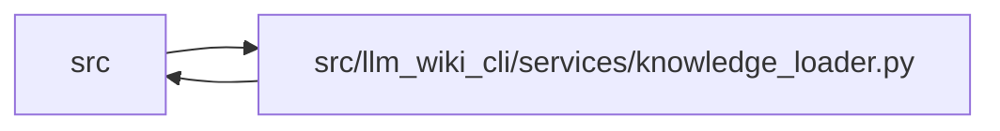

# knowledge_loader Module

**Path:** `src/llm_wiki_cli/services/knowledge_loader.py`

## Description

Authoritative validation and fallback boundary for generated knowledge state.

## Imports

| Source | Symbols |
|--------|---------|
| `.io` | `read_md` |
| `.knowledge_artifacts` | `KNOWLEDGE_INDEX_FILENAME`, `KnowledgeArtifactError`, `validate_knowledge_artifacts`, `validate_surface_index_bytes` |
| `.knowledge_envelope` | `KnowledgeEnvelopeError`, `hash_markdown_snapshot` |
| `.knowledge_governance` | `GOVERNANCE_EXTENSION_KEY`, `GOVERNANCE_FILENAME`, `GovernanceError`, `load_governance`, `validate_governance_projection` |
| `.knowledge_model` | `KnowledgeIndex`, `KnowledgeLoadState` |
| `.sync_manifest` | `MANIFEST_FILENAME`, `SyncManifest`, `SyncManifestError` |
| `.wiki_surface` | `collect_wiki_pages` |
| `.wiki_surface_index` | `SURFACE_INDEX_FILENAME` |
| `__future__` | `annotations` |
| `collections.abc` | `Callable`, `Mapping` |
| `dataclasses` | `dataclass`, `replace` |
| `enum` | `Enum` |
| `pathlib` | `Path` |
| `typing` | `Any` |

## Local dependency map

<!-- Auto-generated local dependency summary. Do not edit by hand. -->

> Module-level dependencies exceed the generated-diagram limits, so the diagram and table below group them by top-level package. Counts report the number of module neighbors in each package.

### Internal neighbors

| Direction | Module |
|---|---|
| Inbound | `src` (6) |
| Outbound | `src` (8) |

> All 14 module neighbor(s) are summarized by package because the module-level view exceeds the 12-node limit.

## Classes

| Class | Kind | Line | Bases / Target | Description |
|-------|------|------|----------------|-------------|
| [KnowledgeMismatchPolicy](../entities/KnowledgeMismatchPolicy.md) | Enum | 36 | `str`, `Enum` | Caller-selected behavior when a present artifact set is not valid. |
| [KnowledgeLoadIssue](../entities/KnowledgeLoadIssue.md) | Class | 45 | — | One stable, path-safe artifact load diagnostic. |
| [KnowledgeLoadResult](../entities/KnowledgeLoadResult.md) | Class | 55 | — | Validated knowledge state or an explicit compatibility fallback. |
| [KnowledgeStateLoadError](../entities/KnowledgeStateLoadError.md) | Class | 67 | `ValueError` | Raised by reject/rebuild policy when no valid state can be returned. |

## Functions

| Function | Signature | Decorators | Description |
|----------|-----------|------------|-------------|
| `load_knowledge_state` | `(wiki_dir: str \| Path, *, policy: KnowledgeMismatchPolicy \| str = KnowledgeMismatchPolicy.REJECT, rebuild_callback: RebuildCallback \| None = None, markdown_pages: Mapping[str, str \| bytes] \| None = None) -> KnowledgeLoadResult` | — | Load one coherent surface/knowledge/manifest state. |
| `_load_once` | `(root: Path, *, markdown_pages: Mapping[str, str \| bytes] \| None) -> tuple[KnowledgeLoadResult, bool]` | — | — |
| `_read_artifact` | `(root: Path, filename: str, *, absent_is_issue: bool = True) -> tuple[bytes \| None, KnowledgeLoadIssue \| None]` | — | — |
| `_load_manifest` | `(root: Path) -> tuple[SyncManifest \| None, KnowledgeLoadIssue \| None]` | — | — |
| `_current_markdown` | `(root: Path, supplied: Mapping[str, str \| bytes] \| None) -> dict[str, str \| bytes]` | — | — |
| `_marker_issues` | `(committed_surface: str, committed_knowledge: str, committed_envelope: str, actual_surface: str, actual_knowledge: str, actual_envelope: str, committed_governance: str \| None = None, actual_governance: str \| None = None) -> tuple[KnowledgeLoadIssue, ...]` | — | — |
| `_live_governance_issues` | `(root: Path, knowledge: KnowledgeIndex, *, committed_hash: str \| None, projected_hash: str \| None) -> tuple[tuple[KnowledgeLoadIssue, ...], KnowledgeLoadState \| None]` | — | Validate the non-rebuildable live ledger without exposing stale state. |
| `_page_parity_message` | `(surface_paths: set[str], live_paths: set[str]) -> str` | — | — |
| `_issue_from_artifact_error` | `(code: str, artifact_path: str, error: KnowledgeArtifactError) -> KnowledgeLoadIssue` | — | — |
