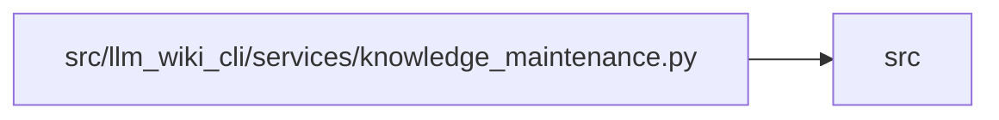

# knowledge_maintenance Module

**Path:** `src/llm_wiki_cli/services/knowledge_maintenance.py`

## Description

Read-only candidate/producer preflight and bound health-policy commands.

## Imports

| Source | Symbols |
|--------|---------|
| `.` | `extractor_helpers` |
| `..config` | `EXTRACTOR_REGISTRY`, `validate_path`, `validate_source_root` |
| `..extractors.common` | `inventory_language_for_path` |
| `.contracts` | `KNOWLEDGE_SCHEMA_VERSION` |
| `.health_policy` | `PREFLIGHT_SCHEMA`, `MaintenanceError`, `derive_policy`, `digest`, `strict_json`, `verify_policy`, `_binding` |
| `.knowledge_envelope` | `ProducerComponentInput`, `build_producer_record`, `hash_source_snapshot` |
| `.knowledge_evidence` | `hash_json` |
| `.knowledge_freshness` | `comparable_producer_components` |
| `.knowledge_model` | `_parse_bundle`, `parse_knowledge_index` |
| `.knowledge_orchestration` | `_producer_evidence`, `_infrastructure_extractor_component`, `runtime_generation_options`, `runtime_generation_options_hash` |
| `.knowledge_packs` | `parse_packed_root` |
| `.knowledge_storage` | `parse_store_root` |
| `.knowledge_storage_io` | `StorageReadSession`, `read_guarded` |
| `.source_selection` | `validate_persisted_source_selection_identity` |
| `.source_snapshot` | `build_source_snapshot` |
| `.sync_manifest` | `SyncManifest` |
| `.wiki_surface_index` | `WIKI_SURFACE_INDEX_SCHEMA_VERSION` |
| `__future__` | `annotations` |
| `argparse` | `argparse` |
| `hashlib` | `hashlib` |
| `importlib.metadata` | `importlib.metadata` |
| `json` | `json` |
| `llm_wiki_cli` | `llm_wiki_cli` |
| `pathlib` | `Path`, `PurePosixPath` |
| `subprocess` | `subprocess` |
| `sys` | `sys` |
| `tarfile` | `tarfile` |
| `tomli` | `tomllib` |
| `tomllib` | `tomllib` |
| `typing` | `Any` |

## Local dependency map

<!-- Auto-generated local dependency summary. Do not edit by hand. -->

> Module-level dependencies exceed the generated-diagram limits, so the diagram and table below group them by top-level package. Counts report the number of module neighbors in each package.

### Internal neighbors

| Direction | Module |
|---|---|
| Outbound | `src` (18) |

### External packages

| Language | Used packages | Undeclared packages |
|---|---:|---:|
| python | 1 | 0 |

> All 18 module neighbor(s) are summarized by package because the module-level view exceeds the 12-node limit.

## Functions

| Function | Signature | Decorators | Description |
|----------|-----------|------------|-------------|
| `project_version` | `(root: Path) -> str` | — | — |
| `_git` | `(root: Path, *args: str) -> str` | — | — |
| `_installed` | `(candidate: Path, version: str, allow_editable: bool) -> dict[str, Any]` | — | — |
| `_archive_binding` | `(archive: Path, identity: dict, candidate: Path, snapshot, wiki: Path) -> None` | — | — |
| `preflight` | `(*, candidate_root: str, candidate_sha: str, src_dir: str, wiki_dir: str, helper_cache_dir: str \| None = None, source_selection: str \| None = None, identity_path: str \| None = None, source_archive: str \| None = None, allow_editable: bool = False) -> dict[str, Any]` | — | — |
| `main` | `(argv = None) -> int` | — | — |
