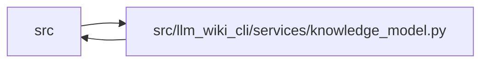

# knowledge_model Module

**Path:** `src/llm_wiki_cli/services/knowledge_model.py`

## Description

Typed contract and stdlib validation for ``llm-wiki-knowledge/v1``.

The persisted knowledge index is a generated observation read model. It stores
the basis needed for a later freshness comparison, but never stores a timeless
freshness verdict. :class:`ComputedFreshness` is therefore a consumer-side
vocabulary only and is not a field on any persisted dataclass.

Core record objects reject unknown fields. Forward-compatible data belongs in
an explicit ``extensions`` object whose keys use ``namespace/name`` syntax.
Unknown concept and relationship kinds are accepted only when similarly
qualified; unqualified unknown values are treated as likely typos.

This module is deliberately pure over supplied Python values. It does not read
or write knowledge artifacts, scan source, invoke helpers, or evaluate live
freshness. Loading the packaged JSON Schema is the sole resource read.

## Imports

| Source | Symbols |
|--------|---------|
| `.` | `wiki_surface` |
| `.contracts` | `KNOWLEDGE_SCHEMA_FILENAME`, `KNOWLEDGE_SCHEMA_VERSION`, `SECTION_OWNERSHIP_EXTENSION_KEY`, `TYPED_GRAPH_EXTENSION_KEY` |
| `.knowledge_evidence` | `SHA256_PATTERN` |
| `.knowledge_governance` | `validate_governance_projection` |
| `.knowledge_graph` | `KnowledgeGraphError`, `typed_graph_from_knowledge_extensions` |
| `.section_ownership` | `SectionOwnershipError`, `validate_section_ownership` |
| `.validation` | `require_bounded_integral_number`, `require_enum_value`, `require_list`, `require_mapping`, `require_nonempty_text`, `require_repository_relative_path`, `require_sha256`, `require_string` |
| `.wiki_media` | `contains_uri_authority_userinfo` |
| `.wiki_surface` | `PageKind`, `SurfaceRole`, `is_safe_page_id`, `iter_page_kinds` |
| `__future__` | `annotations` |
| `dataclasses` | `dataclass`, `field` |
| `enum` | `Enum` |
| `importlib` | `resources` |
| `json` | `json` |
| `math` | `math` |
| `re` | `re` |
| `types` | `MappingProxyType` |
| `typing` | `AbstractSet`, `Any`, `Mapping`, `Optional`, `Type`, `TypeVar`, `Union` |
| `urllib.parse` | `unquote`, `urlsplit` |

## Local dependency map

<!-- Auto-generated local dependency summary. Do not edit by hand. -->

> Module-level dependencies exceed the generated-diagram limits, so the diagram and table below group them by top-level package. Counts report the number of module neighbors in each package.

### Internal neighbors

| Direction | Module |
|---|---|
| Inbound | `src` (22) |
| Outbound | `src` (8) |

> All 29 module neighbor(s) are summarized by package because the module-level view exceeds the 12-node limit.

## Classes

| Class | Kind | Line | Bases / Target | Description |
|-------|------|------|----------------|-------------|
| [KnowledgeModelError](../entities/KnowledgeModelError.md) | Class | 77 | `ValueError` | Raised when a knowledge payload violates the v1 contract. |
| [ConceptKind](../entities/ConceptKind.md) | Enum | 93 | `str`, `Enum` | Versioned domain taxonomy independent of the current page layout. |
| [Origin](../entities/Origin.md) | Enum | 115 | `str`, `Enum` | — |
| [EvidenceState](../entities/EvidenceState.md) | Enum | 125 | `str`, `Enum` | — |
| [Resolution](../entities/Resolution.md) | Enum | 133 | `str`, `Enum` | — |
| [TargetClass](../entities/TargetClass.md) | Enum | 140 | `str`, `Enum` | Classification of a relationship target, separate from resolution. |
| [Verification](../entities/Verification.md) | Enum | 153 | `str`, `Enum` | — |
| [Lifecycle](../entities/Lifecycle.md) | Enum | 162 | `str`, `Enum` | — |
| [ComputedFreshness](../entities/ComputedFreshness.md) | Enum | 170 | `str`, `Enum` | Live comparison outcomes; never serialized in the knowledge index. |
| [KnowledgeLoadState](../entities/KnowledgeLoadState.md) | Enum | 181 | `str`, `Enum` | Validated artifact-load outcomes; never persisted in the knowledge index. |
| [KnowledgeProjectionProfile](../entities/KnowledgeProjectionProfile.md) | Enum | 191 | `str`, `Enum` | Out-of-band projection policies; never selected by artifact metadata. |
| [ActorKind](../entities/ActorKind.md) | Enum | 198 | `str`, `Enum` | — |
| [WorkingTreeState](../entities/WorkingTreeState.md) | Enum | 206 | `str`, `Enum` | — |
| [RepositoryIdentitySource](../entities/RepositoryIdentitySource.md) | Enum | 212 | `str`, `Enum` | How a repository identity was selected by an application-owned writer. |
| [ObservationScope](../entities/ObservationScope.md) | Enum | 220 | `str`, `Enum` | — |
| [RelationshipKind](../entities/RelationshipKind.md) | Enum | 228 | `str`, `Enum` | — |
| [ConceptKindValue](../entities/ConceptKindValue.md) | Type alias | 233 | `Union[ConceptKind, str]` | — |
| [RelationshipKindValue](../entities/RelationshipKindValue.md) | Type alias | 234 | `Union[RelationshipKind, str]` | — |
| [Actor](../entities/Actor.md) | Class | 259 | — | — |
| [RepositoryRecord](../entities/RepositoryRecord.md) | Class | 275 | — | — |
| [SnapshotRecord](../entities/SnapshotRecord.md) | Class | 293 | — | — |
| [ProducerComponent](../entities/ProducerComponent.md) | Class | 302 | — | — |
| [ProducerRecord](../entities/ProducerRecord.md) | Class | 311 | — | — |
| [BundleRecord](../entities/BundleRecord.md) | Class | 319 | — | — |
| [DocumentRecord](../entities/DocumentRecord.md) | Class | 327 | — | — |
| [EvidenceBasis](../entities/EvidenceBasis.md) | Class | 336 | — | — |
| [StructuralFacet](../entities/StructuralFacet.md) | Class | 347 | — | — |
| [SemanticFacet](../entities/SemanticFacet.md) | Class | 355 | — | — |
| [ConceptFacets](../entities/ConceptFacets.md) | Class | 364 | — | — |
| [ConceptRecord](../entities/ConceptRecord.md) | Class | 371 | — | — |
| [RelationshipLocation](../entities/RelationshipLocation.md) | Class | 382 | — | Half-open character offsets for a relationship observation. |
| [RelationshipTarget](../entities/RelationshipTarget.md) | Class | 391 | — | — |
| [RelationshipEvidence](../entities/RelationshipEvidence.md) | Class | 429 | — | — |
| [RelationshipRecord](../entities/RelationshipRecord.md) | Class | 439 | — | — |
| [KnowledgeIndex](../entities/KnowledgeIndex.md) | Class | 450 | — | — |

## Functions

| Function | Signature | Decorators | Description |
|----------|-----------|------------|-------------|
| `concept_kind_for_page_kind` | `(value: Union[PageKind, str]) -> ConceptKind` | — | Map a presentation page kind to the v1 domain/document taxonomy. |
| `repository_identities_match` | `(left: RepositoryRecord, right: RepositoryRecord) -> bool` | — | Return whether two explicit, non-unknown repository identities match. |
| `parse_knowledge_index` | `(payload: object) -> KnowledgeIndex` | — | Validate and deserialize one v1 payload without performing I/O. |
| `_validated_reserved_extensions` | `(extensions: Mapping[str, Any], concepts: tuple[ConceptRecord, ...]) -> dict[str, Any]` | — | Validate application-owned, independently versioned v1 extensions. |
| `validate_knowledge_payload` | `(payload: object) -> KnowledgeIndex` | — | Alias for :func:`parse_knowledge_index` used by future builders/loaders. |
| `knowledge_index_to_payload` | `(model: KnowledgeIndex) -> dict[str, Any]` | — | Return the normalized JSON-compatible representation of ``model``. |
| `serialize_knowledge_index` | `(model: KnowledgeIndex) -> str` | — | Serialize deterministically with exactly one trailing newline. |
| `load_knowledge_schema` | `() -> dict[str, Any]` | — | Load the packaged JSON Schema through a zip-safe resource handle. |
| `_parse_bundle` | `(value: object, path: str) -> BundleRecord` | — | — |
| `_parse_repository` | `(value: object, path: str) -> RepositoryRecord` | — | — |
| `_parse_snapshot` | `(value: object, path: str) -> SnapshotRecord` | — | — |
| `_parse_producer` | `(value: object, path: str) -> ProducerRecord` | — | — |
| `_component_array` | `(value: object, path: str) -> tuple[ProducerComponent, ...]` | — | — |
| `_parse_component` | `(value: object, path: str) -> ProducerComponent` | — | — |
| `_validate_analyzer_component` | `(component: ProducerComponent, path: str) -> None` | — | — |
| `_parse_concept` | `(value: object, path: str) -> ConceptRecord` | — | — |
| `_parse_document` | `(value: object, path: str) -> DocumentRecord` | — | — |
| `_parse_facets` | `(value: object, path: str) -> ConceptFacets` | — | — |
| `_parse_structural_facet` | `(value: object, path: str) -> StructuralFacet` | — | — |
| `_parse_evidence_basis` | `(value: object, path: str) -> EvidenceBasis` | — | — |
| `_parse_semantic_facet` | `(value: object, path: str) -> SemanticFacet` | — | — |
| `_parse_actor` | `(value: object, path: str) -> Actor` | — | — |
| `_parse_relationship` | `(value: object, path: str) -> RelationshipRecord` | — | — |
| `_parse_relationship_target` | `(value: object, path: str) -> RelationshipTarget` | — | — |
| `_parse_relationship_location` | `(value: object, path: str) -> RelationshipLocation` | — | — |
| `_parse_relationship_evidence` | `(value: object, path: str) -> RelationshipEvidence` | — | — |
| `_validate_relationship_shape` | `(relationship: RelationshipRecord, path: str) -> None` | — | — |
| `_validate_index_references` | `(bundle: BundleRecord, concepts: tuple[ConceptRecord, ...], relationships: tuple[RelationshipRecord, ...]) -> None` | — | — |
| `_record` | `(value: object, path: str, fields: AbstractSet[str], *, required: AbstractSet[str] = frozenset()) -> tuple[dict[str, Any], dict[str, Any]]` | — | — |
| `_parse_extensions` | `(value: object, path: str) -> dict[str, Any]` | — | — |
| `_normalize_json_value` | `(value: object, path: str) -> Any` | — | — |
| `_normalize_json_value_inner` | `(value: object, path: str, active_containers: set[int]) -> Any` | — | — |
| `_object` | `(value: object, path: str) -> dict[str, Any]` | — | — |
| `_array` | `(value: object, path: str) -> list[Any]` | — | — |
| `_string` | `(value: object, path: str) -> str` | — | — |
| `_nonempty_string` | `(value: object, path: str) -> str` | — | — |
| `_nonnegative_integer` | `(value: object, path: str) -> int` | — | — |
| `_positive_integer` | `(value: object, path: str) -> int` | — | — |
| `_optional_nonempty_string` | `(value: object, path: str) -> Optional[str]` | — | — |
| `_hash` | `(value: object, path: str) -> str` | — | — |
| `_optional_hash` | `(value: object, path: str) -> Optional[str]` | — | — |
| `_relative_path` | `(value: object, path: str) -> str` | — | — |
| `_optional_relative_path` | `(value: object, path: str) -> Optional[str]` | — | — |
| `_repository_identity` | `(value: object, path: str) -> str` | — | — |
| `_evaluated_revision` | `(value: object, path: str) -> str` | — | — |
| `_locator` | `(value: object, path: str) -> str` | — | — |
| `_external_uri` | `(value: object, path: str) -> str` | — | — |
| `_link_observation_string` | `(value: object, path: str) -> str` | — | — |
| `_enum_value` | `(value: object, enum_type: Type[_EnumT], path: str) -> _EnumT` | — | — |
| `_open_enum_value` | `(value: object, enum_type: Type[_EnumT], path: str) -> Union[_EnumT, str]` | — | — |
| `_reject_duplicate_components` | `(tools: tuple[ProducerComponent, ...], extractors: tuple[ProducerComponent, ...], plugins: tuple[ProducerComponent, ...], path: str) -> None` | — | — |
| `_child` | `(path: str, name: str) -> str` | — | — |
| `_emit_extensions` | `(payload: dict[str, Any], extensions: Extensions, path: str) -> dict[str, Any]` | — | — |
| `_wire_enum` | `(value: object) -> object` | — | Return an enum's wire value while leaving invalid manual input parseable. |
| `_actor_to_payload` | `(actor: Actor) -> dict[str, Any]` | — | — |
| `_component_to_payload` | `(component: ProducerComponent) -> dict[str, Any]` | — | — |
| `_bundle_to_payload` | `(bundle: BundleRecord) -> dict[str, Any]` | — | — |
| `_document_to_payload` | `(document: DocumentRecord) -> dict[str, Any]` | — | — |
| `_basis_to_payload` | `(basis: EvidenceBasis) -> dict[str, Any]` | — | — |
| `_concept_to_payload` | `(concept: ConceptRecord) -> dict[str, Any]` | — | — |
| `_relationship_target_to_payload` | `(target: RelationshipTarget) -> dict[str, Any]` | — | — |
| `_relationship_evidence_to_payload` | `(evidence: RelationshipEvidence) -> dict[str, Any]` | — | — |
| `_relationship_to_payload` | `(relationship: RelationshipRecord) -> dict[str, Any]` | — | — |
| `_knowledge_index_to_payload_unchecked` | `(model: KnowledgeIndex) -> dict[str, Any]` | — | — |
| `_canonical_relationship_key` | `(relationship: dict[str, Any]) -> str` | — | — |
