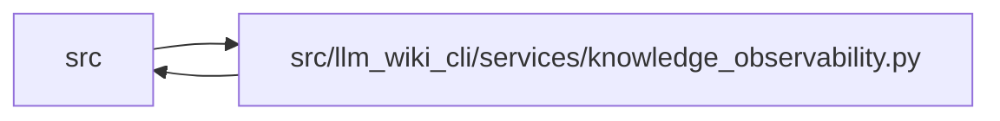

# knowledge_observability Module

**Path:** `src/llm_wiki_cli/services/knowledge_observability.py`

## Description

Privacy-safe observability for native knowledge consumers.

This module is deliberately separate from the deterministic knowledge model.
It projects only closed status values, fixed aggregate counters, static
diagnostic guidance, and optional operational durations.  It never exposes
per-concept evidence, repository identity, hashes, paths, actors, remotes, or
timestamps.

## Imports

| Source | Symbols |
|--------|---------|
| `.knowledge_artifacts` | `KNOWLEDGE_INDEX_FILENAME` |
| `.knowledge_consumption` | `KnowledgeAvailability`, `KnowledgeReadReason`, `KnowledgeReadView`, `build_knowledge_read_view` |
| `.knowledge_freshness` | `REASON_EXTRACTOR_CONFIGURATION_CHANGED`, `REASON_EXTRACTOR_CONFIGURATION_UNKNOWN`, `REASON_EXTRACTOR_LIMITATIONS_CHANGED`, `REASON_EXTRACTOR_SELECTION_CHANGED`, `REASON_EXTRACTOR_VERSION_CHANGED`, `REASON_GENERATION_OPTIONS_CHANGED`, `REASON_IDENTICAL_SOURCE_OBSERVATION_MISMATCH`, `REASON_LIVE_EXTRACTOR_UNAVAILABLE`, `REASON_OBSERVATION_SCOPE_CHANGED`, `REASON_PLUGIN_CONFIGURATION_CHANGED`, `REASON_PLUGIN_CONFIGURATION_UNKNOWN`, `REASON_PLUGIN_LIMITATIONS_CHANGED`, `REASON_PLUGIN_SET_CHANGED`, `REASON_PLUGIN_VERSION_CHANGED`, `REASON_SCHEMA_VERSION_CHANGED`, `REASON_SOURCE_MAPPING_CHANGED`, `REASON_TOOL_CONFIGURATION_CHANGED`, `REASON_TOOL_CONFIGURATION_UNKNOWN`, `REASON_TOOL_ID_CHANGED`, `REASON_TOOL_LIMITATIONS_CHANGED`, `REASON_TOOL_VERSION_CHANGED`, `REASON_VERSION_UNKNOWN` |
| `.knowledge_loader` | `KnowledgeLoadIssue`, `KnowledgeLoadResult`, `KnowledgeMismatchPolicy`, `KnowledgeStateLoadError`, `load_knowledge_state` |
| `.knowledge_model` | `ComputedFreshness`, `EvidenceState`, `KnowledgeLoadState` |
| `.source_selection` | `SourceSelectionError`, `resolve_source_selection`, `source_selection_identity_from_generation_inputs`, `source_selection_inputs_from_generation_inputs`, `validate_persisted_source_selection_identity` |
| `.source_snapshot` | `build_source_snapshot`, `capture_source_selection_inputs` |
| `.sync_manifest` | `SyncManifest` |
| `.wiki_surface_index` | `SURFACE_INDEX_FILENAME`, `evaluate_surface_index` |
| `__future__` | `annotations` |
| `collections.abc` | `Mapping` |
| `dataclasses` | `dataclass`, `replace` |
| `pathlib` | `Path` |
| `time` | `time` |
| `types` | `MappingProxyType` |
| `typing` | `Any` |

## Local dependency map

<!-- Auto-generated local dependency summary. Do not edit by hand. -->

> Module-level dependencies exceed the generated-diagram limits, so the diagram and table below group them by top-level package. Counts report the number of module neighbors in each package.

### Internal neighbors

| Direction | Module |
|---|---|
| Inbound | `src` (13) |
| Outbound | `src` (9) |

> All 22 module neighbor(s) are summarized by package because the module-level view exceeds the 12-node limit.

## Classes

| Class | Line | Bases | Description |
|-------|------|-------|-------------|
| [KnowledgePhaseDurations](../entities/KnowledgePhaseDurations.md) | 194 | — | Operational phase durations in milliseconds. |
| [KnowledgeAggregateSummary](../entities/KnowledgeAggregateSummary.md) | 225 | — | Low-cardinality knowledge status safe for reports and local metrics. |
| [SnapshotKnowledgeObservability](../entities/SnapshotKnowledgeObservability.md) | 389 | — | One snapshot-only read view and its aggregate operational summary. |

## Functions

| Function | Signature | Decorators | Description |
|----------|-----------|------------|-------------|
| `_validated_counts` | `(value: Mapping[str, int] \| None, *, expected_keys: frozenset[str], field_name: str) -> Mapping[str, int] \| None` | — | — |
| `_validated_phase_durations` | `(value: Mapping[str, int \| None]) -> Mapping[str, int \| None]` | — | — |
| `summarize_knowledge_view` | `(view: KnowledgeReadView, *, durations: KnowledgePhaseDurations \| None = None) -> KnowledgeAggregateSummary` | — | Project one read view into a fixed, evidence-free aggregate summary. |
| `knowledge_freshness_disclosure` | `(view: KnowledgeReadView) -> str` | — | Describe whether the read produced one freshness result per concept. |
| `knowledge_freshness_hint` | `(state: ComputedFreshness \| str \| None, reason_code: object) -> str \| None` | — | Return static recovery guidance for one incompatible freshness basis. |
| `_freshness_disclosure` | `(*, evaluated: bool, concepts_evaluated: int) -> str` | — | — |
| `knowledge_status_payload` | `(view: KnowledgeReadView \| None) -> dict[str, object]` | — | Return the stable compact status envelope used by MCP and CLI status. |
| `load_snapshot_knowledge_observability` | `(wiki_dir: str \| Path, *, src_dir: str \| Path \| None = None, source_selection: str \| Path \| None = None) -> SnapshotKnowledgeObservability` | — | Load status without extraction while checking current selection identity. |
| `_with_current_source_selection` | `(load_result: KnowledgeLoadResult, current_identity: Mapping[str, str] \| None, current_inputs: Mapping[str, object] \| None) -> KnowledgeLoadResult` | — | — |
| `_snapshot_result` | `(view: KnowledgeReadView, started: float) -> SnapshotKnowledgeObservability` | — | — |
| `_knowledge_projection_declared` | `(wiki_root: Path) -> bool` | — | — |
| `_snapshot_error_view` | `(surface: Mapping[str, Any], error: KnowledgeStateLoadError) -> KnowledgeReadView` | — | — |
| `_degraded_snapshot_view` | `(surface: Mapping[str, Any] \| None = None) -> KnowledgeReadView` | — | — |
