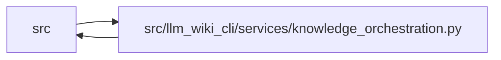

# knowledge_orchestration Module

**Path:** `src/llm_wiki_cli/services/knowledge_orchestration.py`

## Description

Command-facing orchestration for generated native knowledge artifacts.

The bootstrap, sync, and migration commands already own source discovery,
inventory extraction, Markdown generation, and surface evaluation.  This
module adapts those exact in-memory results to the pure generation planner and
applies the shared atomic commit protocol.  It performs no discovery or
extraction of its own.

## Imports

| Source | Symbols |
|--------|---------|
| `..` | `__version__` |
| `..config` | `AGENT_WORKTREE_DIR_PATTERNS`, `EXCLUDED_DIRS` |
| `..extractors.common` | `BUNDLED_HELPER_IMPLEMENTATION_PATHS`, `is_bundled_helper_implementation_path` |
| `.contracts` | `KNOWLEDGE_SCHEMA_VERSION` |
| `.infrastructure_sync` | `INFRASTRUCTURE_EXTRACTOR_REF`, `INFRASTRUCTURE_SYNC_SCHEMA_VERSION`, `current_infrastructure_bases`, `infrastructure_evidence_by_page` |
| `.knowledge_artifacts` | `KNOWLEDGE_INDEX_FILENAME`, `FaultInjector`, `KnowledgeArtifactError`, `KnowledgeCommitPlan`, `KnowledgeCommitResult`, `ValidatedKnowledgeArtifacts`, `commit_knowledge_artifacts`, `validate_knowledge_artifacts` |
| `.knowledge_envelope` | `ConsumedInput`, `ConsumedInputKind`, `ProducerComponentInput`, `RepositoryEvidence`, `build_producer_record`, `collect_git_repository_evidence`, `hash_generation_options`, `hash_source_snapshot`, `plugin_producer_inputs` |
| `.knowledge_evidence` | `ENTITY_OBSERVATION_SCOPE`, `MODULE_OBSERVATION_SCOPE`, `ConceptObservationBasis`, `build_entity_observation_basis`, `build_module_observation_basis`, `is_valid_sha256` |
| `.knowledge_freshness` | `LiveKnowledgeEvaluation` |
| `.knowledge_generation` | `KnowledgeGenerationError`, `KnowledgeGenerationInputs`, `build_knowledge_generation_plan` |
| `.knowledge_governance` | `GOVERNANCE_FILENAME`, `ConceptGovernanceReference`, `GovernanceConflictError`, `GovernanceError`, `GovernanceLedger`, `governance_bundle_id_from_knowledge`, `governance_lock`, `load_governance`, `natural_key_for`, `reconcile_concepts`, `save_governance`, `validate_governance_ledger` |
| `.knowledge_model` | `KnowledgeIndex`, `ObservationScope`, `ProducerRecord`, `concept_kind_for_page_kind` |
| `.source_selection` | `SourceSelectionError`, `selection_may_contain_path`, `with_source_selection_generation_input` |
| `.source_snapshot` | `SourceSnapshot` |
| `.sync_manifest` | `EVIDENCE_NOT_RECORDED`, `MANIFEST_FILENAME`, `SyncManifest` |
| `.wiki_surface_index` | `SURFACE_INDEX_FILENAME`, `WIKI_SURFACE_INDEX_SCHEMA_VERSION`, `SurfaceIndexEvaluation` |
| `__future__` | `annotations` |
| `collections.abc` | `Iterable`, `Mapping`, `Sequence`, `Set` |
| `dataclasses` | `dataclass`, `field`, `replace` |
| `pathlib` | `Path` |
| `re` | `re` |
| `typing` | `Any` |

## Local dependency map

<!-- Auto-generated local dependency summary. Do not edit by hand. -->

> Module-level dependencies exceed the generated-diagram limits, so the diagram and table below group them by top-level package. Counts report the number of module neighbors in each package.

### Internal neighbors

| Direction | Module |
|---|---|
| Inbound | `src` (6) |
| Outbound | `src` (15) |

> All 21 module neighbor(s) are summarized by package because the module-level view exceeds the 12-node limit.

## Classes

| Class | Line | Bases | Description |
|-------|------|-------|-------------|
| [RuntimeKnowledgeInputs](../entities/RuntimeKnowledgeInputs.md) | 126 | — | Evaluated command state needed to plan one three-artifact commit. |
| [CommittedRuntimeProvenance](../entities/CommittedRuntimeProvenance.md) | 172 | — | Exact runtime provenance recovered from an intact committed projection. |
| [RuntimeLiveEvaluationInputs](../entities/RuntimeLiveEvaluationInputs.md) | 181 | — | Already evaluated runtime values for one live freshness comparison. |
| [PreparedRuntimeGenerationOptions](../entities/PreparedRuntimeGenerationOptions.md) | 202 | — | Canonical writer/reader inputs for the generation-options commitment. |

## Functions

| Function | Signature | Decorators | Description |
|----------|-----------|------------|-------------|
| `prepare_runtime_generation_options` | `(generation_options: Mapping[str, Any], *, generation_option_defaults: Mapping[str, Any], generation_option_allowlist: Sequence[str], inventory_complete: bool) -> PreparedRuntimeGenerationOptions` | — | Add the evaluated inventory mode to one generation-options projection. |
| `_runtime_manifest_generation_inputs` | `(inputs: RuntimeKnowledgeInputs) -> Mapping[str, object]` | — | — |
| `_infrastructure_extractor_component` | `() -> ProducerComponentInput` | — | — |
| `build_runtime_knowledge_plan` | `(inputs: RuntimeKnowledgeInputs) -> KnowledgeCommitPlan` | — | Build a commit plan from one command's already evaluated run state. |
| `_stabilize_revision_only_noop` | `(runtime_inputs: RuntimeKnowledgeInputs, plan_inputs: KnowledgeGenerationInputs) -> KnowledgeCommitPlan` | — | Keep a validated artifact set stable across an output-only Git commit. |
| `build_runtime_live_evaluation` | `(inputs: RuntimeLiveEvaluationInputs) -> LiveKnowledgeEvaluation` | — | Adapt one existing inventory/snapshot run to the freshness boundary. |
| `_runtime_live_concept_bases` | `(knowledge: KnowledgeIndex, manifest: SyncManifest, inventory: Mapping[str, Mapping[str, Any]], source_hashes: Mapping[str, str], extractor_ref_by_source: Mapping[str, str], *, infrastructure_bases_by_source: Mapping[str, ConceptObservationBasis], inventory_complete: bool) -> dict[str, ConceptObservationBasis]` | — | — |
| `_previous_committed_artifacts` | `(wiki_dir: str \| Path, manifest: SyncManifest \| None) -> ValidatedKnowledgeArtifacts \| None` | — | Return the validated prior artifact set without consulting Markdown. |
| `committed_governance_bundle_id` | `(wiki_dir: str \| Path, manifest: SyncManifest \| None) -> str \| None` | — | Return a bundle ID only from an intact manifest-committed projection. |
| `committed_runtime_provenance` | `(wiki_dir: str \| Path, manifest: SyncManifest \| None) -> CommittedRuntimeProvenance \| None` | — | Return source and generator identity from an intact committed projection. |
| `_previous_committed_producer` | `(wiki_dir: str \| Path, manifest: SyncManifest \| None) -> ProducerRecord \| None` | — | Return producer evidence only from the prior committed artifact set. |
| `finalize_runtime_knowledge` | `(inputs: RuntimeKnowledgeInputs, *, dry_run: bool = False, fault_injector: FaultInjector \| None = None) -> KnowledgeCommitResult` | — | Plan and commit one generated artifact set through the shared protocol. |
| `_prepared_runtime_governance` | `(inputs: RuntimeKnowledgeInputs) -> GovernanceLedger \| None` | — | Load/reconcile governance without writing or inventing recovery state. |
| `collect_runtime_repository_evidence` | `(source_root: str \| Path, target_wiki_dir: str \| Path, *, source_snapshot: SourceSnapshot \| None = None) -> RepositoryEvidence` | — | Collect Git evidence for the evaluated source-selection boundary. |
| `runtime_generation_options` | `(*, surfaces: Mapping[str, Mapping[str, Any]], generation_inputs: Mapping[str, object] \| None = None, include_tests: Iterable[str] \| None, preserve_semantic: bool) -> dict[str, object]` | — | Project command policy into one cross-command safe option allowlist. |
| `runtime_generation_options_hash` | `(generation_options: Mapping[str, Any], *, inventory_complete: bool = True) -> str` | — | Hash the canonical runtime generation policy used by knowledge output. |
| `persist_runtime_generation_policy` | `(generation_inputs: Mapping[str, object], *, data_flow_enabled: bool, dependency_graph_detail: str, workflows_enabled: bool) -> dict[str, object]` | — | Persist bootstrap-only generation policy for later sync parity. |
| `_runtime_policy_from_generation_inputs` | `(generation_inputs: Mapping[str, object] \| None) -> dict[str, object] \| None` | — | — |
| `_validate_runtime_policy` | `(policy: Mapping[str, object]) -> None` | — | — |
| `_producer_evidence` | `(inventory: Mapping[str, Mapping[str, Any]], *, inventory_complete: bool, historical_extractor_refs: frozenset[str] = frozenset(), extractor_registry: Mapping[str, str] \| None = None, plugin_extractor_components: Sequence[Mapping[str, Any]] = (), plugin_components: Sequence[Mapping[str, Any]] = ()) -> tuple[dict[str, str], dict[str, bool], tuple[ProducerComponentInput, ...], tuple[ProducerComponentInput, ...]]` | — | — |
| `_builtin_extractor_id` | `(language: str) -> str` | — | — |
| `_plugin_extractors_by_language` | `(components: Sequence[Mapping[str, Any]]) -> dict[str, Mapping[str, Any]]` | — | — |
| `_manifest_extractor_refs` | `(manifest: SyncManifest \| None) -> frozenset[str]` | — | — |
| `runtime_consumed_inputs` | `(source_snapshot: SourceSnapshot, *, generation_inputs: Mapping[str, object], plugin_lock_path: str \| None = None, plugin_lock_hash: str \| None = None) -> tuple[ConsumedInput, ...]` | — | Add explicitly selected inputs to the already captured source basis. |
| `runtime_source_snapshot_hash` | `(source_snapshot: SourceSnapshot, *, generation_inputs: Mapping[str, object], plugin_lock_path: str \| None = None, plugin_lock_hash: str \| None = None) -> str` | — | Hash the exact source basis consumed by runtime knowledge generation. |
| `_merge_explicit_consumed_input` | `(consumed_by_path: dict[str, ConsumedInput], *, path: str \| None, content_hash: str \| None, kind: ConsumedInputKind, field: str) -> None` | — | — |
