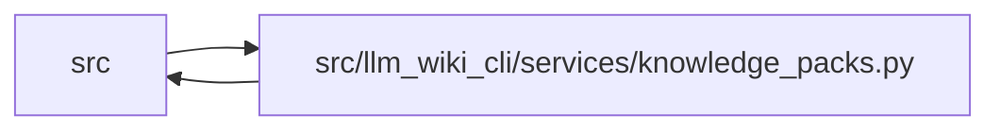

# knowledge_packs Module

**Path:** `src/llm_wiki_cli/services/knowledge_packs.py`

## Description

Stores logical knowledge objects in bounded indexed ZIP containers. V3 retains its original layout; explicit v4 adoption uses smaller data packs and bounded locator pages grouped into content-addressed containers. Selected reads authenticate the consumed page/member ranges; full capture verifies complete container membership and routing. Compatible generation reuses verified packs and compressed payloads while retaining complete validation.

## Imports

| Source | Symbols |
|--------|---------|
| `.knowledge_artifacts` | `require_validated_artifacts`, `validated_artifact_bytes` |
| `.knowledge_storage` | `COLLECTIONS`, `MAX_EXPANDED_BYTES`, `MAX_OBJECT_BYTES`, `MAX_READ_OBJECTS`, `MAX_ROOT_BYTES`, `OBJECT_SCHEMA`, `KnowledgeSlice`, `KnowledgeStorageError`, `KnowledgeStorePlan`, `KnowledgeStoreReader`, `build_knowledge_store`, `canonical_bytes`, `decode_bytes`, `digest`, `parse_store_root`, `_fields`, `_hash`, `_integer` |
| `.storage_spool` | `ByteSpool` |
| `__future__` | `annotations` |
| `collections` | `defaultdict` |
| `collections.abc` | `Callable`, `Mapping`, `MutableMapping` |
| `contextlib` | `nullcontext` |
| `hashlib` | `hashlib` |
| `io` | `io` |
| `json` | `json` |
| `re` | `re` |
| `struct` | `struct` |
| `typing` | `Any`, `NoReturn` |
| `zipfile` | `zipfile` |
| `zlib` | `zlib` |

## Local dependency map

<!-- Auto-generated local dependency summary. Do not edit by hand. -->

> Module-level dependencies exceed the generated-diagram limits, so the diagram and table below group them by top-level package. Counts report the number of module neighbors in each package.

### Internal neighbors

| Direction | Module |
|---|---|
| Inbound | `src` (10) |
| Outbound | `src` (3) |

> All 12 module neighbor(s) are summarized by package because the module-level view exceeds the 12-node limit.

## Classes

| Class | Line | Bases | Description |
|-------|------|-------|-------------|
| [PackedKnowledgeStoreReader](../entities/PackedKnowledgeStoreReader.md) | 568 | `KnowledgeStoreReader` | — |

## Functions

| Function | Signature | Decorators | Description |
|----------|-----------|------------|-------------|
| `_fail` | `(field: str, message: str, code: str = 'storage-invalid') -> NoReturn` | — | — |
| `_bits` | `(hexadecimal: str) -> str` | — | — |
| `_bucket` | `(member: str) -> str` | — | — |
| `_member_name` | `(raw: bytes) -> str` | — | — |
| `pack_path` | `(descriptor: Mapping[str, Any]) -> str` | — | — |
| `index_path` | `(commitment: str) -> str` | — | — |
| `index_page_path` | `(commitment)` | — | — |
| `_index_descriptor` | `(value: Any, *, paged: bool = False) -> dict[str, Any]` | — | — |
| `_pack_descriptor` | `(value: Any) -> dict[str, Any]` | — | — |
| `parse_packed_root` | `(raw: bytes) -> dict[str, Any]` | — | — |
| `packed_format` | `(root: Mapping[str, Any]) -> str` | — | Return the explicitly adopted physical format of a validated packed root. |
| `_zip_bytes` | `(members: Mapping[str, bytes], compression: str) -> tuple[bytes, dict[str, list[Any]]]` | — | — |
| `_zip_reusing` | `(members: Mapping[str, bytes], compression: str, reusable: Mapping[str, tuple[bytes, int]]) -> tuple[bytes, dict[str, list[Any]]]` | — | Write the pinned ZIP profile, copying verified compressed payloads verbatim. |
| `build_packed_store` | `(payload: Mapping[str, Any], *, compression: str = 'stored', prior = None, objects = None, profile: str = 'standard') -> KnowledgeStorePlan` | — | — |
| `_pack_logical` | `(logical, compression, prior, objects, profile = 'standard')` | — | — |
| `_paged_indexes` | `(members, packs, files)` | — | Pack locator pages bottom-up, so every extent has an acyclic commitment. |
| `_coordinates` | `(value: Any) -> tuple[str, list[Any]]` | — | — |
| `inspect_index_pages` | `(raw: bytes, relative: str) -> dict[str, Any]` | — | Validate intrinsic page-container syntax without claiming reachability. |
| `_position` | `(value: Any, descriptor: dict[str, Any]) -> tuple[dict[str, Any], list[Any]]` | — | — |
| `_member_header` | `(position: list[Any], compression: str) -> bytes` | — | — |
| `decode_member` | `(raw: bytes, position: list[Any], compression: str, commitment: str \| None, *, verify_name: bool = True) -> bytes` | — | — |
| `_pack_structure` | `(raw: bytes, descriptor: dict[str, Any], compression: str) -> dict[str, list[Any]]` | — | Check all container/header bytes; member content validation is separate. |
| `validate_pack` | `(raw: bytes, descriptor: dict[str, Any], compression: str) -> dict[str, list[Any]]` | — | Validate a whole archive and each logical member, inflating each once. |
| `inspect_pack` | `(raw: bytes, relative: str) -> dict[str, Any]` | — | Recognize a complete generated archive for diagnostics and orphan cleanup. |
| `open_knowledge_store` | `(root_bytes: bytes, read_file: Callable[[str, int], bytes], *, read_range: RangeReader \| None = None, **limits) -> KnowledgeStoreReader` | — | — |
| `physical_objects` | `(reader: KnowledgeStoreReader) -> Mapping[str, bytes]` | — | — |
| `build_storage` | `(payload: Mapping[str, Any], storage_format: str, *, prior = None, objects = None) -> KnowledgeStorePlan` | — | — |