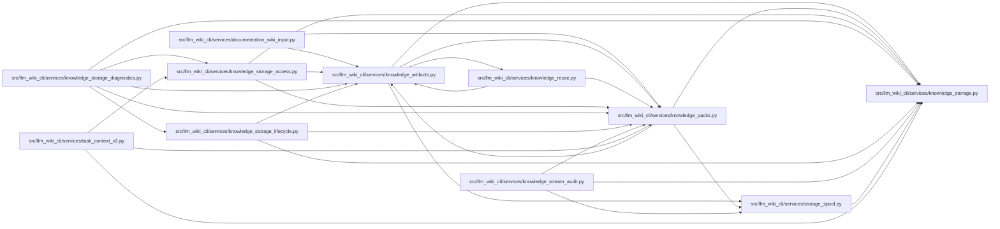

# knowledge_packs Module

**Path:** `src/llm_wiki_cli/services/knowledge_packs.py`

## Description

Stores unchanged logical knowledge objects in bounded indexed ZIP containers. Full capture inflates each member once and reconciles its verified content with all ZIP headers and routing coordinates. Generation can reuse compatible whole packs or copy verified compressed member payloads; the resulting generation still undergoes complete validation.

## Imports

| Source | Symbols |
|--------|---------|
| `.knowledge_artifacts` | `require_validated_artifacts`, `validated_artifact_bytes` |
| `.knowledge_storage` | `COLLECTIONS`, `MAX_EXPANDED_BYTES`, `MAX_OBJECT_BYTES`, `MAX_READ_OBJECTS`, `MAX_ROOT_BYTES`, `OBJECT_SCHEMA`, `KnowledgeSlice`, `KnowledgeStorageError`, `KnowledgeStorePlan`, `KnowledgeStoreReader`, `build_knowledge_store`, `canonical_bytes`, `decode_bytes`, `digest`, `parse_store_root`, `_fields`, `_hash`, `_integer` |
| `.storage_spool` | `ByteSpool` |
| `__future__` | `annotations` |
| `collections` | `defaultdict` |
| `collections.abc` | `Callable`, `Mapping`, `MutableMapping` |
| `contextlib` | `nullcontext` |
| `hashlib` | `hashlib` |
| `io` | `io` |
| `json` | `json` |
| `re` | `re` |
| `struct` | `struct` |
| `typing` | `Any`, `NoReturn` |
| `zipfile` | `zipfile` |
| `zlib` | `zlib` |

## Local dependency map

<!-- Auto-generated local dependency summary. Do not edit by hand. -->

### Internal neighbors

| Direction | Module |
|---|---|
| Inbound | [documentation_wiki_input](../modules/documentation_wiki_input.md) |
| Inbound | [knowledge_artifacts](../modules/knowledge_artifacts.md) |
| Inbound | [knowledge_reuse](../modules/knowledge_reuse.md) |
| Inbound | [knowledge_storage_access](../modules/knowledge_storage_access.md) |
| Inbound | [knowledge_storage_diagnostics](../modules/knowledge_storage_diagnostics.md) |
| Inbound | [knowledge_storage_lifecycle](../modules/knowledge_storage_lifecycle.md) |
| Inbound | [knowledge_stream_audit](../modules/knowledge_stream_audit.md) |
| Inbound | [task_context_v2](../modules/task_context_v2.md) |
| Outbound | [knowledge_artifacts](../modules/knowledge_artifacts.md) |
| Outbound | [knowledge_storage](../modules/knowledge_storage.md) |
| Outbound | [storage_spool](../modules/storage_spool.md) |

## Classes

| Class | Line | Bases | Description |
|-------|------|-------|-------------|
| [PackedKnowledgeStoreReader](../entities/PackedKnowledgeStoreReader.md) | 428 | `KnowledgeStoreReader` | — |

## Functions

| Function | Signature | Decorators | Description |
|----------|-----------|------------|-------------|
| `_fail` | `(field: str, message: str, code: str = 'storage-invalid') -> NoReturn` | — | — |
| `_bits` | `(hexadecimal: str) -> str` | — | — |
| `_bucket` | `(member: str) -> str` | — | — |
| `_member_name` | `(raw: bytes) -> str` | — | — |
| `pack_path` | `(descriptor: Mapping[str, Any]) -> str` | — | — |
| `index_path` | `(commitment: str) -> str` | — | — |
| `_index_descriptor` | `(value: Any) -> dict[str, Any]` | — | — |
| `_pack_descriptor` | `(value: Any) -> dict[str, Any]` | — | — |
| `parse_packed_root` | `(raw: bytes) -> dict[str, Any]` | — | — |
| `_zip_bytes` | `(members: Mapping[str, bytes], compression: str) -> tuple[bytes, dict[str, list[Any]]]` | — | — |
| `_zip_reusing` | `(members: Mapping[str, bytes], compression: str, reusable: Mapping[str, tuple[bytes, int]]) -> tuple[bytes, dict[str, list[Any]]]` | — | Write the pinned ZIP profile, copying verified compressed payloads verbatim. |
| `build_packed_store` | `(payload: Mapping[str, Any], *, compression: str = 'stored', prior = None, objects = None) -> KnowledgeStorePlan` | — | — |
| `_pack_logical` | `(logical, compression, prior, objects)` | — | — |
| `_coordinates` | `(value: Any) -> tuple[str, list[Any]]` | — | — |
| `_position` | `(value: Any, descriptor: dict[str, Any]) -> tuple[dict[str, Any], list[Any]]` | — | — |
| `_member_header` | `(position: list[Any], compression: str) -> bytes` | — | — |
| `decode_member` | `(raw: bytes, position: list[Any], compression: str, commitment: str \| None, *, verify_name: bool = True) -> bytes` | — | — |
| `_pack_structure` | `(raw: bytes, descriptor: dict[str, Any], compression: str) -> dict[str, list[Any]]` | — | Check all container/header bytes; member content validation is separate. |
| `validate_pack` | `(raw: bytes, descriptor: dict[str, Any], compression: str) -> dict[str, list[Any]]` | — | Validate a whole archive and each logical member, inflating each once. |
| `inspect_pack` | `(raw: bytes, relative: str) -> dict[str, Any]` | — | Recognize a complete generated archive for diagnostics and orphan cleanup. |
| `open_knowledge_store` | `(root_bytes: bytes, read_file: Callable[[str, int], bytes], *, read_range: RangeReader \| None = None, **limits) -> KnowledgeStoreReader` | — | — |
| `physical_objects` | `(reader: KnowledgeStoreReader) -> Mapping[str, bytes]` | — | — |
| `build_storage` | `(payload: Mapping[str, Any], storage_format: str, *, prior = None, objects = None) -> KnowledgeStorePlan` | — | — |