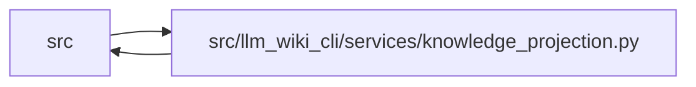

# knowledge_projection Module

**Path:** `src/llm_wiki_cli/services/knowledge_projection.py`

## Description

Safe, deterministic projections over one validated knowledge read view.

The native knowledge index is repository-sensitive.  This module is the only
boundary that turns it into exporter-facing data.  Projection is pure over a
supplied :class:`KnowledgeReadView`: it performs no file reads, source
discovery, extraction, governance mutation, subprocess work, or network I/O.

The ``public-portable`` profile is deliberately allowlist-only.  Unknown
extensions, actors, producer details, raw evidence, source coordinates, remote
identities, and non-parity hashes are never visited while constructing it.

## Imports

| Source | Symbols |
|--------|---------|
| `.concept_identity` | `ConceptIdentityError`, `validate_bundle_id`, `validate_concept_uid` |
| `.contracts` | `GOVERNANCE_EXTENSION_KEY`, `GOVERNANCE_HASH_EXTENSION_KEY`, `SECTION_OWNERSHIP_EXTENSION_KEY`, `TYPED_GRAPH_EXTENSION_KEY` |
| `.knowledge_artifacts` | `validate_knowledge_artifacts` |
| `.knowledge_consumption` | `KnowledgeAvailability`, `KnowledgeReadView`, `MachineVerificationAvailability` |
| `.knowledge_envelope` | `KnowledgeEnvelopeError`, `validate_configured_public_identity` |
| `.knowledge_evidence` | `sha256_bytes` |
| `.knowledge_freshness` | `KNOWN_FRESHNESS_REASON_CODES`, `REASON_RECORDED_BASIS_MATCHES_LIVE_EVALUATION` |
| `.knowledge_governance` | `validate_governance_projection` |
| `.knowledge_graph` | `CORE_RELATIONSHIP_KINDS`, `ENDPOINT_KINDS`, `GRAPH_EVIDENCE_STATES`, `GRAPH_ORIGINS`, `GRAPH_RESOLUTIONS`, `typed_graph_from_knowledge_extensions` |
| `.knowledge_model` | `ActorKind`, `ConceptKind`, `ConceptRecord`, `ComputedFreshness`, `EVALUATED_REVISION_PATTERN`, `EvidenceState`, `KnowledgeIndex`, `KnowledgeProjectionProfile`, `Lifecycle`, `LIMITATION_CODE_PATTERN`, `ObservationScope`, `Origin`, `REPOSITORY_IDENTITY_SOURCE_EXTENSION`, `RepositoryIdentitySource`, `Verification`, `WorkingTreeState`, `serialize_knowledge_index` |
| `.knowledge_observability` | `UNEVALUATED_FRESHNESS_DISCLOSURE`, `knowledge_freshness_disclosure`, `knowledge_freshness_hint` |
| `.redaction` | `CREDENTIAL_VALUE_RE`, `PROJECTION_URI_USERINFO_RE`, `SENSITIVE_KEY_RE` |
| `.validation` | `require_bool`, `require_choice`, `require_exact_fields`, `require_mapping`, `require_nonnegative_int`, `require_portable_relative_path`, `require_positive_int`, `require_sequence`, `require_sha256` |
| `.wiki_surface` | `PageKind`, `SurfaceRole` |
| `__future__` | `annotations` |
| `collections.abc` | `Mapping`, `Sequence` |
| `dataclasses` | `dataclass` |
| `enum` | `Enum` |
| `json` | `json` |
| `math` | `math` |
| `re` | `re` |
| `types` | `MappingProxyType` |
| `typing` | `Any`, `NoReturn` |

## Local dependency map

<!-- Auto-generated local dependency summary. Do not edit by hand. -->

> Module-level dependencies exceed the generated-diagram limits, so the diagram and table below group them by top-level package. Counts report the number of module neighbors in each package.

### Internal neighbors

| Direction | Module |
|---|---|
| Inbound | `src` (5) |
| Outbound | `src` (14) |

> All 19 module neighbor(s) are summarized by package because the module-level view exceeds the 12-node limit.

## Classes

| Class | Line | Bases | Description |
|-------|------|-------|-------------|
| [KnowledgeProjectionError](../entities/KnowledgeProjectionError.md) | 196 | `ValueError` | Stable failure at the validated projection boundary. |
| [KnowledgeProjection](../entities/KnowledgeProjection.md) | 207 | — | One deterministic exporter-facing projection. |

## Functions

| Function | Signature | Decorators | Description |
|----------|-----------|------------|-------------|
| `project_knowledge` | `(view: KnowledgeReadView, *, profile: KnowledgeProjectionProfile \| str = KnowledgeProjectionProfile.PUBLIC_PORTABLE, relationship_limit: int = DEFAULT_RELATIONSHIP_LIMIT, public_repository_identity: str \| None = None) -> KnowledgeProjection` | — | Build an allowlisted projection from one validated read session. |
| `serialize_knowledge_projection` | `(projection: KnowledgeProjection) -> str` | — | Serialize a projection deterministically with one trailing newline. |
| `projection_json_value` | `(value: object) -> Any` | — | Detach one deeply frozen projection value for JSON-only consumers. |
| `projection_concept_summary` | `(projection: KnowledgeProjection, canonical_path: str) -> dict[str, str]` | — | Flatten the documented safe concept subset for Markdown front matter. |
| `_projection_concept_summary_unchecked` | `(projection: KnowledgeProjection, canonical_path: str) -> dict[str, str]` | — | — |
| `validate_projection_summaries` | `(projection: KnowledgeProjection, canonical_paths: Sequence[str]) -> dict[str, dict[str, str]]` | — | Validate one projection for an exact derived-output page set. |
| `_validate_projection_structure` | `(projection: KnowledgeProjection) -> None` | — | Validate the complete safe projection wire shape without governance policy. |
| `_validate_projection_diagnostics` | `(projection: KnowledgeProjection) -> None` | — | — |
| `_validate_projection_bundle` | `(bundle: Mapping[str, Any], profile: KnowledgeProjectionProfile) -> str` | — | — |
| `_validate_projection_producer` | `(producer: Mapping[str, Any]) -> None` | — | — |
| `_validate_projection_concept` | `(concept: Mapping[str, Any], *, path: str, bundle_id: str, profile: KnowledgeProjectionProfile) -> None` | — | — |
| `_validate_projection_identity` | `(identity: Mapping[str, Any], *, path: str, bundle_id: str) -> None` | — | — |
| `_validate_projection_lifecycle` | `(lifecycle: Mapping[str, Any], *, path: str, bundle_id: str, profile: KnowledgeProjectionProfile) -> None` | — | — |
| `_validate_projection_evidence` | `(evidence: Mapping[str, Any], *, path: str, profile: KnowledgeProjectionProfile) -> None` | — | — |
| `_validate_projection_freshness` | `(freshness: Mapping[str, Any], *, path: str) -> None` | — | — |
| `_validate_projection_review` | `(review: Mapping[str, Any], *, path: str, profile: KnowledgeProjectionProfile) -> None` | — | — |
| `_validate_review_reasons` | `(value: object, path: str) -> tuple[str, ...]` | — | — |
| `_validate_projection_machine_check` | `(machine: Mapping[str, Any], *, path: str) -> None` | — | — |
| `_validate_projection_relationships` | `(relationships: Mapping[str, Any], *, path: str, profile: KnowledgeProjectionProfile, concepts: Mapping[str, Mapping[str, Any]]) -> None` | — | — |
| `_validate_projection_relationship` | `(relation: Mapping[str, Any], *, path: str, profile: KnowledgeProjectionProfile, concepts: Mapping[str, Mapping[str, Any]]) -> None` | — | — |
| `_validate_projection_target` | `(target: Mapping[str, Any], *, path: str, profile: KnowledgeProjectionProfile, resolution: str, concepts: Mapping[str, Mapping[str, Any]]) -> None` | — | — |
| `_validate_actor` | `(actor: Mapping[str, Any], path: str, *, allow_unknown: bool) -> None` | — | — |
| `_validate_concept_kind` | `(value: object, path: str, profile: KnowledgeProjectionProfile) -> None` | — | — |
| `_validate_safe_json_value` | `(value: object, path: str, *, depth: int = 0) -> None` | — | — |
| `_require_mapping` | `(value: object, path: str) -> Mapping[str, Any]` | — | — |
| `_require_sequence` | `(value: object, path: str) -> Sequence[Any]` | — | — |
| `_require_exact_fields` | `(value: Mapping[str, Any], path: str, required: set[str], *, optional: set[str] \| frozenset[str] = frozenset()) -> None` | — | — |
| `_require_safe_text` | `(value: object, path: str) -> str` | — | — |
| `_require_canonical_path` | `(value: object, path: str) -> str` | — | — |
| `_require_relative_path` | `(value: object, path: str) -> str` | — | — |
| `_require_enum` | `(value: object, values: set[str] \| frozenset[str], path: str) -> str` | — | — |
| `_require_bool` | `(value: object, path: str) -> bool` | — | — |
| `_require_nonnegative_int` | `(value: object, path: str) -> int` | — | — |
| `_require_positive_int` | `(value: object, path: str) -> int` | — | — |
| `_require_sha256` | `(value: object, path: str, *, code: str = 'projection-shape-invalid') -> str` | — | — |
| `_require_machine_code` | `(value: object, path: str) -> str` | — | — |
| `_shape_error` | `(path: str, message: str) -> NoReturn` | — | — |
| `_validated_source` | `(view: KnowledgeReadView) -> tuple[KnowledgeIndex, str]` | — | — |
| `_project_bundle` | `(knowledge: KnowledgeIndex, *, bundle_id: str, profile: KnowledgeProjectionProfile, approved_public_identity: str \| None, omitted: dict[str, int]) -> dict[str, Any]` | — | — |
| `_project_producer` | `(knowledge: KnowledgeIndex, *, omitted: dict[str, int]) -> dict[str, Any]` | — | — |
| `_project_concept` | `(concept: ConceptRecord, *, view: KnowledgeReadView, bundle_id: str, governance: Mapping[str, Any] \| None, relationships: Mapping[str, Any], profile: KnowledgeProjectionProfile, omitted: dict[str, int]) -> dict[str, Any]` | — | — |
| `_project_freshness` | `(concept: ConceptRecord, view: KnowledgeReadView) -> dict[str, Any]` | — | — |
| `_project_review` | `(governance: Mapping[str, Any] \| None, *, profile: KnowledgeProjectionProfile, omitted: dict[str, int]) -> dict[str, Any]` | — | — |
| `_project_machine_check` | `(concept: ConceptRecord, view: KnowledgeReadView) -> dict[str, Any]` | — | — |
| `_machine_check_counts` | `(checks: Mapping[str, Mapping[str, Any]]) -> dict[str, int]` | — | — |
| `_project_relationships` | `(knowledge: KnowledgeIndex, *, concepts_by_locator: Mapping[str, ConceptRecord], concepts_by_uid: Mapping[str, ConceptRecord], bundle_id: str, profile: KnowledgeProjectionProfile, limit: int, omitted: dict[str, int]) -> tuple[dict[str, Mapping[str, Any]], bool]` | — | — |
| `_project_relation` | `(edge: Mapping[str, Any], *, direction: str, endpoint: Mapping[str, Any], related: ConceptRecord \| None, bundle_id: str, profile: KnowledgeProjectionProfile, omitted: dict[str, int]) -> dict[str, Any]` | — | — |
| `_project_endpoint` | `(endpoint: Mapping[str, Any], *, related: ConceptRecord \| None, resolution: str, bundle_id: str, profile: KnowledgeProjectionProfile, omitted: dict[str, int]) -> dict[str, Any]` | — | — |
| `_endpoint_concept` | `(endpoint: Mapping[str, Any], concepts_by_locator: Mapping[str, ConceptRecord], concepts_by_uid: Mapping[str, ConceptRecord]) -> ConceptRecord \| None` | — | — |
| `_empty_relationships` | `(available: bool, limit: int) -> Mapping[str, Any]` | — | — |
| `_projection_warnings` | `(concepts: Mapping[str, Mapping[str, Any]], *, graph_available: bool, governance_available: bool, omitted: Mapping[str, int]) -> tuple[str, ...]` | — | — |
| `_initial_omitted_counts` | `(knowledge: KnowledgeIndex, profile: KnowledgeProjectionProfile) -> dict[str, int]` | — | — |
| `_unknown_extension_count` | `(knowledge: KnowledgeIndex) -> int` | — | — |
| `_project_unknown_extensions` | `(extensions: Mapping[str, Any], *, omitted: dict[str, int]) -> dict[str, Any]` | — | — |
| `_safe_internal_value` | `(key: str, value: Any, omitted: dict[str, int]) -> Any` | — | — |
| `_safe_internal_scalar` | `(key: str, value: str, omitted: dict[str, int]) -> str \| None` | — | — |
| `_project_actor` | `(actor: Any, *, omitted: dict[str, int]) -> dict[str, Any]` | — | — |
| `_governance_summary` | `(concept: ConceptRecord) -> Mapping[str, Any] \| None` | — | — |
| `_namespaced_uid` | `(bundle_id: str, uid: str) -> str` | — | — |
| `_approved_public_repository_identity` | `(knowledge: KnowledgeIndex, profile: KnowledgeProjectionProfile, requested: str \| None) -> str \| None` | — | — |
| `_project_concept_kind` | `(value: object, *, profile: KnowledgeProjectionProfile, omitted: dict[str, int]) -> str` | — | — |
| `_project_relationship_kind` | `(value: object, *, profile: KnowledgeProjectionProfile, omitted: dict[str, int]) -> str` | — | — |
| `_actor_has_identity` | `(value: object) -> bool` | — | — |
| `_projection_profile` | `(value: KnowledgeProjectionProfile \| str) -> KnowledgeProjectionProfile` | — | — |
| `_relationship_limit` | `(value: object) -> int` | — | — |
| `_mapping` | `(value: object) -> Mapping[str, Any]` | — | — |
| `_wire` | `(value: object) -> str` | — | — |
| `_nonnegative_int` | `(value: object, *, fallback: int = 0) -> int` | — | — |
| `_deep_freeze` | `(value: object, path: str, *, _active: set[int] \| None = None) -> Any` | — | Return a detached, recursively immutable JSON-compatible value. |
| `_json_copy` | `(value: object) -> Any` | — | — |
| `_boolean_text` | `(value: bool) -> str` | — | — |
