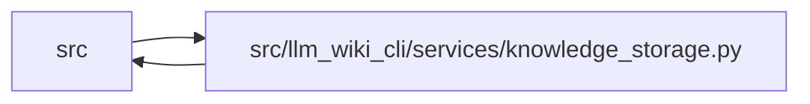

# knowledge_storage Module

**Path:** `src/llm_wiki_cli/services/knowledge_storage.py`

## Description

Encodes the logical native knowledge model as a bounded root and immutable JSON objects. Owner-based partitions, shared descriptors and indexed references preserve identities and repeated observations. Full reads reconstruct and audit the complete model; selected reads validate consumed records and disclose unverified scope. Byte, object and expansion limits reject incomplete data without claiming full validity.

## Imports

| Source | Symbols |
|--------|---------|
| `.canonical_json` | `canonical_chunks`, `scalar_size` |
| `.contracts` | `SECTION_OWNERSHIP_EXTENSION_KEY`, `TYPED_GRAPH_EXTENSION_KEY`, `GOVERNANCE_EXTENSION_KEY` |
| `.knowledge_envelope` | `INVENTORY_HASH_EXTENSION` |
| `.knowledge_governance` | `natural_key_for` |
| `.knowledge_graph` | `validate_typed_graph_slice`, `_normalise_edge` |
| `.knowledge_model` | `_parse_bundle`, `_parse_concept`, `_parse_relationship`, `_parse_extensions` |
| `.section_ownership` | `validate_section_ownership` |
| `__future__` | `annotations` |
| `collections` | `Counter`, `defaultdict` |
| `collections.abc` | `MutableMapping`, `Callable`, `Iterable`, `Mapping` |
| `dataclasses` | `dataclass`, `field` |
| `hashlib` | `hashlib` |
| `json` | `json` |
| `re` | `re` |
| `typing` | `Any`, `NoReturn` |

## Local dependency map

<!-- Auto-generated local dependency summary. Do not edit by hand. -->

> Module-level dependencies exceed the generated-diagram limits, so the diagram and table below group them by top-level package. Counts report the number of module neighbors in each package.

### Internal neighbors

| Direction | Module |
|---|---|
| Inbound | `src` (16) |
| Outbound | `src` (7) |

> All 23 module neighbor(s) are summarized by package because the module-level view exceeds the 12-node limit.

## Classes

| Class | Line | Bases | Description |
|-------|------|-------|-------------|
| [KnowledgeStorageError](../entities/KnowledgeStorageError.md) | 45 | `ValueError` | A storage contract, integrity or bounded-work failure. |
| [KnowledgeStorePlan](../entities/KnowledgeStorePlan.md) | 179 | — | — |
| [_Encoder](../entities/Encoder.md) | 186 | — | — |
| [_TreeBuilder](../entities/TreeBuilder.md) | 212 | — | — |
| [KnowledgeSlice](../entities/KnowledgeSlice.md) | 456 | — | Detached scoped data; deliberately not ValidatedKnowledgeArtifacts. |
| [KnowledgeStoreReader](../entities/KnowledgeStoreReader.md) | 465 | — | Read committed objects through a caller-owned bounded I/O boundary. |

## Functions

| Function | Signature | Decorators | Description |
|----------|-----------|------------|-------------|
| `canonical_bytes` | `(value: Any) -> bytes` | — | — |
| `digest` | `(data: bytes) -> str` | — | — |
| `logical_digest` | `(value: Any) -> str` | — | Hash logical JSON without allocating a second monolithic serialization. |
| `_fail` | `(field: str, message: str, code: str = 'storage-invalid') -> NoReturn` | — | — |
| `_fields` | `(value: Any, names: set[str], field: str) -> dict[str, Any]` | — | — |
| `_integer` | `(value: Any, field: str, maximum: int, minimum: int = 0) -> int` | — | — |
| `_text` | `(value: Any, field: str, maximum: int = 16384) -> str` | — | — |
| `_hash` | `(value: Any, field: str) -> str` | — | — |
| `_unique` | `(pairs: list[tuple[str, Any]]) -> dict[str, Any]` | — | — |
| `decode_bytes` | `(raw: bytes, *, limit: int, field: str) -> dict[str, Any]` | — | — |
| `object_path` | `(commitment: str) -> str` | — | — |
| `_descriptor` | `(value: Any, field: str) -> dict[str, Any]` | — | — |
| `_route` | `(owner: str, record_id: str) -> str` | — | — |
| `_owner` | `(concept: Mapping[str, Any]) -> str` | — | — |
| `_node_aliases` | `(node: Any) -> set[str]` | — | — |
| `_concept_aliases` | `(concept: Mapping[str, Any]) -> set[str]` | — | — |
| `build_knowledge_store` | `(payload: Mapping[str, Any], *, target_bytes: int = TARGET_OBJECT_BYTES, objects = None) -> KnowledgeStorePlan` | — | Encode a canonical logical v1 payload after its semantic validation. |
| `parse_store_root` | `(raw: bytes) -> dict[str, Any]` | — | — |
| `_validate_selected_record` | `(collection: str, row: dict[str, Any], value: Any) -> None` | — | Reuse semantic record owners without issuing a whole-bundle verdict. |