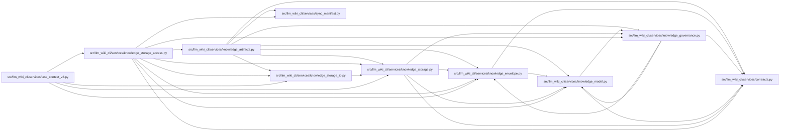

# knowledge_storage_access Module

**Path:** `src/llm_wiki_cli/services/knowledge_storage_access.py`

## Description

Captures the committed root, sync manifest, selected objects and the Markdown pages supporting selected concepts. Governance identities, aliases and lifecycle are compared with the committed ledger. The returned scoped read requires a final recheck and never stands for validation of unread objects or live source behavior.

## Imports

| Source | Symbols |
|--------|---------|
| `.contracts` | `GOVERNANCE_EXTENSION_KEY` |
| `.knowledge_artifacts` | `_decode_json_object` |
| `.knowledge_envelope` | `EvaluatedEnvelope` |
| `.knowledge_governance` | `GOVERNANCE_FILENAME`, `parse_governance_ledger`, `lifecycle_state_by_uid`, `natural_key_for` |
| `.knowledge_model` | `_parse_bundle` |
| `.knowledge_storage` | `MAX_EXPANDED_BYTES`, `MAX_OBJECT_BYTES`, `MAX_ROOT_BYTES`, `ROOT_FILENAME`, `STORE_SCHEMA`, `KnowledgeSlice`, `KnowledgeStorageError`, `KnowledgeStoreReader`, `digest` |
| `.knowledge_storage_io` | `StorageReadSession` |
| `.sync_manifest` | `MANIFEST_FILENAME`, `SyncManifest` |
| `__future__` | `annotations` |
| `collections.abc` | `Iterable` |
| `dataclasses` | `dataclass`, `field` |
| `json` | `json` |
| `pathlib` | `Path` |
| `typing` | `Any` |

## Local dependency map

<!-- Auto-generated local dependency summary. Do not edit by hand. -->

### Internal neighbors

| Direction | Module |
|---|---|
| Inbound | [task_context_v2](../modules/task_context_v2.md) |
| Outbound | [services_contracts](../modules/services_contracts.md) |
| Outbound | [knowledge_artifacts](../modules/knowledge_artifacts.md) |
| Outbound | [knowledge_envelope](../modules/knowledge_envelope.md) |
| Outbound | [knowledge_governance](../modules/knowledge_governance.md) |
| Outbound | [knowledge_model](../modules/knowledge_model.md) |
| Outbound | [knowledge_storage](../modules/knowledge_storage.md) |
| Outbound | [knowledge_storage_io](../modules/knowledge_storage_io.md) |
| Outbound | [sync_manifest](../modules/sync_manifest.md) |

## Classes

| Class | Line | Bases | Description |
|-------|------|-------|-------------|
| [ScopedKnowledgeRead](../entities/ScopedKnowledgeRead.md) | 26 | — | Request-owned observations that require a final authoritative recheck. |

## Functions

| Function | Signature | Decorators | Description |
|----------|-----------|------------|-------------|
| `capture_knowledge_slice` | `(wiki_dir: str \| Path, selectors: Iterable[str], *, max_bytes: int = 8388608, max_records: int = 1000, max_expanded_bytes: int = 16777216, include_graph: bool = False) -> ScopedKnowledgeRead` | — | Capture selected stored observations without enumerating the wiki tree. |