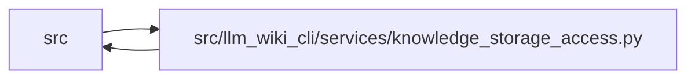

# knowledge_storage_access Module

**Path:** `src/llm_wiki_cli/services/knowledge_storage_access.py`

## Description

Captures selected knowledge records, their Markdown and required governance observations through guarded filesystem reads. Manifest v6 uses the committed header and necessary policy catalogs; legacy manifests retain complete parsing. The owning request performs final rechecks before publishing a result, and unread records remain outside the validated scope.

Read the knowledge root and committed manifest policy, verify generation commitments, then resolve the requested records and required authority. Manifest v6 leaves unrelated source and page catalogs unread. The caller must run the final guarded recheck before using the selected result.

## Imports

| Source | Symbols |
|--------|---------|
| `.contracts` | `GOVERNANCE_EXTENSION_KEY` |
| `.knowledge_artifacts` | `_decode_json_object` |
| `.knowledge_envelope` | `EvaluatedEnvelope` |
| `.knowledge_governance` | `GOVERNANCE_FILENAME`, `parse_governance_ledger`, `lifecycle_state_by_uid`, `natural_key_for` |
| `.knowledge_model` | `_parse_bundle` |
| `.knowledge_packs` | `PACKED_SCHEMAS`, `open_knowledge_store` |
| `.knowledge_storage` | `MAX_EXPANDED_BYTES`, `MAX_OBJECT_BYTES`, `MAX_ROOT_BYTES`, `ROOT_FILENAME`, `STORE_SCHEMA`, `KnowledgeSlice`, `KnowledgeStorageError`, `KnowledgeStoreReader`, `digest` |
| `.knowledge_storage_io` | `StorageReadSession` |
| `.manifest_storage` | `ValidatedManifestHeader`, `read_manifest_header` |
| `.sync_manifest` | `MANIFEST_FILENAME` |
| `__future__` | `annotations` |
| `collections.abc` | `Iterable` |
| `dataclasses` | `dataclass`, `field` |
| `json` | `json` |
| `pathlib` | `Path` |
| `typing` | `Any` |

## Local dependency map

<!-- Auto-generated local dependency summary. Do not edit by hand. -->

> Module-level dependencies exceed the generated-diagram limits, so the diagram and table below group them by top-level package. Counts report the number of module neighbors in each package.

### Internal neighbors

| Direction | Module |
|---|---|
| Inbound | `src` (2) |
| Outbound | `src` (10) |

> All 12 module neighbor(s) are summarized by package because the module-level view exceeds the 12-node limit.

## Classes

| Class | Line | Bases | Description |
|-------|------|-------|-------------|
| [ScopedKnowledgeRead](../entities/ScopedKnowledgeRead.md) | 28 | — | Request-owned observations that require a final authoritative recheck. |

## Functions

| Function | Signature | Decorators | Description |
|----------|-----------|------------|-------------|
| `capture_knowledge_slice` | `(wiki_dir: str \| Path, selectors: Iterable[str], *, max_bytes: int = 8388608, max_records: int = 1000, max_expanded_bytes: int = 16777216, include_graph: bool = False, collections: Iterable[str] \| None = None, coalesce_rechecks: bool = False, cancelled = None) -> ScopedKnowledgeRead` | — | Capture selected stored observations without enumerating the wiki tree. |
| `_capture_slice` | `(session, keys, max_bytes, max_records, max_expanded_bytes, include_graph, collections)` | — | — |