# knowledge_storage_cmd Module

**Path:** `src/llm_wiki_cli/commands/knowledge_storage_cmd.py`

## Description

Adapts explicit storage commands to the shared lifecycle and diagnostic services. Migration and recovery offer previews, cleanup defaults to preview, and JSON output keeps unusual paths escaped. Failed checks produce a nonzero exit status without exposing a partially successful result.

## Imports

| Source | Symbols |
|--------|---------|
| `..services.knowledge_storage_diagnostics` | `storage_report` |
| `..services.knowledge_storage_lifecycle` | `migrate_knowledge_storage`, `recover_knowledge_storage`, `export_knowledge_v1`, `prune_knowledge_storage` |
| `.knowledge_cmd` | `_wiki_root` |
| `__future__` | `annotations` |
| `json` | `json` |

## Local dependency map

```mermaid
flowchart LR
    n0["src/llm_wiki_cli/commands/knowledge_cmd.py"]
    n1["src/llm_wiki_cli/commands/knowledge_storage_cmd.py"]
    n2["src/llm_wiki_cli/services/knowledge_storage_diagnostics.py"]
    n3["src/llm_wiki_cli/services/knowledge_storage_lifecycle.py"]
    n0 --> n1
    n1 --> n0
    n1 --> n2
    n1 --> n3
    n2 --> n3
    click n0 "../modules/knowledge_cmd.md"
    click n1 "../modules/knowledge_storage_cmd.md"
    click n2 "../modules/knowledge_storage_diagnostics.md"
    click n3 "../modules/knowledge_storage_lifecycle.md"
```

<!-- Auto-generated local dependency summary. Do not edit by hand. -->

### Internal neighbors

| Direction | Module |
|---|---|
| Inbound | [knowledge_cmd](../modules/knowledge_cmd.md) |
| Outbound | [knowledge_cmd](../modules/knowledge_cmd.md) |
| Outbound | [knowledge_storage_diagnostics](../modules/knowledge_storage_diagnostics.md) |
| Outbound | [knowledge_storage_lifecycle](../modules/knowledge_storage_lifecycle.md) |

## Functions

| Function | Signature | Decorators | Description |
|----------|-----------|------------|-------------|
| `run` | `(args) -> None` | — | — |