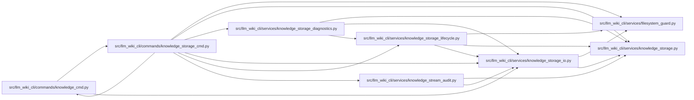

# knowledge_storage_cmd Module

**Path:** `src/llm_wiki_cli/commands/knowledge_storage_cmd.py`

## Description

Adapts explicit storage migration, recovery, export, cleanup, diagnostics and logical review operations to the CLI. It delegates validation and mutation to their owning services, emits structured output and preserves explicit adoption and failure reporting. Logical inspection and comparison use bounded compact JSON output.

## Imports

| Source | Symbols |
|--------|---------|
| `..services.filesystem_guard` | `atomic_write_guarded_bytes`, `ensure_guarded_directory` |
| `..services.knowledge_storage` | `decode_bytes`, `canonical_bytes`, `MAX_OBJECT_BYTES` |
| `..services.knowledge_storage_diagnostics` | `storage_report`, `review_storage` |
| `..services.knowledge_storage_io` | `read_guarded` |
| `..services.knowledge_storage_lifecycle` | `migrate_knowledge_storage`, `recover_knowledge_storage`, `export_knowledge_v1`, `prune_knowledge_storage`, `restore_pruned_storage`, `_outside_tree` |
| `..services.knowledge_stream_audit` | `audit_knowledge_stream` |
| `.knowledge_cmd` | `_wiki_root` |
| `__future__` | `annotations` |
| `json` | `json` |
| `pathlib` | `Path` |

## Local dependency map

<!-- Auto-generated local dependency summary. Do not edit by hand. -->

### Internal neighbors

| Direction | Module |
|---|---|
| Inbound | [knowledge_cmd](../modules/knowledge_cmd.md) |
| Outbound | [knowledge_cmd](../modules/knowledge_cmd.md) |
| Outbound | [filesystem_guard](../modules/filesystem_guard.md) |
| Outbound | [knowledge_storage](../modules/knowledge_storage.md) |
| Outbound | [knowledge_storage_diagnostics](../modules/knowledge_storage_diagnostics.md) |
| Outbound | [knowledge_storage_io](../modules/knowledge_storage_io.md) |
| Outbound | [knowledge_storage_lifecycle](../modules/knowledge_storage_lifecycle.md) |
| Outbound | [knowledge_stream_audit](../modules/knowledge_stream_audit.md) |

## Functions

| Function | Signature | Decorators | Description |
|----------|-----------|------------|-------------|
| `run` | `(args) -> None` | — | — |