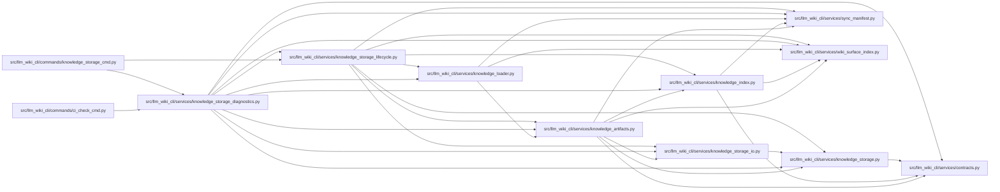

# knowledge_storage_diagnostics Module

**Path:** `src/llm_wiki_cli/services/knowledge_storage_diagnostics.py`

## Description

Reports native artifact sizes and optional full snapshot integrity. Explicit Git range checks inspect every reachable outgoing blob, including historical versions absent from the latest tree. The checks have bounded output and time, require complete local history, and perform no fetch, hook installation or push.

## Imports

| Source | Symbols |
|--------|---------|
| `.contracts` | `TYPED_GRAPH_EXTENSION_KEY`, `SECTION_OWNERSHIP_EXTENSION_KEY` |
| `.knowledge_artifacts` | `validated_artifact_bytes` |
| `.knowledge_index` | `_model_to_payload` |
| `.knowledge_loader` | `load_knowledge_state` |
| `.knowledge_storage` | `GIT_FAILURE_BYTES`, `GIT_WARNING_BYTES`, `MAX_EXPANDED_BYTES`, `MAX_OBJECT_BYTES`, `MAX_ROOT_BYTES`, `ROOT_FILENAME`, `STORE_SCHEMA`, `KnowledgeStorageError`, `canonical_bytes`, `parse_store_root` |
| `.knowledge_storage_io` | `_absolute_path`, `read_guarded` |
| `.knowledge_storage_lifecycle` | `stored_object_paths` |
| `.sync_manifest` | `MANIFEST_FILENAME` |
| `.wiki_surface_index` | `SURFACE_INDEX_FILENAME` |
| `__future__` | `annotations` |
| `heapq` | `heapq` |
| `json` | `json` |
| `os` | `os` |
| `pathlib` | `Path` |
| `re` | `re` |
| `subprocess` | `subprocess` |
| `threading` | `Event`, `Thread` |
| `typing` | `Any` |

## Local dependency map

<!-- Auto-generated local dependency summary. Do not edit by hand. -->

### Internal neighbors

| Direction | Module |
|---|---|
| Inbound | [ci_check_cmd](../modules/ci_check_cmd.md) |
| Inbound | [knowledge_storage_cmd](../modules/knowledge_storage_cmd.md) |
| Outbound | [services_contracts](../modules/services_contracts.md) |
| Outbound | [knowledge_artifacts](../modules/knowledge_artifacts.md) |
| Outbound | [knowledge_index](../modules/knowledge_index.md) |
| Outbound | [knowledge_loader](../modules/knowledge_loader.md) |
| Outbound | [knowledge_storage](../modules/knowledge_storage.md) |
| Outbound | [knowledge_storage_io](../modules/knowledge_storage_io.md) |
| Outbound | [knowledge_storage_lifecycle](../modules/knowledge_storage_lifecycle.md) |
| Outbound | [sync_manifest](../modules/sync_manifest.md) |
| Outbound | [wiki_surface_index](../modules/wiki_surface_index.md) |

## Functions

| Function | Signature | Decorators | Description |
|----------|-----------|------------|-------------|
| `_git` | `(root: Path, arguments: list[str], *, input_bytes: bytes \| None = None, maximum: int = 16777216) -> tuple[int, bytes]` | — | Drain both pipes with hard byte/time bounds; never invoke a shell. |
| `inspect_git_range` | `(project: str \| Path, *, base: str, head: str) -> dict[str, Any]` | — | Inspect every blob in head minus base, including subsequently deleted files. |
| `storage_report` | `(wiki_dir: str \| Path, *, full: bool = False, git_base: str \| None = None, git_head: str \| None = None) -> dict[str, Any]` | — | — |