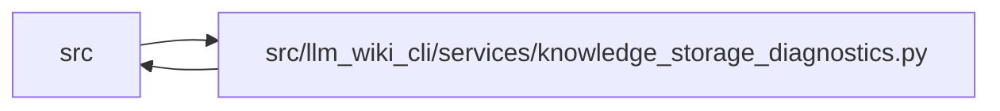

# knowledge_storage_diagnostics Module

**Path:** `src/llm_wiki_cli/services/knowledge_storage_diagnostics.py`

## Description

Reports physical sizes and complete integrity through one native materialization, using statistics captured during that validation. Logical inspection and comparison retain full snapshot validation by default. Explicit selectors provide a separate scoped inspection whose output names its narrower validation boundary.

## Imports

| Source | Symbols |
|--------|---------|
| `.contracts` | `TYPED_GRAPH_EXTENSION_KEY`, `SECTION_OWNERSHIP_EXTENSION_KEY` |
| `.knowledge_artifacts` | `validated_artifact_bytes` |
| `.knowledge_index` | `_model_to_payload` |
| `.knowledge_loader` | `load_knowledge_state` |
| `.knowledge_model` | `_concept_to_payload`, `_relationship_to_payload` |
| `.knowledge_packs` | `PACKED_SCHEMA`, `PACK_NAME`, `INDEX_NAME`, `MAX_PACK_BYTES`, `MAX_INDEX_BYTES`, `parse_packed_root` |
| `.knowledge_storage` | `GIT_FAILURE_BYTES`, `GIT_WARNING_BYTES`, `MAX_EXPANDED_BYTES`, `MAX_OBJECT_BYTES`, `MAX_ROOT_BYTES`, `ROOT_FILENAME`, `STORE_SCHEMA`, `KnowledgeStorageError`, `canonical_bytes`, `parse_store_root`, `digest`, `digest` |
| `.knowledge_storage_access` | `capture_knowledge_slice` |
| `.knowledge_storage_io` | `_absolute_path`, `read_guarded` |
| `.knowledge_storage_lifecycle` | `stored_object_paths` |
| `.manifest_storage` | `OBJECT_NAME`, `OBJECT_LIMIT` |
| `.sync_manifest` | `MANIFEST_FILENAME` |
| `.wiki_surface_index` | `SURFACE_INDEX_FILENAME` |
| `__future__` | `annotations` |
| `heapq` | `heapq` |
| `json` | `json` |
| `os` | `os` |
| `pathlib` | `Path` |
| `re` | `re` |
| `subprocess` | `subprocess` |
| `threading` | `Event`, `Thread` |
| `typing` | `Any` |

## Local dependency map

<!-- Auto-generated local dependency summary. Do not edit by hand. -->

> Module-level dependencies exceed the generated-diagram limits, so the diagram and table below group them by top-level package. Counts report the number of module neighbors in each package.

### Internal neighbors

| Direction | Module |
|---|---|
| Inbound | `src` (2) |
| Outbound | `src` (13) |

> All 15 module neighbor(s) are summarized by package because the module-level view exceeds the 12-node limit.

## Functions

| Function | Signature | Decorators | Description |
|----------|-----------|------------|-------------|
| `_git` | `(root: Path, arguments: list[str], *, input_bytes: bytes \| None = None, maximum: int = 16777216) -> tuple[int, bytes]` | — | Drain both pipes with hard byte/time bounds; never invoke a shell. |
| `inspect_git_range` | `(project: str \| Path, *, base: str, head: str) -> dict[str, Any]` | — | Inspect every blob in head minus base, including subsequently deleted files. |
| `storage_report` | `(wiki_dir: str \| Path, *, full: bool = False, git_base: str \| None = None, git_head: str \| None = None) -> dict[str, Any]` | — | — |
| `_review_records` | `(wiki_dir: str \| Path) -> dict[str, Any]` | — | Logical review keys preserve duplicates and avoid physical pack identities. |
| `review_storage` | `(wiki_dir: str \| Path, *, against: str \| Path \| None = None, limit: int = 100, max_bytes: int = 262144, selectors = None) -> dict[str, Any]` | — | Inspect or compare complete logical snapshots with explicitly bounded output. |