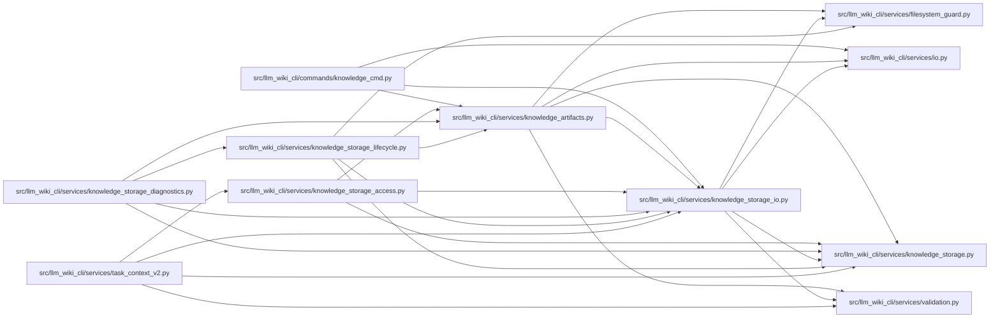

# knowledge_storage_io Module

**Path:** `src/llm_wiki_cli/services/knowledge_storage_io.py`

## Description

Reads native storage through guarded regular files and retained directory identities. Each request records exact bytes and filesystem observations, charges rereads to its budget and rejects replacement or content changes. Platform guards prevent following redirected paths; a final authoritative reread is separate from a cache hit.

## Imports

| Source | Symbols |
|--------|---------|
| `.filesystem_guard` | `guard_windows_directory_chain`, `open_windows_readonly_file` |
| `.io` | `first_unsafe_path_component` |
| `.knowledge_storage` | `KnowledgeStorageError`, `MAX_EXPANDED_BYTES` |
| `.validation` | `is_portable_relative_path` |
| `__future__` | `annotations` |
| `contextlib` | `ExitStack` |
| `dataclasses` | `dataclass` |
| `os` | `os` |
| `pathlib` | `Path` |
| `stat` | `stat` |
| `typing` | `Any` |

## Local dependency map

<!-- Auto-generated local dependency summary. Do not edit by hand. -->

### Internal neighbors

| Direction | Module |
|---|---|
| Inbound | [knowledge_cmd](../modules/knowledge_cmd.md) |
| Inbound | [knowledge_artifacts](../modules/knowledge_artifacts.md) |
| Inbound | [knowledge_storage_access](../modules/knowledge_storage_access.md) |
| Inbound | [knowledge_storage_diagnostics](../modules/knowledge_storage_diagnostics.md) |
| Inbound | [knowledge_storage_lifecycle](../modules/knowledge_storage_lifecycle.md) |
| Inbound | [task_context_v2](../modules/task_context_v2.md) |
| Outbound | [filesystem_guard](../modules/filesystem_guard.md) |
| Outbound | [io](../modules/io.md) |
| Outbound | [knowledge_storage](../modules/knowledge_storage.md) |
| Outbound | [validation](../modules/validation.md) |

## Classes

| Class | Line | Bases | Description |
|-------|------|-------|-------------|
| [ReadObservation](../entities/ReadObservation.md) | 42 | — | — |
| [StorageReadSession](../entities/StorageReadSession.md) | 109 | — | Request-owned file observations, with charged authoritative rechecks. |

## Functions

| Function | Signature | Decorators | Description |
|----------|-----------|------------|-------------|
| `_identity` | `(value: os.stat_result) -> tuple[int, ...]` | — | — |
| `_require_relative_name` | `(relative: str) -> None` | — | — |
| `_absolute_path` | `(path: Path) -> Path` | — | — |
| `read_guarded` | `(path: Path, maximum: int) -> ReadObservation` | — | Read a regular file through pinned/no-follow ancestors and bound its bytes. |