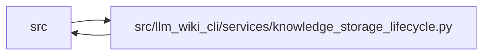

# knowledge_storage_lifecycle Module

**Path:** `src/llm_wiki_cli/services/knowledge_storage_lifecycle.py`

## Description

Owns explicit transitions among supported indexed storage profiles, verified recovery snapshots, bounded v1 export and reachability cleanup. Migration validates complete logical equivalence and preserves authored Markdown and governance. Recovery refuses unrelated generations or changed authority. Cleanup removes recognized checksum-valid inactive objects, indexes and packs only after validating the committed live snapshot.

## Imports

| Source | Symbols |
|--------|---------|
| `.filesystem_guard` | `atomic_write_guarded_bytes`, `ensure_guarded_directory`, `unlink_guarded_bytes` |
| `.knowledge_artifacts` | `ArtifactWriteState`, `KnowledgeCommitPlan`, `PlannedArtifactWrite`, `build_knowledge_commit_plan`, `commit_knowledge_artifacts`, `current_knowledge_format`, `validate_knowledge_artifacts`, `validated_artifact_bytes`, `_commit_sharded` |
| `.knowledge_governance` | `GOVERNANCE_FILENAME`, `governance_lock` |
| `.knowledge_index` | `serialize_knowledge_index` |
| `.knowledge_loader` | `load_knowledge_state` |
| `.knowledge_packs` | `PACKED_SCHEMA`, `PACKED_FORMATS`, `PACK_NAME`, `INDEX_NAME`, `PACK_DIRECTORY`, `PACK_INDEX_DIRECTORY`, `PackedKnowledgeStoreReader`, `inspect_pack` |
| `.knowledge_storage` | `MAX_EXPANDED_BYTES`, `MAX_OBJECT_BYTES`, `OBJECT_DIRECTORY`, `ROOT_FILENAME`, `GIT_FAILURE_BYTES`, `KnowledgeStorageError`, `KnowledgeStoreReader`, `decode_bytes`, `canonical_bytes`, `digest`, `_hash`, `decode_bytes` |
| `.knowledge_storage_io` | `StorageReadSession`, `read_guarded`, `_absolute_path` |
| `.sync_manifest` | `MANIFEST_FILENAME`, `SyncManifest` |
| `.wiki_surface_index` | `SURFACE_INDEX_FILENAME` |
| `__future__` | `annotations` |
| `json` | `json` |
| `os` | `os` |
| `pathlib` | `Path` |
| `re` | `re` |
| `subprocess` | `subprocess` |
| `typing` | `Any` |

## Local dependency map

<!-- Auto-generated local dependency summary. Do not edit by hand. -->

> Module-level dependencies exceed the generated-diagram limits, so the diagram and table below group them by top-level package. Counts report the number of module neighbors in each package.

### Internal neighbors

| Direction | Module |
|---|---|
| Inbound | `src` (2) |
| Outbound | `src` (10) |

> All 12 module neighbor(s) are summarized by package because the module-level view exceeds the 12-node limit.

## Functions

| Function | Signature | Decorators | Description |
|----------|-----------|------------|-------------|
| `_committed_inputs` | `(wiki_dir: str \| Path)` | — | — |
| `_default_recovery_directory` | `(root: Path, root_hash: str) -> Path \| None` | — | — |
| `_outside_tree` | `(directory: Path, root: Path) -> Path` | — | — |
| `_backup` | `(directory: Path, files: dict[str, bytes], target_hash: str) -> None` | — | — |
| `migrate_knowledge_storage` | `(wiki_dir: str \| Path, *, dry_run: bool = False, recovery_dir: str \| Path \| None = None, to: str = 'sharded-v2') -> dict[str, Any]` | — | Explicitly adopt indexed storage, retaining verified recovery bytes outside the wiki. |
| `_read_recovery` | `(directory: Path) -> tuple[dict[str, Any], dict[str, bytes]]` | — | — |
| `recover_knowledge_storage` | `(wiki_dir: str \| Path, recovery_dir: str \| Path, *, dry_run: bool = False) -> dict[str, Any]` | — | Restore an exact interrupted migration; refuse unrelated newer roots. |
| `export_knowledge_v1` | `(wiki_dir: str \| Path, output: str \| Path) -> dict[str, Any]` | — | — |
| `is_storage_path` | `(relative: str) -> bool` | — | — |
| `stored_object_paths` | `(wiki_dir: str \| Path) -> tuple[list[str], list[str]]` | — | Bounded enumeration of the owned two-level object namespace, without links. |
| `prune_knowledge_storage` | `(wiki_dir: str \| Path, *, dry_run: bool = True) -> dict[str, Any]` | — | Remove only valid content-addressed objects unreachable from a full audit. |