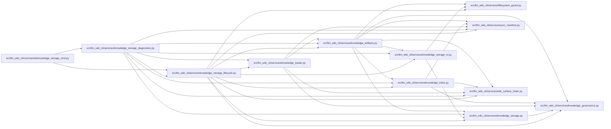

# knowledge_storage_lifecycle Module

**Path:** `src/llm_wiki_cli/services/knowledge_storage_lifecycle.py`

## Description

Owns explicit storage migration, verified recovery, bounded v1 export and cleanup. Migration retains original artifacts outside the wiki and publishes through the shared manifest-last writer. Recovery protects changed authored content; cleanup preserves live objects, unknown files and busy files. These operations leave Git history and staging under the caller’s control.

## Imports

| Source | Symbols |
|--------|---------|
| `.filesystem_guard` | `atomic_write_guarded_bytes`, `ensure_guarded_directory`, `unlink_guarded_bytes` |
| `.knowledge_artifacts` | `ArtifactWriteState`, `KnowledgeCommitPlan`, `PlannedArtifactWrite`, `build_knowledge_commit_plan`, `commit_knowledge_artifacts`, `current_knowledge_format`, `validate_knowledge_artifacts`, `validated_artifact_bytes`, `_commit_sharded` |
| `.knowledge_governance` | `GOVERNANCE_FILENAME`, `governance_lock` |
| `.knowledge_index` | `serialize_knowledge_index` |
| `.knowledge_loader` | `load_knowledge_state` |
| `.knowledge_storage` | `MAX_EXPANDED_BYTES`, `MAX_OBJECT_BYTES`, `OBJECT_DIRECTORY`, `ROOT_FILENAME`, `GIT_FAILURE_BYTES`, `KnowledgeStorageError`, `KnowledgeStoreReader`, `decode_bytes`, `canonical_bytes`, `digest`, `_hash`, `decode_bytes` |
| `.knowledge_storage_io` | `StorageReadSession`, `read_guarded`, `_absolute_path` |
| `.sync_manifest` | `MANIFEST_FILENAME`, `SyncManifest` |
| `.wiki_surface_index` | `SURFACE_INDEX_FILENAME` |
| `__future__` | `annotations` |
| `json` | `json` |
| `os` | `os` |
| `pathlib` | `Path` |
| `re` | `re` |
| `subprocess` | `subprocess` |
| `typing` | `Any` |

## Local dependency map

<!-- Auto-generated local dependency summary. Do not edit by hand. -->

### Internal neighbors

| Direction | Module |
|---|---|
| Inbound | [knowledge_storage_cmd](../modules/knowledge_storage_cmd.md) |
| Inbound | [knowledge_storage_diagnostics](../modules/knowledge_storage_diagnostics.md) |
| Outbound | [filesystem_guard](../modules/filesystem_guard.md) |
| Outbound | [knowledge_artifacts](../modules/knowledge_artifacts.md) |
| Outbound | [knowledge_governance](../modules/knowledge_governance.md) |
| Outbound | [knowledge_index](../modules/knowledge_index.md) |
| Outbound | [knowledge_loader](../modules/knowledge_loader.md) |
| Outbound | [knowledge_storage](../modules/knowledge_storage.md) |
| Outbound | [knowledge_storage_io](../modules/knowledge_storage_io.md) |
| Outbound | [sync_manifest](../modules/sync_manifest.md) |
| Outbound | [wiki_surface_index](../modules/wiki_surface_index.md) |

## Functions

| Function | Signature | Decorators | Description |
|----------|-----------|------------|-------------|
| `_committed_inputs` | `(wiki_dir: str \| Path)` | — | — |
| `_default_recovery_directory` | `(root: Path, root_hash: str) -> Path \| None` | — | — |
| `_outside_tree` | `(directory: Path, root: Path) -> Path` | — | — |
| `_backup` | `(directory: Path, files: dict[str, bytes], target_hash: str) -> None` | — | — |
| `migrate_knowledge_storage` | `(wiki_dir: str \| Path, *, dry_run: bool = False, recovery_dir: str \| Path \| None = None) -> dict[str, Any]` | — | Explicitly adopt v2, retaining verified recovery bytes outside the wiki. |
| `_read_recovery` | `(directory: Path) -> tuple[dict[str, Any], dict[str, bytes]]` | — | — |
| `recover_knowledge_storage` | `(wiki_dir: str \| Path, recovery_dir: str \| Path, *, dry_run: bool = False) -> dict[str, Any]` | — | Restore an exact interrupted migration; refuse unrelated newer roots. |
| `export_knowledge_v1` | `(wiki_dir: str \| Path, output: str \| Path) -> dict[str, Any]` | — | — |
| `stored_object_paths` | `(wiki_dir: str \| Path) -> tuple[list[str], list[str]]` | — | Bounded enumeration of the owned two-level object namespace, without links. |
| `prune_knowledge_storage` | `(wiki_dir: str \| Path, *, dry_run: bool = True) -> dict[str, Any]` | — | Remove only valid content-addressed objects unreachable from a full audit. |