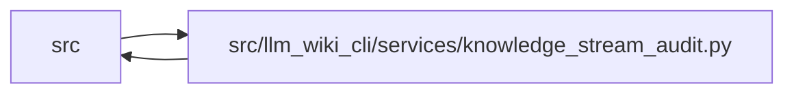

# knowledge_stream_audit Module

**Path:** `src/llm_wiki_cli/services/knowledge_stream_audit.py`

## Description

Audits complete indexed storage, native record shapes and references, logical commitments and routing membership using private spill buffers. The result explicitly excludes companion authority and complete native projection parity, which require full snapshot validation. Record, cache, index and disk quotas bound the operation, and final guarded reads detect changed inputs.

## Imports

| Source | Symbols |
|--------|---------|
| `.canonical_json` | `CanonicalArray` |
| `.contracts` | `SECTION_OWNERSHIP_EXTENSION_KEY`, `TYPED_GRAPH_EXTENSION_KEY` |
| `.knowledge_audit` | `audit_spilled_records` |
| `.knowledge_envelope` | `EvaluatedEnvelope` |
| `.knowledge_graph` | `_normalise_edge` |
| `.knowledge_model` | `_parse_bundle`, `_parse_concept`, `_parse_relationship`, `_concept_to_payload`, `_relationship_to_payload`, `_validate_index_references`, `Resolution` |
| `.knowledge_packs` | `PackedKnowledgeStoreReader`, `open_knowledge_store` |
| `.knowledge_storage` | `MAX_EXPANDED_BYTES`, `MAX_ROOT_BYTES`, `ROOT_FILENAME`, `LOGICAL_SCHEMA`, `KnowledgeStorageError`, `canonical_bytes`, `digest`, `logical_digest`, `_validate_selected_record` |
| `.knowledge_storage_io` | `read_guarded`, `_absolute_path`, `_require_relative_name` |
| `.manifest_storage` | `read_manifest_header` |
| `.storage_sort` | `SortedRuns` |
| `.storage_spool` | `ByteSpool`, `DecodeCache`, `JsonSpool` |
| `.sync_manifest` | `MANIFEST_FILENAME` |
| `__future__` | `annotations` |
| `collections.abc` | `Mapping` |
| `contextlib` | `ExitStack` |
| `pathlib` | `Path` |

## Local dependency map

<!-- Auto-generated local dependency summary. Do not edit by hand. -->

> Module-level dependencies exceed the generated-diagram limits, so the diagram and table below group them by top-level package. Counts report the number of module neighbors in each package.

### Internal neighbors

| Direction | Module |
|---|---|
| Inbound | `src` (1) |
| Outbound | `src` (13) |

> All 14 module neighbor(s) are summarized by package because the module-level view exceeds the 12-node limit.

## Classes

| Class | Line | Bases | Description |
|-------|------|-------|-------------|
| [_DigestSession](../entities/DigestSession.md) | 34 | — | — |
| [_Extensions](../entities/Extensions.md) | 56 | `Mapping` | — |

## Functions

| Function | Signature | Decorators | Description |
|----------|-----------|------------|-------------|
| `audit_knowledge_stream` | `(wiki_dir, *, record_bytes = 1048576)` | — | Validate all storage bytes, logical hash, record shapes and exact routing. |