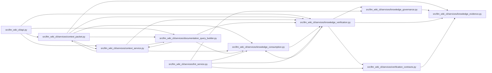

# knowledge_verification Module

**Path:** `src/llm_wiki_cli/services/knowledge_verification.py`

## Description

Read-only machine-verification evaluation for native knowledge sessions.

Verification receipts are disposable evidence anchored to committed native
artifacts.  This module loads and evaluates a receipt without running any
checker, and returns the same coordinate-keyed summaries to every consumer.

## Imports

| Source | Symbols |
|--------|---------|
| `.knowledge_consumption` | `KnowledgeReadView`, `MachineVerificationAvailability`, `MachineVerificationReadView` |
| `.knowledge_evidence` | `hash_json` |
| `.knowledge_governance` | `GOVERNANCE_EXTENSION_KEY` |
| `.verification_contracts` | `VerificationReceipt`, `VerificationResult`, `build_artifact_verification_context`, `evaluate_verification_receipt`, `load_verification_receipt` |
| `__future__` | `annotations` |
| `collections.abc` | `Mapping` |
| `dataclasses` | `replace` |
| `pathlib` | `Path` |
| `types` | `MappingProxyType` |
| `typing` | `Any` |

## Local dependency map

<!-- Auto-generated local dependency summary. Do not edit by hand. -->

### Internal neighbors

| Direction | Module |
|---|---|
| Inbound | [api](../modules/api.md) |
| Inbound | [context_packet](../modules/context_packet.md) |
| Inbound | [context_service](../modules/context_service.md) |
| Inbound | [documentation_query_builder](../modules/documentation_query_builder.md) |
| Inbound | [knowledge_consumption](../modules/knowledge_consumption.md) |
| Inbound | [lint_service](../modules/lint_service.md) |
| Outbound | [knowledge_consumption](../modules/knowledge_consumption.md) |
| Outbound | [knowledge_evidence](../modules/knowledge_evidence.md) |
| Outbound | [knowledge_governance](../modules/knowledge_governance.md) |
| Outbound | [verification_contracts](../modules/verification_contracts.md) |

## Functions

| Function | Signature | Decorators | Description |
|----------|-----------|------------|-------------|
| `machine_verification_summaries` | `(wiki_dir: str \| Path, knowledge_view: KnowledgeReadView) -> Mapping[str, Mapping[str, Any]]` | — | Return the legacy coordinate-keyed adapter for API/query consumers. |
| `attach_machine_verification_read_view` | `(wiki_dir: str \| Path, knowledge_view: KnowledgeReadView) -> KnowledgeReadView` | — | Attach one fixed receipt evaluation to an operation-scoped read view. |
| `load_machine_verification_read_view` | `(wiki_dir: str \| Path, knowledge_view: KnowledgeReadView) -> MachineVerificationReadView` | — | Load and evaluate one fixed receipt without executing a checker. |
| `verification_summaries_for_concepts` | `(knowledge_view: KnowledgeReadView, evaluated: MachineVerificationReadView \| None = None) -> Mapping[str, Mapping[str, Any]]` | — | Adapt one receipt evaluation to the existing per-coordinate contract. |
| `machine_verification_summary` | `(receipt: VerificationReceipt, *, valid: bool, reasons: list[str]) -> dict[str, Any]` | — | Return a compact, bounded machine-only receipt summary. |
| `_frozen_summaries` | `(values: Mapping[str, Mapping[str, Any]]) -> Mapping[str, Mapping[str, Any]]` | — | — |
| `_deep_copy` | `(value: object) -> Any` | — | — |
