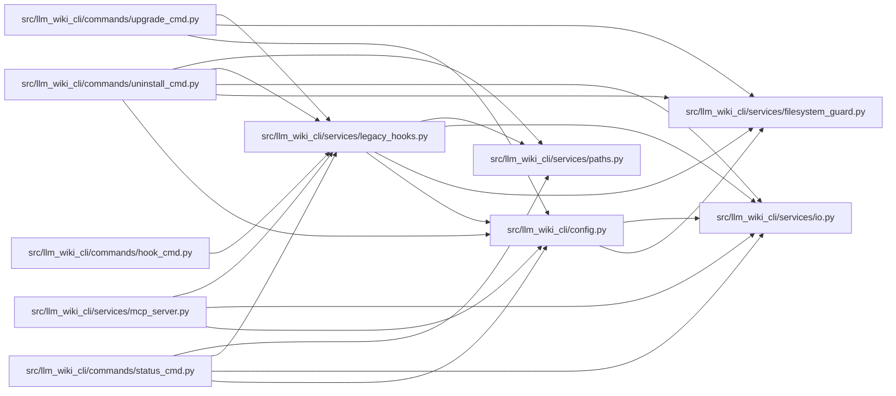

# legacy_hooks Module

**Path:** `src/llm_wiki_cli/services/legacy_hooks.py`

## Description

Recognize and retire historical LLM Wiki Git hooks without installing hooks.

The frozen script renderers below are ownership fingerprints for migrations.
They are never executed or written to a hook path.

## Imports

| Source | Symbols |
|--------|---------|
| `..config` | `AGENT_CHOICES`, `validate_path` |
| `.filesystem_guard` | `unlink_guarded_bytes` |
| `.io` | `first_unsafe_path_component` |
| `.paths` | `display_project_path`, `shell_quote` |
| `__future__` | `annotations` |
| `dataclasses` | `dataclass` |
| `hashlib` | `hashlib` |
| `os` | `os` |
| `pathlib` | `Path` |
| `shlex` | `shlex` |
| `subprocess` | `subprocess` |

## Local dependency map

<!-- Auto-generated local dependency summary. Do not edit by hand. -->

### Internal neighbors

| Direction | Module |
|---|---|
| Inbound | [hook_cmd](../modules/hook_cmd.md) |
| Inbound | [status_cmd](../modules/status_cmd.md) |
| Inbound | [uninstall_cmd](../modules/uninstall_cmd.md) |
| Inbound | [upgrade_cmd](../modules/upgrade_cmd.md) |
| Inbound | [mcp_server](../modules/mcp_server.md) |
| Outbound | [config](../modules/config.md) |
| Outbound | [filesystem_guard](../modules/filesystem_guard.md) |
| Outbound | [io](../modules/io.md) |
| Outbound | [paths](../modules/paths.md) |

## Classes

| Class | Line | Bases | Description |
|-------|------|-------|-------------|
| [LegacyHookError](../entities/LegacyHookError.md) | 24 | `ValueError` | Hook ownership or its filesystem snapshot cannot be verified safely. |
| [LegacyHookInspection](../entities/LegacyHookInspection.md) | 29 | — | Exact hook bytes classified before a lifecycle operation changes files. |

## Functions

| Function | Signature | Decorators | Description |
|----------|-----------|------------|-------------|
| `_require_safe_path` | `(path: Path) -> Path` | — | — |
| `_git_value` | `(root: Path, *arguments: str, optional: bool = False) -> str \| None` | — | — |
| `_hook_directories` | `() -> tuple[Path, ...]` | — | Locate repository-owned hooks, including a linked worktree's common Git dir. |
| `inspect_legacy_hooks` | `() -> tuple[LegacyHookInspection, ...]` | — | Capture known hook candidates without executing them or following links. |
| `remove_legacy_hooks` | `(*, plan: tuple[LegacyHookInspection, ...] \| None = None, dry_run: bool = False) -> int` | — | Remove exact, unmodified library hooks from one rechecked ownership snapshot. |
| `_build_post_commit` | `(agent: str, wiki_dir: str, source_selection: str \| Path \| None = None) -> str` | — | Build the managed post-commit hook. |
| `_build_ide_post_commit` | `(wiki_dir: str, *, source_selection: str \| Path \| None = None) -> str` | — | — |
| `_build_validation_pre_commit` | `(wiki_dir: str, *, source_selection: str \| Path \| None = None) -> str` | — | — |
| `_source_selection_args` | `(source_selection: str \| Path \| None) -> str` | — | — |
| `require_safe_hook_arguments` | `(wiki_dir: str \| Path, source_selection: str \| Path \| None = None) -> None` | — | Reject control characters that cannot round-trip through hook scripts. |
| `_hook_parameters_are_within_project` | `(wiki_dir: str, source_selection: str \| None = None) -> bool` | — | — |
| `_current_post_commit_parameters` | `(content: str) -> tuple[str, str \| None] \| None` | — | — |
| `_current_pre_commit_parameters` | `(content: str) -> tuple[str, str \| None] \| None` | — | — |
| `_legacy_ide_post_commit` | `(wiki_dir: str) -> str` | — | — |
| `_legacy_auto_sync_post_commit` | `(agent: str, wiki_dir: str) -> str` | — | — |
| `_legacy_auto_sync_parameters` | `(content: str) -> tuple[str, str] \| None` | — | — |
| `_is_legacy_trigger_invocation` | `(line: str) -> bool` | — | — |
| `_is_legacy_prompt_invocation` | `(line: str, content: str) -> bool` | — | — |
| `_legacy_skeleton_digest` | `(name: str, content: str) -> str \| None` | — | — |
| `is_managed_hook_content` | `(name: str, content: str) -> bool` | — | Return whether ``content`` exactly matches a recognized managed hook. |
