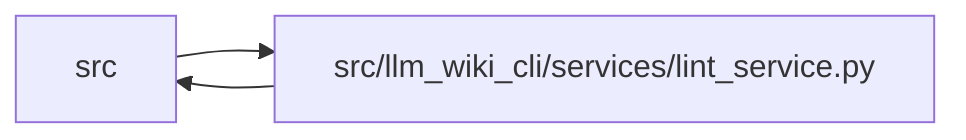

# lint_service Module

**Path:** `src/llm_wiki_cli/services/lint_service.py`

## Description

Builds the canonical wiki validation report. It combines source extraction
with registry, link, orphan, media, diagram, manifest, architecture, and
generated-knowledge checks, then renders the same findings as text, Markdown,
or structured data. Strict mode adds managed-wiki completeness and freshness
requirements without changing the underlying issue model.

## Imports

| Source | Symbols |
|--------|---------|
| `.` | `wiki_media` |
| `..config` | `validate_path`, `validate_source_root` |
| `..extractors.common` | `normalize_include_tests` |
| `.bootstrap_runtime` | `build_entity_occurrence_page_map`, `build_module_page_map` |
| `.data_flow` | `analyze_data_flow` |
| `.dependencies` | `analyze_dependencies` |
| `.diagrams` | `GENERATED_DIAGRAM_CHAR_LIMIT`, `GENERATED_DIAGRAM_LINE_LIMIT`, `GENERATED_DIAGRAM_NODE_LIMIT` |
| `.entrypoints` | `build_flow`, `get_entry_points`, `javascript_flow_limitations`, `read_console_scripts` |
| `.extraction_jobs` | `ExtractionJobPlan`, `ExtractionJobRequest`, `extraction_job_request_from_args`, `print_extraction_job_plan` |
| `.extraction_service` | `InventoryResult`, `get_call_graph`, `get_docker_inventory`, `get_inventory_result`, `resolve_call_edges` |
| `.infrastructure_inventory` | `get_yaml_infrastructure_inventory`, `infrastructure_page_name` |
| `.infrastructure_sync` | `INFRASTRUCTURE_GENERATION_INPUT_KEY`, `INFRASTRUCTURE_SYNC_SCHEMA_VERSION`, `build_infrastructure_page_map` |
| `.inventory_cache` | `InventoryCacheOptions`, `InventoryCacheStats`, `format_cache_stats` |
| `.io` | `read_md` |
| `.knowledge_artifacts` | `KNOWLEDGE_INDEX_FILENAME` |
| `.knowledge_consumption` | `KnowledgeAvailability`, `KnowledgeReadView`, `MachineVerificationAvailability`, `build_knowledge_read_view` |
| `.knowledge_governance` | `GOVERNANCE_EXTENSION_KEY`, `GOVERNANCE_FILENAME`, `evaluate_review_event`, `load_governance` |
| `.knowledge_loader` | `KnowledgeLoadIssue`, `KnowledgeLoadResult`, `KnowledgeMismatchPolicy`, `KnowledgeStateLoadError`, `load_knowledge_state` |
| `.knowledge_model` | `ComputedFreshness`, `EvidenceState`, `KnowledgeLoadState`, `ObservationScope` |
| `.knowledge_observability` | `KnowledgeAggregateSummary`, `KnowledgePhaseDurations`, `knowledge_freshness_hint`, `summarize_knowledge_view` |
| `.knowledge_orchestration` | `RUNTIME_GENERATION_OPTION_DEFAULTS`, `RuntimeLiveEvaluationInputs`, `build_runtime_live_evaluation`, `runtime_generation_options` |
| `.knowledge_verification` | `attach_machine_verification_read_view` |
| `.metrics` | `record_validation_event` |
| `.plugins` | `PluginError`, `iter_components`, `load_entry_point`, `runtime_plugin_fallback_root`, `runtime_project_plugins_enabled` |
| `.source_selection` | `SourceSelectionError`, `resolve_source_selection`, `validate_persisted_source_selection_identity` |
| `.source_snapshot` | `SourceSnapshot`, `build_source_snapshot`, `capture_source_selection_inputs`, `format_unsupported_source_summary`, `unsupported_source_label`, `unsupported_source_summary` |
| `.sync_analysis` | `compute_sync_diff` |
| `.sync_manifest` | `MANIFEST_FILENAME`, `SyncManifest`, `SyncManifestError` |
| `.team` | `build_team_issues` |
| `.validation` | `path_is_in_top_level_directory` |
| `.verification_contracts` | `VERIFICATION_RECEIPT_FILENAME`, `VerificationResult`, `load_verification_receipt` |
| `.wiki_lifecycle` | `WikiLifecycleState`, `bootstrap_guidance`, `classify_wiki_lifecycle`, `migration_guidance`, `sync_guidance` |
| `.wiki_surface` | `PageKind`, `is_safe_page_id`, `iter_page_kinds` |
| `.wiki_surface_index` | `SURFACE_INDEX_FILENAME` |
| `__future__` | `annotations` |
| `collections.abc` | `Callable`, `Iterable`, `Iterator`, `Mapping` |
| `contextlib` | `contextmanager` |
| `dataclasses` | `asdict`, `dataclass`, `field`, `replace` |
| `enum` | `Enum` |
| `json` | `json` |
| `pathlib` | `Path` |
| `re` | `re` |
| `sys` | `sys` |
| `time` | `time` |
| `typing` | `TypeVar` |

## Local dependency map

<!-- Auto-generated local dependency summary. Do not edit by hand. -->

> Module-level dependencies exceed the generated-diagram limits, so the diagram and table below group them by top-level package. Counts report the number of module neighbors in each package.

### Internal neighbors

| Direction | Module |
|---|---|
| Inbound | `src` (6) |
| Outbound | `src` (34) |

> All 39 module neighbor(s) are summarized by package because the module-level view exceeds the 12-node limit.

## Classes

| Class | Line | Bases | Description |
|-------|------|-------|-------------|
| [_LintProfiler](../entities/LintProfiler.md) | 181 | — | — |
| [LintIssue](../entities/LintIssue.md) | 219 | — | — |
| [KnowledgeLintSummary](../entities/KnowledgeLintSummary.md) | 230 | `KnowledgeAggregateSummary` | Aggregate strict-lint knowledge status without exposing evidence. |
| [LintReport](../entities/LintReport.md) | 268 | — | — |
| [_WikiPageIndex](../entities/WikiPageIndex.md) | 308 | — | — |
| [_LintInputs](../entities/LintInputs.md) | 315 | — | — |
| [_KnowledgeLintState](../entities/KnowledgeLintState.md) | 327 | — | — |

## Functions

| Function | Signature | Decorators | Description |
|----------|-----------|------------|-------------|
| `_profile_phase` | `(profiler: _LintProfiler \| None, name: str) -> Iterator[None]` | `@contextmanager` | — |
| `_local_link_path` | `(link: str) -> str \| None` | — | Return the file portion of a local markdown link, or None if ignored. |
| `_is_legacy_page` | `(path: Path, wiki_dir: Path) -> bool` | — | Return True for archived migration pages that lint should ignore. |
| `_collect_documented_entities` | `(wiki_dir: Path) -> set[str]` | — | Return the set of entity names that have wiki pages. |
| `_collect_code_classes` | `(inventory_or_src_dir) -> set[str]` | — | Return the set of entity page names found by AST scanning. |
| `_collect_documented_modules` | `(wiki_dir: Path) -> set[str]` | — | Return the set of module names that have wiki pages. |
| `_collect_code_modules` | `(inventory_or_src_dir) -> set[str]` | — | Return the set of module page names with tracked inventory. |
| `_collect_documented_workflows` | `(wiki_dir: Path) -> set[str]` | — | Return the set of workflow names that have wiki pages. |
| `_collect_documented_flows` | `(wiki_dir: Path) -> set[str]` | — | Return the set of user-flow page stems (entry-point ids). |
| `_collect_documented_infrastructure` | `(wiki_dir: Path) -> set[str]` | — | Return the set of infrastructure page names that have wiki pages. |
| `_collect_docker_files` | `(docker_inventory_or_src_dir) -> set[str]` | — | Return the set of Docker/Compose file page-names found in source. |
| `_collect_infrastructure_files` | `(docker_inventory: dict, yaml_infrastructure_inventory: dict \| None = None) -> set[str]` | — | Return page names for all supported infrastructure files in source. |
| `_persisted_infrastructure_tombstone_pages` | `(wiki_dir: Path) -> set[str]` | — | — |
| `_add` | `(report: LintReport, category: str, message: str, *, path: str \| None = None, target: str \| None = None, reason_code: str \| None = None, hint: str \| None = None) -> None` | — | — |
| `_diagnose` | `(report: LintReport, category: str, message: str, *, path: str \| None = None, target: str \| None = None, severity: str = 'warning', reason_code: str \| None = None, hint: str \| None = None) -> None` | — | — |
| `_record_knowledge_drift` | `(report: LintReport, message: str, *, path: str \| None = None, target: str \| None = None, reason_code: str \| None = None, hint: str \| None = None) -> None` | — | Record native freshness only in the explicit report-only mode. |
| `_coerce_plugin_issue` | `(raw: object, component_ref: str) -> LintIssue` | — | — |
| `_run_plugin_lint_rules` | `(report: LintReport, wiki_dir: Path, src_dir: str, inventory: dict, pages: list[Path], *, source_snapshot: SourceSnapshot, source_plugins_only: bool) -> None` | — | — |
| `_inventory_code_classes` | `(inventory: dict) -> set[str]` | — | — |
| `_inventory_code_modules` | `(inventory: dict) -> set[str]` | — | — |
| `_check_required_structure` | `(report: LintReport, wiki_dir: Path) -> None` | — | — |
| `_check_sync_manifest` | `(report: LintReport, wiki_dir: Path, src_dir: str, inventory: dict \| None = None, *, source_snapshot: SourceSnapshot \| None = None, proven_nonsemantic_paths: frozenset[str] = frozenset()) -> None` | — | — |
| `_check_source_selection_identity` | `(report: LintReport, wiki_dir: Path, source_snapshot: SourceSnapshot) -> None` | — | Always verify the live/committed selection boundary. |
| `_collect_lint_inputs` | `(report: LintReport, wiki_path: Path, src_dir: str, profiler: _LintProfiler \| None, cache_options: InventoryCacheOptions \| None, parallel_jobs: int, helper_cache_dir: str \| None, include_tests: Iterable[str] \| None, job_request: ExtractionJobRequest \| None, plan_reporter: Callable[[ExtractionJobPlan], None] \| None, include_plugins: bool, source_plugins_only: bool, source_selection: str \| Path \| None, expected_selection_inputs: Mapping[str, object] \| None) -> _LintInputs \| None` | — | — |
| `_check_unsupported_source_diagnostics` | `(report: LintReport, unsupported_sources: dict[str, dict[str, object]]) -> None` | — | — |
| `_build_page_index` | `(wiki_path: Path) -> _WikiPageIndex` | — | — |
| `_check_broken_links` | `(report: LintReport, wiki_path: Path, page_index: _WikiPageIndex) -> None` | — | — |
| `_check_media_references` | `(report: LintReport, wiki_path: Path, page_index: _WikiPageIndex, *, media_size_warn_bytes: int) -> None` | — | — |
| `_content_by_relative_path` | `(page_index: _WikiPageIndex, wiki_path: Path) -> dict[str, str]` | — | — |
| `_section_body` | `(markdown: str, heading: str) -> str \| None` | — | — |
| `_iter_mermaid_blocks` | `(section_body: str) -> Iterator[list[str]]` | — | — |
| `_generated_diagram_sections` | `(markdown: str) -> Iterator[tuple[str, str]]` | — | — |
| `_check_generated_diagram_links` | `(report: LintReport, page: Path, rel: str, heading: str, block: list[str]) -> None` | — | — |
| `_diagnose_generated_diagram_bloat` | `(report: LintReport, rel: str, heading: str, block: list[str]) -> None` | — | — |
| `_check_generated_diagrams` | `(report: LintReport, wiki_path: Path, page_index: _WikiPageIndex) -> None` | — | — |
| `_check_orphan_pages` | `(report: LintReport, wiki_path: Path, page_index: _WikiPageIndex) -> None` | — | — |
| `_check_entity_coverage` | `(report: LintReport, wiki_path: Path, deep_inventory: dict) -> None` | — | — |
| `_check_module_coverage` | `(report: LintReport, wiki_path: Path, deep_inventory: dict) -> None` | — | — |
| `_check_workflow_coverage` | `(report: LintReport, wiki_path: Path, deep_inventory: dict, page_index: _WikiPageIndex) -> None` | — | — |
| `_check_flow_coverage` | `(report: LintReport, wiki_path: Path, deep_inventory: dict, src_dir: str, *, include_plugins: bool = True, source_plugins_only: bool = False, source_snapshot: SourceSnapshot \| None = None) -> None` | — | Flag user-flow pages whose entry point no longer exists in the code. |
| `_check_data_flow_diagnostics` | `(report: LintReport, wiki_path: Path, deep_inventory: dict, src_dir: str, *, include_plugins: bool = True, source_plugins_only: bool = False, source_snapshot: SourceSnapshot \| None = None) -> None` | — | — |
| `_check_javascript_flow_diagnostics` | `(report: LintReport, deep_inventory: dict, src_dir: str, *, include_plugins: bool = True, source_plugins_only: bool = False, source_snapshot: SourceSnapshot \| None = None) -> None` | — | — |
| `_check_dependency_coverage` | `(report: LintReport, wiki_path: Path, deep_inventory: dict, src_dir: str, source_snapshot: SourceSnapshot \| None = None) -> None` | — | Re-run dependency analysis for the architecture pages and warn on drift. |
| `_format_dependency_scope` | `(scope: object) -> str` | — | — |
| `_check_infrastructure_coverage` | `(report: LintReport, wiki_path: Path, docker_inventory: dict, yaml_infrastructure_inventory: dict \| None = None) -> None` | — | — |
| `_check_team_issues` | `(report: LintReport, wiki_path: Path, src_dir: str, inputs: _LintInputs) -> None` | — | — |
| `_canonical_markdown_content` | `(page_index: _WikiPageIndex, wiki_path: Path) -> dict[str, str]` | — | Reuse the page-index bytes for only the versioned canonical surface. |
| `_knowledge_lint_enabled` | `(wiki_path: Path) -> bool` | — | Recognize generated or manifest-declared knowledge without taxing legacy. |
| `_load_knowledge_lint_state` | `(wiki_path: Path, inputs: _LintInputs) -> _KnowledgeLintState` | — | — |
| `_reliably_missing_source_paths` | `(load_result: KnowledgeLoadResult, source_snapshot: SourceSnapshot) -> frozenset[str]` | — | — |
| `_evaluate_knowledge_lint_state` | `(state: _KnowledgeLintState, inputs: _LintInputs) -> _KnowledgeLintState` | — | — |
| `_projection_issue_category` | `(issue: KnowledgeLoadIssue) -> str` | — | — |
| `_enum_count_payload` | `(values: Mapping[_CountKey, int]) -> dict[str, int]` | — | — |
| `_set_knowledge_summary` | `(report: LintReport, view: KnowledgeReadView, *, durations: KnowledgePhaseDurations) -> None` | — | — |
| `_promised_structural_scope` | `(concept) -> ObservationScope \| None` | — | — |
| `_promised_evidence_reason` | `(concept, expected_scope: ObservationScope) -> str \| None` | — | — |
| `_check_knowledge_concepts` | `(report: LintReport, view: KnowledgeReadView) -> None` | — | — |
| `_manifest_promises_infrastructure_evidence` | `(manifest: SyncManifest) -> bool` | — | — |
| `_check_knowledge_reviews` | `(report: LintReport, view: KnowledgeReadView) -> None` | — | Surface computed review expiry without treating it as machine status. |
| `_check_verification_receipt` | `(report: LintReport, view: KnowledgeReadView \| None) -> None` | — | Validate one operation-scoped receipt view without executing checkers. |
| `_check_knowledge_lint` | `(report: LintReport, state: _KnowledgeLintState) -> None` | — | — |
| `_measure_knowledge_phase` | `(durations: dict[str, int], name: str) -> Iterator[None]` | `@contextmanager` | — |
| `_proven_nonsemantic_source_paths` | `(view: KnowledgeReadView \| None) -> frozenset[str]` | — | — |
| `_run_report_checks` | `(report: LintReport, wiki_path: Path, src_dir: str, strict: bool, profiler: _LintProfiler \| None, inputs: _LintInputs, media_size_warn_bytes: int, include_plugins: bool, source_plugins_only: bool) -> None` | — | — |
| `_add_source_selection_mismatch` | `(report: LintReport, message: str) -> None` | — | — |
| `_preflight_lint_source_selection` | `(report: LintReport, wiki_path: Path, src_dir: str, source_selection: str \| Path \| None) -> tuple[bool, dict[str, object] \| None]` | — | — |
| `_new_lint_report` | `(wiki_path: Path, src_dir: str, effective_strict: bool, knowledge_drift_report: bool) -> LintReport` | — | — |
| `_add_missing_wiki` | `(report: LintReport, wiki_path: Path) -> None` | — | — |
| `build_report` | `(wiki_dir: str \| Path, src_dir: str = '.', *, strict: bool = False, knowledge_drift_report: bool = False, profiler: _LintProfiler \| None = None, cache_options: InventoryCacheOptions \| None = None, parallel_jobs: int = 1, helper_cache_dir: str \| None = None, include_tests: Iterable[str] \| None = None, media_size_warn_bytes: int = wiki_media.DEFAULT_MEDIA_SIZE_WARN_BYTES, job_request: ExtractionJobRequest \| None = None, plan_reporter: Callable[[ExtractionJobPlan], None] \| None = None, include_plugins: bool = True, source_plugins_only: bool = False, source_selection: str \| Path \| None = None) -> LintReport` | — | Build a structured lint report without rendering or exiting. |
| `_lint_issue_payload` | `(issue: LintIssue) -> dict[str, object]` | — | — |
| `report_to_dict` | `(report: LintReport, *, include_execution: bool = False) -> dict` | — | — |
| `_profile_report_to_dict` | `(report: LintReport, profiler: _LintProfiler, *, include_cache: bool = False) -> dict` | — | — |
| `_add_extractor_failures` | `(report: LintReport, inventory_result) -> None` | — | — |
| `render_text` | `(report: LintReport) -> str` | — | — |
| `render_markdown` | `(report: LintReport) -> str` | — | — |
| `run` | `(args)` | — | — |