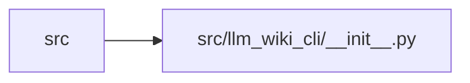

# __init__ Module

**Path:** `src/llm_wiki_cli/__init__.py`

## Description

LLM Wiki CLI.

## Imports

| Source | Symbols |
|--------|---------|
| `importlib.metadata` | `version`, `PackageNotFoundError` |

## Local dependency map

<!-- Auto-generated local dependency summary. Do not edit by hand. -->

> Module-level dependencies exceed the generated-diagram limits, so the diagram and table below group them by top-level package. Counts report the number of module neighbors in each package.

### Internal neighbors

| Direction | Module |
|---|---|
| Inbound | `src` (12) |

> All 12 module neighbor(s) are summarized by package because the module-level view exceeds the 12-node limit.
