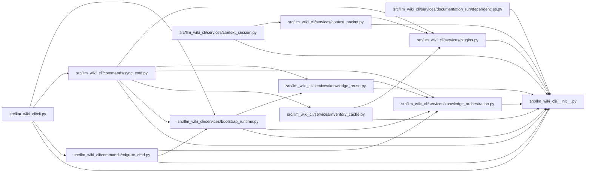

# __init__ Module

**Path:** `src/llm_wiki_cli/__init__.py`

## Description

LLM Wiki CLI.

## Imports

| Source | Symbols |
|--------|---------|
| `importlib.metadata` | `version`, `PackageNotFoundError` |

## Local dependency map

<!-- Auto-generated local dependency summary. Do not edit by hand. -->

### Internal neighbors

| Direction | Module |
|---|---|
| Inbound | [cli](../modules/cli.md) |
| Inbound | [migrate_cmd](../modules/migrate_cmd.md) |
| Inbound | [sync_cmd](../modules/sync_cmd.md) |
| Inbound | [bootstrap_runtime](../modules/bootstrap_runtime.md) |
| Inbound | [context_packet](../modules/context_packet.md) |
| Inbound | [context_session](../modules/context_session.md) |
| Inbound | [documentation_run_dependencies](../modules/documentation_run_dependencies.md) |
| Inbound | [inventory_cache](../modules/inventory_cache.md) |
| Inbound | [knowledge_orchestration](../modules/knowledge_orchestration.md) |
| Inbound | [knowledge_reuse](../modules/knowledge_reuse.md) |
| Inbound | [plugins](../modules/plugins.md) |
