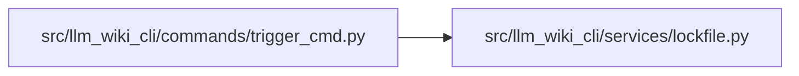

# lockfile Module

**Path:** `src/llm_wiki_cli/services/lockfile.py`

## Description

_Auto-generated from `src/llm_wiki_cli/services/lockfile.py`._

## Imports

| Source | Symbols |
|--------|---------|
| `errno` | `errno` |
| `math` | `math` |
| `os` | `os` |
| `pathlib` | `Path` |
| `sys` | `sys` |
| `time` | `time` |

## Local dependency map

<!-- Auto-generated local dependency summary. Do not edit by hand. -->

### Internal neighbors

| Direction | Module |
|---|---|
| Inbound | [trigger_cmd](../modules/trigger_cmd.md) |

## Classes

| Class | Line | Bases | Description |
|-------|------|-------|-------------|
| [LockAcquisitionError](../entities/LockAcquisitionError.md) | 22 | `Exception` | Raised when the wiki lock cannot be acquired (another sync is running). |
| [WikiLock](../entities/WikiLock.md) | 26 | — | Exclusive file lock to prevent concurrent wiki syncs. |

## Functions

| Function | Signature | Decorators | Description |
|----------|-----------|------------|-------------|
| `_is_lock_contention_error` | `(exc: OSError) -> bool` | — | Return whether *exc* represents a held non-blocking file lock. |
