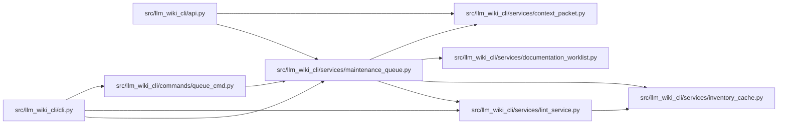

# maintenance_queue Module

**Path:** `src/llm_wiki_cli/services/maintenance_queue.py`

## Description

Ranks managed wiki pages using captured freshness, semantic work items, lint
findings, reachability, and source fan-in. Each bounded queue item explains its
priority, distinguishes actionable from informational evidence, and identifies
the editable semantic section. Unknown provenance stays explicit; queue
construction preserves the captured source/wiki basis and does not edit pages.

## Imports

| Source | Symbols |
|--------|---------|
| `.context_packet` | `capture_context_read`, `_assert_source_unchanged`, `_assert_wiki_unchanged`, `_assert_selection_unchanged` |
| `.documentation_worklist` | `build_documentation_worklist` |
| `.inventory_cache` | `InventoryCacheOptions` |
| `.lint_service` | `build_report` |
| `__future__` | `annotations` |
| `dataclasses` | `asdict` |
| `hashlib` | `hashlib` |
| `json` | `json` |
| `pathlib` | `Path` |

## Local dependency map

<!-- Auto-generated local dependency summary. Do not edit by hand. -->

### Internal neighbors

| Direction | Module |
|---|---|
| Inbound | [api](../modules/api.md) |
| Inbound | [cli](../modules/cli.md) |
| Inbound | [queue_cmd](../modules/queue_cmd.md) |
| Outbound | [context_packet](../modules/context_packet.md) |
| Outbound | [documentation_worklist](../modules/documentation_worklist.md) |
| Outbound | [inventory_cache](../modules/inventory_cache.md) |
| Outbound | [lint_service](../modules/lint_service.md) |

## Functions

| Function | Signature | Decorators | Description |
|----------|-----------|------------|-------------|
| `validate_queue_limit` | `(limit: object) -> int` | — | Validate the shared CLI and service bound before reading queue inputs. |
| `compose_queue` | `(pages, work_items, freshness, issues, metrics, *, limit = DEFAULT_QUEUE_LIMIT)` | — | Rank captured evidence; unknown provenance never becomes confirmed drift. |
| `build_maintenance_queue` | `(src_dir = '.', wiki_dir = 'docs/llm_wiki', *, limit = DEFAULT_QUEUE_LIMIT, allow_external_src = False, source_selection = None, helper_cache_dir = None)` | — | — |
| `render_queue` | `(queue)` | — | — |