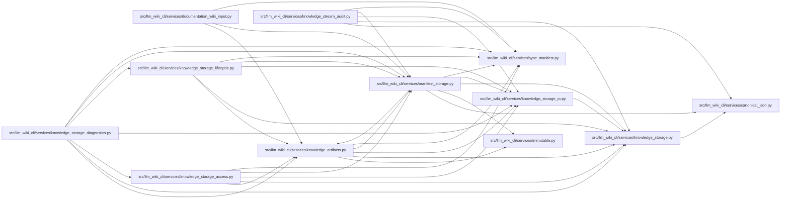

# manifest_storage Module

**Path:** `src/llm_wiki_cli/services/manifest_storage.py`

## Description

Stores manifest v6 as a bounded commit root plus immutable catalogs under `.llm-wiki-manifest/objects/`. Artifact commitments and small generation policy remain in the root; oversized policy is referenced and charged to the caller. Full readers reconstruct and validate the complete logical v5 manifest. Selected readers receive a typed header containing only policy and artifact commitments.

## Imports

| Source | Symbols |
|--------|---------|
| `.canonical_json` | `canonical_chunks` |
| `.immutable` | `freeze` |
| `.knowledge_artifacts` | `_decode_json_object` |
| `.knowledge_storage` | `MAX_EXPANDED_BYTES`, `KnowledgeStorageError`, `canonical_bytes`, `decode_bytes`, `digest`, `logical_digest`, `_hash` |
| `.knowledge_storage_io` | `read_guarded` |
| `.sync_manifest` | `ManifestArtifactHashes`, `SyncManifest`, `validate_manifest_policy`, `MANIFEST_FILENAME` |
| `__future__` | `annotations` |
| `base64` | `base64` |
| `collections.abc` | `Callable`, `Mapping` |
| `dataclasses` | `dataclass` |
| `json` | `json` |
| `pathlib` | `Path` |
| `re` | `re` |
| `typing` | `Any` |

## Local dependency map

<!-- Auto-generated local dependency summary. Do not edit by hand. -->

### Internal neighbors

| Direction | Module |
|---|---|
| Inbound | [documentation_wiki_input](../modules/documentation_wiki_input.md) |
| Inbound | [knowledge_artifacts](../modules/knowledge_artifacts.md) |
| Inbound | [knowledge_storage_access](../modules/knowledge_storage_access.md) |
| Inbound | [knowledge_storage_diagnostics](../modules/knowledge_storage_diagnostics.md) |
| Inbound | [knowledge_storage_lifecycle](../modules/knowledge_storage_lifecycle.md) |
| Inbound | [knowledge_stream_audit](../modules/knowledge_stream_audit.md) |
| Outbound | [canonical_json](../modules/canonical_json.md) |
| Outbound | [immutable](../modules/immutable.md) |
| Outbound | [knowledge_artifacts](../modules/knowledge_artifacts.md) |
| Outbound | [knowledge_storage](../modules/knowledge_storage.md) |
| Outbound | [knowledge_storage_io](../modules/knowledge_storage_io.md) |
| Outbound | [sync_manifest](../modules/sync_manifest.md) |

## Classes

| Class | Line | Bases | Description |
|-------|------|-------|-------------|
| [ManifestStore](../entities/ManifestStore.md) | 77 | — | — |
| [ManifestStoreReader](../entities/ManifestStoreReader.md) | 143 | — | — |
| [ValidatedManifestHeader](../entities/ValidatedManifestHeader.md) | 212 | — | Policy and artifact commitments only; never a complete sync manifest. |

## Functions

| Function | Signature | Decorators | Description |
|----------|-----------|------------|-------------|
| `object_path` | `(commitment: str) -> str` | — | — |
| `_descriptor` | `(value: object) -> dict[str, Any]` | — | — |
| `validate_catalog` | `(raw: bytes) -> dict[str, Any]` | — | — |
| `build_manifest_store` | `(payload: Mapping[str, Any]) -> ManifestStore` | — | — |
| `read_manifest_header` | `(raw: bytes, read: Reader) -> ValidatedManifestHeader` | — | — |
| `current_manifest_format` | `(wiki_dir: str \| Path) -> str` | — | — |