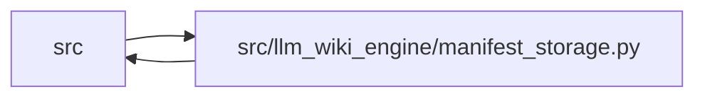

# manifest_storage Module

**Path:** `src/llm_wiki_engine/manifest_storage.py`

## Description

Stores indexed manifests as a bounded commit root plus immutable catalogs under `.llm-wiki-manifest/objects/`. Legacy physical v6 reconstructs logical v5; adopted physical v8 reconstructs logical v7 and carries a maintenance-state catalog plus readable adoption and state commitments. Artifact commitments and small generation policy remain in the root; oversized policy is referenced and charged to the caller. Full readers validate the complete logical manifest. Selected readers consume a typed header and required catalogs without claiming that unread operational state was validated.

## Imports

| Source | Symbols |
|--------|---------|
| `.knowledge_artifacts` | `_decode_json_object` |
| `.knowledge_storage` | `MAX_EXPANDED_BYTES`, `KnowledgeStorageError`, `canonical_bytes`, `decode_bytes`, `digest`, `logical_digest`, `_hash` |
| `.knowledge_storage_io` | `read_guarded` |
| `.layout` | `DEFAULT_LAYOUT` |
| `.maintenance_state` | `validate_maintenance_adoption`, `LIMITS`, `maintenance_state_hash` |
| `.sync_manifest` | `ManifestArtifactHashes`, `SyncManifest`, `SyncManifest`, `validate_manifest_policy`, `MANIFEST_FILENAME` |
| `__future__` | `annotations` |
| `base64` | `base64` |
| `collections.abc` | `Callable`, `Iterable`, `Iterator`, `Mapping` |
| `dataclasses` | `dataclass` |
| `json` | `json` |
| `llm_wiki_engine.canonical_json` | `canonical_chunks` |
| `llm_wiki_engine.immutable` | `freeze` |
| `pathlib` | `Path` |
| `re` | `re` |
| `typing` | `Any` |
| `zlib` | `zlib` |

## Local dependency map

<!-- Auto-generated local dependency summary. Do not edit by hand. -->

```mermaid
flowchart LR
    n0["src"]
    n1["src/llm_wiki_engine/manifest_storage.py"]
    n0 --> n1
    n1 --> n0
    click n1 "../modules/manifest_storage.md"
```

> Module-level dependencies exceed the generated-diagram limits, so the diagram and table below group them by top-level package. Counts report the number of module neighbors in each package.

### Internal neighbors

| Direction | Module |
|---|---|
| Inbound | `src` (9) |
| Outbound | `src` (8) |

> All 15 module neighbor(s) are summarized by package because the module-level view exceeds the 12-node limit.

## Classes

| Class | Line | Bases | Description |
|-------|------|-------|-------------|
| [ManifestStore](../entities/ManifestStore.md) | 121 | — | — |
| [ManifestStoreReader](../entities/ManifestStoreReader.md) | 192 | — | — |
| [ValidatedManifestHeader](../entities/ValidatedManifestHeader.md) | 287 | — | Policy and artifact commitments only; never a complete sync manifest. |

## Functions

| Function | Signature | Decorators | Description |
|----------|-----------|------------|-------------|
| `object_path` | `(commitment: str) -> str` | — | — |
| `_descriptor` | `(value: object) -> dict[str, Any]` | — | — |
| `validate_catalog` | `(raw: bytes) -> dict[str, Any]` | — | — |
| `_segment_end` | `(buffer: bytearray) -> int` | — | Return where the segment starting ``buffer`` ends. |
| `content_segments` | `(parts: Iterable[bytes]) -> Iterator[bytes]` | — | Regroup a byte stream into content-defined segments of bounded size. |
| `build_manifest_store` | `(payload: Mapping[str, Any]) -> ManifestStore` | — | — |
| `read_manifest_header` | `(raw: bytes, read: Reader) -> ValidatedManifestHeader` | — | — |
| `current_manifest_format` | `(wiki_dir: str \| Path) -> str` | — | — |
