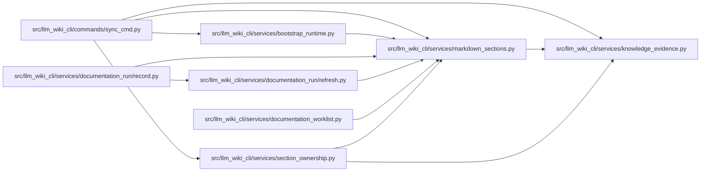

# markdown_sections Module

**Path:** `src/llm_wiki_cli/services/markdown_sections.py`

## Description

Deterministic Markdown section parsing and legacy sync splice helpers.

The hierarchy parser in this module is deliberately small.  It recognizes ATX
headings and the code/frontmatter constructs that can make heading-looking
lines non-structural, but it is not intended to be a complete CommonMark
parser.  All parsing and hashing is pure over the supplied strings.

The legacy helpers at the end of the module preserve the historical sync
command contract.  In particular, they intentionally keep first-match and
duplicate-table-row behavior that predates the hierarchy parser.

## Imports

| Source | Symbols |
|--------|---------|
| `.knowledge_evidence` | `hash_json`, `sha256_bytes` |
| `__future__` | `annotations` |
| `collections` | `defaultdict` |
| `dataclasses` | `dataclass`, `replace` |
| `re` | `re` |
| `typing` | `Callable`, `Iterable` |
| `urllib.parse` | `quote` |

## Local dependency map

<!-- Auto-generated local dependency summary. Do not edit by hand. -->

### Internal neighbors

| Direction | Module |
|---|---|
| Inbound | [sync_cmd](../modules/sync_cmd.md) |
| Inbound | [bootstrap_runtime](../modules/bootstrap_runtime.md) |
| Inbound | [record](../modules/record.md) |
| Inbound | [refresh](../modules/refresh.md) |
| Inbound | [documentation_worklist](../modules/documentation_worklist.md) |
| Inbound | [section_ownership](../modules/section_ownership.md) |
| Outbound | [knowledge_evidence](../modules/knowledge_evidence.md) |

## Classes

| Class | Line | Bases | Description |
|-------|------|-------|-------------|
| [MarkdownSection](../entities/MarkdownSection.md) | 85 | — | One ATX heading and its exact normalized section extent. |
| [MarkdownSectionDocument](../entities/MarkdownSectionDocument.md) | 155 | — | Normalized Markdown plus its ordered hierarchy commitment. |
| [TableDescriptionCell](../entities/TableDescriptionCell.md) | 176 | — | One table Description cell without lossy duplicate-key collapse. |
| [MixedTableProjection](../entities/MixedTableProjection.md) | 188 | — | Separate structural and semantic commitments for one mixed section. |
| [_HeadingCandidate](../entities/HeadingCandidate.md) | 199 | — | — |

## Functions

| Function | Signature | Decorators | Description |
|----------|-----------|------------|-------------|
| `normalize_markdown` | `(text: str) -> str` | — | Return *text* with CRLF and lone CR normalized to LF. |
| `_line_content` | `(line: str) -> str` | — | — |
| `_frontmatter_extent` | `(lines: list[str]) -> int` | — | Return the number of leading frontmatter lines to mask. |
| `_atx_heading` | `(line: str) -> tuple[int, str] \| None` | — | — |
| `_iter_structural_headings` | `(markdown: str) -> Iterable[tuple[int, str, int, int]]` | — | Yield ``(level, title, start, body_start)`` outside masked constructs. |
| `section_locator` | `(page_locator: str, heading_path: Iterable[str], occurrence_path: Iterable[int]) -> str` | — | Build a deterministic locator from a page and full sibling path. |
| `parse_markdown_document` | `(markdown: str, page_locator: str) -> MarkdownSectionDocument` | — | Parse and commit one normalized Markdown document. |
| `parse_markdown_sections` | `(markdown: str, page_locator: str) -> tuple[MarkdownSection, ...]` | — | Return parsed sections in exact document order. |
| `split_table_row` | `(line: str) -> list[str]` | — | Split a pipe table row, respecting escapes and inline-code pipe runs. |
| `format_table_row` | `(cells: Iterable[str]) -> str` | — | Render already escaped Markdown table cells canonically. |
| `is_table_separator` | `(cells: list[str]) -> bool` | — | Return whether every supplied cell is a Markdown separator cell. |
| `semantic_table_key` | `(cell: str) -> str` | — | Normalize the first cell exactly as the historical sync merger does. |
| `is_placeholder_description` | `(value: str \| None) -> bool` | — | Return whether a Description cell/body is not human semantic content. |
| `should_preserve_semantic_value` | `(existing: str \| None, generated: str \| None, old_generated: str \| None) -> bool` | — | Apply the historical three-way semantic preservation decision. |
| `description_table_cells` | `(markdown: str) -> tuple[TableDescriptionCell, ...]` | — | Return first-table Description cells with duplicate occurrences intact. |
| `mixed_table_projection` | `(section_markdown: str) -> MixedTableProjection` | — | Build structural/semantic projections for the first Description table. |
| `section_bounds` | `(lines: list[str], heading: str) -> tuple[int, int, int] \| None` | — | Return historical level-two ``(heading, body_start, body_end)`` bounds. |
| `trim_blank_lines` | `(lines: list[str]) -> list[str]` | — | Trim blank lines exactly as the historical sync helper does. |
| `section_body` | `(markdown: str, heading: str) -> str \| None` | — | Return the trimmed body of the first historical level-two section. |
| `replace_section_body` | `(markdown: str, heading: str, body: str) -> str` | — | Replace the first historical level-two body byte-compatibly. |
| `preserve_level_two_section_exact` | `(existing: str, generated: str, heading: str) -> str` | — | Splice the first matching human-owned level-two section verbatim. |
| `_legacy_heading_title` | `(line: str) -> str \| None` | — | — |
| `_legacy_level_two_sections` | `(lines: list[str]) -> list[tuple[str, list[str]]]` | — | — |
| `_index_intro_lines` | `(lines: list[str]) -> list[str]` | — | — |
| `_merge_index_intro_into_notes` | `(sections: list[tuple[str, list[str]]], intro: list[str]) -> list[tuple[str, list[str]]]` | — | — |
| `preserve_index_custom_sections` | `(old_markdown: str, new_markdown: str) -> str` | — | Preserve historical custom index prose and level-two sections. |
| `table_description_cells` | `(markdown: str, heading: str) -> dict[str, str]` | — | Return the historical duplicate-collapsing Description mapping. |
| `preserve_table_description_cells` | `(markdown: str, heading: str, descriptions: dict[str, str], old_descriptions: dict[str, str] \| None = None, *, should_preserve: Callable[[str \| None, str \| None, str \| None], bool] \| None = None) -> tuple[str, int]` | — | Restore historical semantic cells without changing duplicate handling. |
