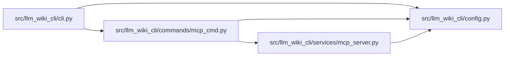

# mcp_cmd Module

**Path:** `src/llm_wiki_cli/commands/mcp_cmd.py`

## Description

Validates launch arguments and starts the local, read-only Model Context
Protocol adapter. The service module and optional SDK are imported lazily only
when this command runs. Configuration carries the source root, wiki path,
source-selection profile, transport, loopback endpoint, and allowed origins to
the MCP service.

## Imports

| Source | Symbols |
|--------|---------|
| `..config` | `validate_source_root` |
| `..services` | `mcp_server` |
| `__future__` | `annotations` |
| `sys` | `sys` |
| `typing` | `Any` |

## Local dependency map

<!-- Auto-generated local dependency summary. Do not edit by hand. -->

### Internal neighbors

| Direction | Module |
|---|---|
| Inbound | [cli](../modules/cli.md) |
| Outbound | [config](../modules/config.md) |
| Outbound | [mcp_server](../modules/mcp_server.md) |

## Functions

| Function | Signature | Decorators | Description |
|----------|-----------|------------|-------------|
| `_mcp_service_export` | `(name: str) -> Any` | — | — |
| `__getattr__` | `(name: str) -> Any` | — | Lazily preserve the command module's historical MCP imports. |
| `run` | `(args) -> None` | — | — |
