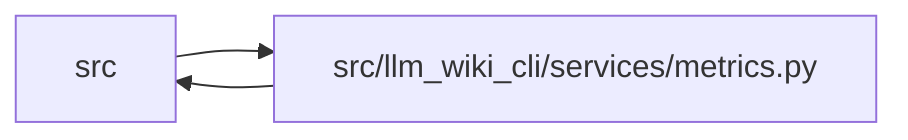

# metrics Module

**Path:** `src/llm_wiki_cli/services/metrics.py`

## Description

_Auto-generated from `src/llm_wiki_cli/services/metrics.py`._

## Imports

| Source | Symbols |
|--------|---------|
| `..config` | `CLI_AGENTS`, `DEFAULT_WIKI_DIR`, `IDE_AGENTS`, `read_config` |
| `.bootstrap_runtime` | `build_entity_occurrence_page_map`, `build_module_page_map` |
| `.documentation_query_builder` | `validate_live_query_source_selection` |
| `.extraction_service` | `InventoryRequest`, `InventoryResult`, `get_inventory_result` |
| `.knowledge_consumption` | `KnowledgeReadReason` |
| `.knowledge_observability` | `KnowledgeAggregateSummary` |
| `.lint_service` | `_collect_documented_entities`, `_collect_documented_modules` |
| `.source_selection` | `resolve_source_selection` |
| `.source_snapshot` | `build_source_snapshot`, `capture_source_selection_inputs` |
| `__future__` | `annotations` |
| `collections.abc` | `Mapping` |
| `datetime` | `datetime`, `timedelta`, `timezone` |
| `json` | `json` |
| `pathlib` | `Path`, `PurePosixPath`, `PureWindowsPath` |
| `re` | `re` |
| `typing` | `Any` |

## Local dependency map

<!-- Auto-generated local dependency summary. Do not edit by hand. -->

> Module-level dependencies exceed the generated-diagram limits, so the diagram and table below group them by top-level package. Counts report the number of module neighbors in each package.

### Internal neighbors

| Direction | Module |
|---|---|
| Inbound | `src` (5) |
| Outbound | `src` (9) |

> All 13 module neighbor(s) are summarized by package because the module-level view exceeds the 12-node limit.

## Functions

| Function | Signature | Decorators | Description |
|----------|-----------|------------|-------------|
| `metrics_path` | `(git_dir: str \| Path = '.git') -> Path` | — | — |
| `_utc_now` | `() -> datetime` | — | — |
| `_iso_now` | `() -> str` | — | — |
| `_parse_ts` | `(value: str) -> datetime \| None` | — | — |
| `parse_window` | `(value: str \| int \| None) -> timedelta \| None` | — | — |
| `resolve_agent` | `(agent: str \| None = None, wiki_dir: str \| Path = DEFAULT_WIKI_DIR) -> tuple[str, str]` | — | — |
| `record_event` | `(event: str, payload: dict[str, Any] \| None = None, *, git_dir: str \| Path = '.git') -> None` | — | — |
| `record_validation_event` | `(*, command: str, passed: bool, issue_count: int, strict: bool, duration_ms: int \| None, wiki_dir: str, src_dir: str, knowledge_summary: KnowledgeAggregateSummary \| Mapping[str, Any] \| None = None, git_dir: str \| Path = '.git') -> None` | — | — |
| `load_events` | `(*, last: str \| int \| None = None, git_dir: str \| Path = '.git') -> list[dict[str, Any]]` | — | — |
| `current_coverage` | `(src_dir: str = '.', wiki_dir: str \| Path = DEFAULT_WIKI_DIR, *, source_selection: str \| Path \| None = None) -> dict[str, Any]` | — | — |
| `summarize_events` | `(events: list[dict[str, Any]], *, src_dir: str = '.', wiki_dir: str \| Path = DEFAULT_WIKI_DIR, source_selection: str \| Path \| None = None) -> dict[str, Any]` | — | — |
| `_safe_knowledge_summary` | `(value: KnowledgeAggregateSummary \| Mapping[str, Any] \| object \| None) -> dict[str, object] \| None` | — | — |
| `_safe_count_mapping` | `(value: object, *, allowed_keys: set[str]) -> dict[str, int] \| None` | — | — |
| `_safe_phase_durations` | `(value: object) -> dict[str, int \| None] \| None` | — | — |
| `_sanitize_metrics_value` | `(value: object, *, path_value: bool = False) -> object` | — | — |
| `_forbidden_metrics_key` | `(key: str) -> bool` | — | — |
| `_path_field` | `(key: str) -> bool` | — | — |
| `_is_absolute_path` | `(value: str) -> bool` | — | — |
