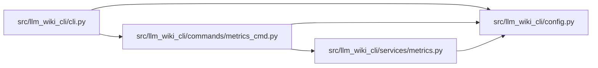

# metrics_cmd Module

**Path:** `src/llm_wiki_cli/commands/metrics_cmd.py`

## Description

_Auto-generated from `src/llm_wiki_cli/commands/metrics_cmd.py`._

## Imports

| Source | Symbols |
|--------|---------|
| `..config` | `DEFAULT_WIKI_DIR`, `validate_path`, `validate_source_root` |
| `..services.metrics` | `load_events`, `summarize_events` |
| `__future__` | `annotations` |
| `json` | `json` |

## Local dependency map

<!-- Auto-generated local dependency summary. Do not edit by hand. -->

### Internal neighbors

| Direction | Module |
|---|---|
| Inbound | [cli](../modules/cli.md) |
| Outbound | [config](../modules/config.md) |
| Outbound | [metrics](../modules/metrics.md) |

## Functions

| Function | Signature | Decorators | Description |
|----------|-----------|------------|-------------|
| `_fmt_percent` | `(value) -> str` | — | — |
| `_fmt_ms` | `(value) -> str` | — | — |
| `_fmt_counts` | `(value: object) -> str` | — | — |
| `render_text` | `(summary: dict, last: str) -> str` | — | — |
| `_fmt_phase_durations` | `(value: object) -> str` | — | — |
| `run` | `(args) -> None` | — | — |
