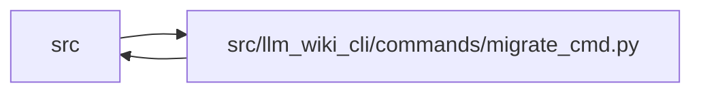

# migrate_cmd Module

**Path:** `src/llm_wiki_cli/commands/migrate_cmd.py`

## Description

Legacy wiki migration command.

`llm-wiki migrate` reconciles pages generated by older llm-wiki versions with
the current collision-aware naming rules.  Active canonical pages are
regenerated from source, old active pages are archived, and previous page
content is preserved under a Legacy Notes section.

## Imports

| Source | Symbols |
|--------|---------|
| `..` | `__version__` |
| `..config` | `DEFAULT_WIKI_DIR`, `validate_path`, `validate_source_root` |
| `..services.bootstrap_runtime` | `_build_relationships`, `_generate_docker_md`, `_generate_entity_md`, `_generate_index_md`, `_generate_module_md`, `build_entity_occurrence_page_map`, `build_module_page_map` |
| `..services.concept_identity` | `AliasType`, `identity_coordinate_key` |
| `..services.extraction_service` | `InventoryResult`, `get_call_graph`, `get_docker_inventory`, `get_inventory_result`, `print_inventory_failures` |
| `..services.io` | `read_md`, `write_json_atomic`, `write_md` |
| `..services.knowledge_artifacts` | `KNOWLEDGE_INDEX_FILENAME`, `ArtifactWriteState` |
| `..services.knowledge_envelope` | `RepositoryEvidence` |
| `..services.knowledge_evidence` | `is_valid_sha256`, `sha256_bytes` |
| `..services.knowledge_governance` | `GOVERNANCE_FILENAME`, `GovernanceError`, `load_governance` |
| `..services.knowledge_loader` | `KnowledgeStateLoadError`, `load_knowledge_state` |
| `..services.knowledge_orchestration` | `RUNTIME_GENERATION_OPTION_DEFAULTS`, `RuntimeKnowledgeInputs`, `build_runtime_knowledge_plan`, `collect_runtime_repository_evidence`, `committed_governance_bundle_id`, `finalize_runtime_knowledge`, `runtime_generation_options` |
| `..services.paths` | `normalize_source_path` |
| `..services.source_selection` | `resolve_source_selection`, `validate_persisted_source_selection_identity` |
| `..services.source_snapshot` | `SourceSnapshot`, `build_source_snapshot`, `capture_source_selection_inputs` |
| `..services.sync_manifest` | `MANIFEST_FILENAME`, `MANIFEST_STATE_UNAVAILABLE`, `SyncManifest` |
| `..services.validation` | `path_is_in_top_level_directory` |
| `..services.wiki_surface` | `PageKind`, `WikiSurfaceError`, `mcp_uri` |
| `..services.wiki_surface_index` | `SURFACE_INDEX_FILENAME`, `evaluate_surface_index` |
| `__future__` | `annotations` |
| `contextlib` | `redirect_stdout` |
| `dataclasses` | `dataclass`, `field`, `replace` |
| `datetime` | `datetime`, `timezone` |
| `io` | `io` |
| `json` | `json` |
| `os` | `os` |
| `pathlib` | `Path` |
| `re` | `re` |
| `shutil` | `shutil` |
| `sys` | `sys` |
| `tempfile` | `tempfile` |

## Local dependency map

<!-- Auto-generated local dependency summary. Do not edit by hand. -->

> Module-level dependencies exceed the generated-diagram limits, so the diagram and table below group them by top-level package. Counts report the number of module neighbors in each package.

### Internal neighbors

| Direction | Module |
|---|---|
| Inbound | `src` (1) |
| Outbound | `src` (18) |

> All 19 module neighbor(s) are summarized by package because the module-level view exceeds the 12-node limit.

## Classes

| Class | Line | Bases | Description |
|-------|------|-------|-------------|
| [ExistingPage](../entities/ExistingPage.md) | 112 | — | A currently active wiki page before migration. |
| [TargetPage](../entities/TargetPage.md) | 128 | — | A canonical page generated from the current source inventory. |
| [MigrationPlan](../entities/MigrationPlan.md) | 141 | — | Computed migration operations, shared by apply and dry-run paths. |
| [MigrationChunk](../entities/MigrationChunk.md) | 169 | — | A bounded subset of currently pending migration work. |

## Functions

| Function | Signature | Decorators | Description |
|----------|-----------|------------|-------------|
| `_normalize_source_path` | `(value: str \| None, src_dir: str) -> str \| None` | — | Normalize extracted markdown source paths to inventory-relative paths. |
| `_page_rel` | `(path: Path, wiki_dir: Path) -> str` | — | — |
| `_legacy_gitignore_pattern` | `(wiki_dir: Path) -> str` | — | Return the project-root-relative gitignore pattern for legacy archives. |
| `_gitignore_has_pattern` | `(content: str, pattern: str) -> bool` | — | — |
| `_legacy_gitignore_needs_write` | `(wiki_dir: Path) -> bool` | — | — |
| `_ensure_legacy_gitignore` | `(wiki_dir: Path, dry_run: bool) -> bool` | — | Ensure migration archives are ignored by git. |
| `_split_location` | `(value: str) -> tuple[str, int \| None]` | — | Split a legacy Location value into path and optional line number. |
| `_read_existing_page` | `(path: Path, wiki_dir: Path, src_dir: str, *, archived: bool = False) -> ExistingPage` | — | — |
| `_active_managed_pages` | `(wiki_dir: Path, src_dir: str) -> list[ExistingPage]` | — | — |
| `_legacy_archive_roots` | `(wiki_dir: Path) -> list[Path]` | — | — |
| `_archived_managed_pages` | `(wiki_dir: Path, src_dir: str) -> list[ExistingPage]` | — | — |
| `_additional_doc_entries` | `(wiki_dir: Path) -> list[str]` | — | — |
| `_append_additional_docs_index` | `(index_content: str, wiki_dir: Path) -> str` | — | — |
| `_build_targets` | `(wiki_dir: Path, src_dir: str, inventory: dict, docker_inventory: dict) -> tuple[list[TargetPage], str]` | — | — |
| `_list_workflows` | `(wiki_dir: Path) -> list[dict]` | — | — |
| `_list_flows` | `(wiki_dir: Path) -> list[dict]` | — | — |
| `_list_architecture_pages` | `(wiki_dir: Path) -> list[dict]` | — | — |
| `_build_workflow_link_maps` | `(wiki_dir: Path, inventory: dict, module_page_map: dict[str, str]) -> dict[str, dict[str, str]]` | — | Return per-workflow rewrites for raw module-stem links. |
| `_unique` | `(values: list[TargetPage]) -> TargetPage \| None` | — | — |
| `_build_match_lookups` | `(targets: list[TargetPage]) -> dict[str, dict]` | — | — |
| `_match_existing_page` | `(page: ExistingPage, lookups: dict[str, dict]) -> TargetPage \| None` | — | — |
| `_build_migration_plan` | `(wiki_dir: Path, src_dir: str, *, source_selection: str \| Path \| None = None) -> MigrationPlan` | — | — |
| `_prepare_migration_governance_plan` | `(wiki_dir: Path, plan: MigrationPlan) -> None` | — | Derive UID carry-forward strictly from the migration's exact matches. |
| `_validated_migration_progress_pages` | `(wiki_dir: Path, plan: MigrationPlan) -> frozenset[str]` | — | Load durable receipts for pages written by an earlier migration chunk. |
| `_save_migration_progress` | `(wiki_dir: Path, plan: MigrationPlan) -> None` | — | Atomically persist exact evidence receipts before a chunk can return. |
| `_clear_migration_progress` | `(wiki_dir: Path) -> None` | — | — |
| `_existing_legacy_payload` | `(page: ExistingPage, generated_content: str) -> str` | — | — |
| `_split_legacy_sections` | `(payload: str) -> list[str]` | — | — |
| `_merge_legacy_notes` | `(target: TargetPage, pages: list[ExistingPage]) -> str` | — | — |
| `_archive_page` | `(page: ExistingPage, wiki_dir: Path, archive_root: Path, dry_run: bool) -> None` | — | — |
| `_remove_old_page` | `(page: ExistingPage, dry_run: bool) -> None` | — | — |
| `_write_page` | `(wiki_dir: Path, rel: str, content: str, dry_run: bool) -> bool` | — | — |
| `_is_legacy_path` | `(path: Path, wiki_dir: Path) -> bool` | — | — |
| `_active_markdown_pages` | `(wiki_dir: Path) -> list[Path]` | — | — |
| `_rewrite_links_in_content` | `(content: str, page: Path, wiki_dir: Path, link_map: dict[str, str]) -> str` | — | — |
| `_page_link_map` | `(page: Path, wiki_dir: Path, link_map: dict[str, str], page_link_maps: dict[str, dict[str, str]] \| None = None) -> dict[str, str]` | — | — |
| `_rewrite_active_links` | `(wiki_dir: Path, link_map: dict[str, str], dry_run: bool, page_link_maps: dict[str, dict[str, str]] \| None = None) -> int` | — | — |
| `_should_archive_matched_page` | `(page: ExistingPage, target: TargetPage) -> bool` | — | — |
| `_matched_archive_count` | `(plan: MigrationPlan) -> int` | — | — |
| `_target_needs_apply` | `(wiki_dir: Path, target: TargetPage, matched_pages: list[ExistingPage]) -> bool` | — | — |
| `_manifest_payload` | `(manifest: SyncManifest) -> str` | — | — |
| `_manifest_needs_write` | `(wiki_dir: Path, manifest: SyncManifest \| None) -> bool` | — | — |
| `_knowledge_artifacts_need_backfill` | `(wiki_dir: Path) -> bool` | — | — |
| `_pending_link_rewrite_count` | `(wiki_dir: Path, link_map: dict[str, str], page_link_maps: dict[str, dict[str, str]] \| None = None) -> int` | — | — |
| `_finalizers_pending` | `(wiki_dir: Path, plan: MigrationPlan) -> bool` | — | — |
| `_pending_targets` | `(wiki_dir: Path, plan: MigrationPlan) -> list[TargetPage]` | — | — |
| `_build_chunks` | `(wiki_dir: Path, plan: MigrationPlan, chunk_size: int) -> list[MigrationChunk]` | — | — |
| `_chunk_link_map` | `(plan: MigrationPlan, chunk: MigrationChunk) -> dict[str, str]` | — | — |
| `_planned_archive_count` | `(plan: MigrationPlan) -> int` | — | — |
| `_legacy_archive_ignore_applicable` | `(wiki_dir: Path, plan: MigrationPlan) -> bool` | — | — |
| `_chunk_has_archive_work` | `(plan: MigrationPlan, chunk: MigrationChunk) -> bool` | — | — |
| `_print_chunk_plan` | `(chunks: list[MigrationChunk], chunk_size: int) -> None` | — | — |
| `_print_migration_governance_plan` | `(plan: MigrationPlan) -> None` | — | — |
| `_migration_runtime_inputs` | `(wiki_dir: Path, plan: MigrationPlan, *, repository_wiki_dir: Path \| None = None) -> RuntimeKnowledgeInputs` | — | — |
| `_finalize_migration_artifacts` | `(wiki_dir: Path, plan: MigrationPlan) -> None` | — | — |
| `_staged_existing_page` | `(page: ExistingPage, *, staged_wiki_dir: Path) -> ExistingPage` | — | — |
| `_staged_migration_plan` | `(plan: MigrationPlan, *, staged_wiki_dir: Path) -> MigrationPlan` | — | — |
| `_assert_migration_preview_tree_safe` | `(wiki_dir: Path) -> None` | — | — |
| `_preview_migration_artifact_plan` | `(wiki_dir: Path, plan: MigrationPlan)` | — | — |
| `_print_migration_artifact_preview` | `(wiki_dir: Path, plan: MigrationPlan) -> None` | — | — |
| `_apply_chunk` | `(wiki_dir: Path, plan: MigrationPlan, chunk: MigrationChunk, dry_run: bool, *, finalize_artifacts: bool = True) -> None` | — | — |
| `_apply_plan` | `(wiki_dir: Path, plan: MigrationPlan, dry_run: bool, *, finalize_artifacts: bool = True) -> None` | — | — |
| `run` | `(args) -> None` | — | — |
