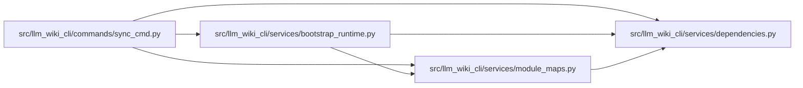

# module_maps Module

**Path:** `src/llm_wiki_cli/services/module_maps.py`

## Description

Pure per-module dependency mini-map summaries.

This module projects the existing dependency-analysis bundle into bounded local
views for module pages. It performs no I/O and does not render Markdown; page
generators can turn the returned plain dict/list data into diagrams later.

## Imports

| Source | Symbols |
|--------|---------|
| `.dependencies` | `top_level_package` |
| `__future__` | `annotations` |
| `collections` | `defaultdict` |
| `typing` | `Iterable`, `Mapping` |

## Local dependency map

<!-- Auto-generated local dependency summary. Do not edit by hand. -->

### Internal neighbors

| Direction | Module |
|---|---|
| Inbound | [sync_cmd](../modules/sync_cmd.md) |
| Inbound | [bootstrap_runtime](../modules/bootstrap_runtime.md) |
| Outbound | [services_dependencies](../modules/services_dependencies.md) |

## Functions

| Function | Signature | Decorators | Description |
|----------|-----------|------------|-------------|
| `_sort_key` | `(value: object) -> tuple[str, str]` | — | — |
| `_edge_tuple` | `(edge: Iterable[object]) -> tuple[str, str]` | — | — |
| `_graph_edges` | `(graph: Mapping) -> list[tuple[str, str]]` | — | — |
| `_graph_nodes` | `(graph: Mapping, edges: Iterable[tuple[str, str]]) -> list[str]` | — | — |
| `_safe_node_limit` | `(node_limit: int) -> int` | — | — |
| `_cycle_groups` | `(cycles: Iterable[Iterable[object]]) -> list[set[str]]` | — | — |
| `_cycle_edges_for_module` | `(module: str, edges: Iterable[tuple[str, str]], groups: Iterable[set[str]]) -> list[tuple[str, str]]` | — | — |
| `_external_summary` | `(module: str, reconciliation: Mapping) -> dict` | — | — |
| `_module_undeclared_packages` | `(module: str, used_packages: Iterable[str], reconciliation_data: Mapping) -> set[str]` | — | — |
| `_package_buckets` | `(files: Iterable[str]) -> list[dict]` | — | — |
| `_package_nodes_and_edges` | `(module: str, inbound: Iterable[str], outbound: Iterable[str]) -> tuple[list[str], list[tuple[str, str]]]` | — | — |
| `_module_summary` | `(module: str, edges: list[tuple[str, str]], cycle_groups: list[set[str]], reconciliation: Mapping, node_limit: int) -> dict` | — | — |
| `build_module_dependency_maps` | `(analysis: Mapping, *, node_limit: int = _DEFAULT_NODE_LIMIT) -> dict[str, dict]` | — | Build bounded local dependency summaries for each internal module. |
