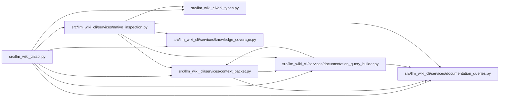

# native_inspection Module

**Path:** `src/llm_wiki_cli/services/native_inspection.py`

## Description

One bounded concept inspection over one captured native read view.

## Imports

| Source | Symbols |
|--------|---------|
| `.` | `context_packet` |
| `..api_types` | `QueryCostDisclosure` |
| `.documentation_queries` | `DocumentationQueryError`, `QUERY_RESULT_SERIALIZED_BYTE_LIMIT` |
| `.documentation_query_builder` | `build_documentation_query_service_from_view`, `build_snapshot_documentation_query_service` |
| `.knowledge_coverage` | `MAX_COVERAGE_BYTES`, `build_knowledge_coverage` |
| `json` | `json` |
| `pathlib` | `Path` |
| `typing` | `Any` |

## Local dependency map

<!-- Auto-generated local dependency summary. Do not edit by hand. -->

### Internal neighbors

| Direction | Module |
|---|---|
| Inbound | [api](../modules/api.md) |
| Outbound | [api_types](../modules/api_types.md) |
| Outbound | [context_packet](../modules/context_packet.md) |
| Outbound | [documentation_queries](../modules/documentation_queries.md) |
| Outbound | [documentation_query_builder](../modules/documentation_query_builder.md) |
| Outbound | [knowledge_coverage](../modules/knowledge_coverage.md) |

## Functions

| Function | Signature | Decorators | Description |
|----------|-----------|------------|-------------|
| `inspect_native_concept` | `(coordinate: str, *, src_dir: str, wiki_root: Path, live: bool, limit: int, include_evidence: bool, allow_external_src: bool, source_selection: str \| Path \| None, helper_cache_dir: str \| Path \| None) -> dict[str, Any]` | — | Compose existing queries, then check that their common inputs still hold. |
