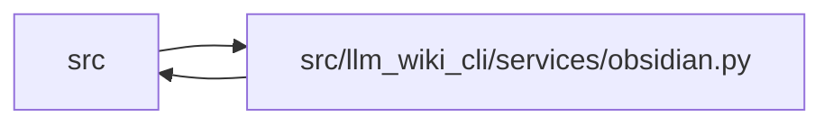

# obsidian Module

**Path:** `src/llm_wiki_cli/services/obsidian.py`

## Description

Builds and validates an Obsidian-friendly mirror without changing the canonical
wiki. It discovers pages through the surface registry, adds frontmatter,
wikilinks, related links, optional portable knowledge metadata, and separate
human-note stubs, and performs guarded path and overlap checks. It also installs
the packaged Obsidian plugin into a vault on explicit request.

## Imports

| Source | Symbols |
|--------|---------|
| `.` | `wiki_surface` |
| `.bootstrap_runtime` | `build_entity_occurrence_page_map`, `build_module_page_map` |
| `.documentation_queries` | `DocumentationQueryError` |
| `.documentation_query_builder` | `validate_live_query_source_selection` |
| `.extraction_service` | `InventoryRequest`, `get_inventory`, `get_inventory_result` |
| `.filesystem_guard` | `fresh_no_follow_stat` |
| `.io` | `first_unsafe_path_component`, `read_md`, `write_md` |
| `.knowledge_projection` | `KnowledgeProjection`, `KnowledgeProjectionError`, `projection_concept_summary`, `projection_json_value`, `validate_projection_summaries` |
| `.source_selection` | `SourceSelectionError`, `resolve_source_selection` |
| `.source_snapshot` | `SourceSnapshot`, `build_source_snapshot`, `capture_source_selection_inputs` |
| `.validation` | `path_is_within`, `paths_overlap`, `require_existing_directory`, `require_portable_relative_path`, `require_safe_base_path`, `resolve_portable_workspace_path` |
| `__future__` | `annotations` |
| `collections.abc` | `Mapping`, `Sequence` |
| `dataclasses` | `dataclass`, `field` |
| `json` | `json` |
| `os` | `os` |
| `pathlib` | `Path`, `PurePosixPath` |
| `re` | `re` |
| `shutil` | `shutil` |
| `stat` | `stat` |
| `tempfile` | `tempfile` |
| `typing` | `Any` |

## Local dependency map

<!-- Auto-generated local dependency summary. Do not edit by hand. -->

> Module-level dependencies exceed the generated-diagram limits, so the diagram and table below group them by top-level package. Counts report the number of module neighbors in each package.

### Internal neighbors

| Direction | Module |
|---|---|
| Inbound | `src` (1) |
| Outbound | `src` (11) |

> All 12 module neighbor(s) are summarized by package because the module-level view exceeds the 12-node limit.

## Classes

| Class | Line | Bases | Description |
|-------|------|-------|-------------|
| [ObsidianError](../entities/ObsidianError.md) | 106 | `ValueError` | Raised for invalid Obsidian export/check requests. |
| [WikiPage](../entities/obsidian_WikiPage.md) | 153 | — | — |
| [ObsidianOperation](../entities/ObsidianOperation.md) | 165 | — | — |
| [ObsidianReport](../entities/ObsidianReport.md) | 172 | — | — |

## Functions

| Function | Signature | Decorators | Description |
|----------|-----------|------------|-------------|
| `validate_obsidian_export_source_selection` | `(*, src_dir: str \| Path, wiki_dir: str \| Path, source_selection: str \| Path \| None) -> SourceSnapshot` | — | Freeze and validate the live profile before any persisted wiki read. |
| `export_obsidian_vault` | `(*, src_dir: str = '.', wiki_dir: str \| Path = 'docs/llm_wiki', vault_dir: str \| Path, notes_dir: str \| Path = DEFAULT_NOTES_DIR, dry_run: bool = False, source_selection: str \| Path \| None = None, knowledge_metadata: str \| None = None, knowledge_projection: KnowledgeProjection \| None = None) -> ObsidianReport` | — | Export an Obsidian-friendly mirror and sidecar notes. |
| `check_obsidian_vault` | `(*, wiki_dir: str \| Path = 'docs/llm_wiki', vault_dir: str \| Path, knowledge_metadata: str \| None = None, knowledge_projection: KnowledgeProjection \| None = None) -> ObsidianReport` | — | Check whether the Obsidian mirror is present and internally linked. |
| `install_obsidian_plugin` | `(*, vault_dir: str \| Path, plugin_dir: str \| Path = DEFAULT_PLUGIN_SOURCE) -> ObsidianReport` | — | Copy the bundled companion plugin into a vault's plugin directory. |
| `collect_wiki_pages` | `(wiki_dir: str \| Path, *, content_cache: dict[str, str] \| None = None) -> list[WikiPage]` | — | Collect active canonical wiki pages in deterministic order. |
| `_obsidian_kind` | `(kind: wiki_surface.PageKind) -> str` | — | — |
| `_mirror_rel` | `(surface_page: wiki_surface.WikiSurfacePage) -> str` | — | — |
| `build_mirror_page` | `(page: WikiPage, content: str, *, outgoing: set[str], related: set[str], canonical_map: dict[str, WikiPage], wiki_dir: Path, note_target: str \| None, knowledge_projection: KnowledgeProjection \| None = None) -> str` | — | — |
| `_escape_source_wikilinks` | `(content: str) -> str` | — | Treat existing double-bracket text as source prose, not vault links. |
| `build_frontmatter` | `(page: WikiPage, *, knowledge_projection: KnowledgeProjection \| None = None) -> str` | — | — |
| `convert_markdown_links` | `(content: str, page: WikiPage, canonical_map: dict[str, WikiPage], wiki_dir: Path, *, escape_aliases: bool = False) -> str` | — | Convert internal Markdown links to Obsidian wikilinks. |
| `render_report_text` | `(report: ObsidianReport, *, action: str) -> str` | — | — |
| `render_report_json` | `(report: ObsidianReport) -> str` | — | — |
| `_collect_outgoing_links` | `(pages: list[WikiPage], canonical_map: dict[str, WikiPage], wiki_dir: Path, page_content: dict[str, str]) -> dict[str, set[str]]` | — | — |
| `_build_related_links` | `(pages: list[WikiPage], outgoing: dict[str, set[str]]) -> dict[str, set[str]]` | — | — |
| `_merge_inventory_relationships` | `(related: dict[str, set[str]], pages: list[WikiPage], src_dir: str, *, source_selection: str \| Path \| None = None, source_snapshot: SourceSnapshot \| None = None) -> None` | — | Restore the legacy source-inventory relationship projection. |
| `_merge_source_coordinate_relationships` | `(related: dict[str, set[str]], pages: Sequence[WikiPage]) -> None` | — | Preserve legacy module/entity related links without scanning source. |
| `_select_knowledge_projection` | `(pages: Sequence[WikiPage], *, knowledge_metadata: str \| None, knowledge_projection: KnowledgeProjection \| None) -> KnowledgeProjection \| None` | — | — |
| `_knowledge_frontmatter_summary` | `(projection: KnowledgeProjection, page: WikiPage) -> dict[str, str]` | — | — |
| `_render_typed_relationships` | `(projection: KnowledgeProjection, page: WikiPage, canonical_map: Mapping[str, WikiPage]) -> str` | — | — |
| `_relation_sort_key` | `(relation: Mapping[str, Any]) -> tuple[str, ...]` | — | — |
| `_render_projected_target` | `(target: Mapping[str, Any], canonical_map: Mapping[str, WikiPage], *, resolution: str) -> str` | — | — |
| `_render_relation_details` | `(relation: Mapping[str, Any]) -> str` | — | — |
| `_projection_count` | `(value: Any) -> int` | — | — |
| `_markdown_text` | `(value: str) -> str` | — | — |
| `_markdown_code` | `(value: str) -> str` | — | — |
| `_frontmatter_block` | `(content: str) -> str \| None` | — | — |
| `_unexpected_projected_mirror_pages` | `(vault_dir: Path, *, expected_relative_paths: Sequence[str], excluded_roots: Sequence[Path] = (), knowledge_metadata_only: bool = False) -> list[Path]` | — | Find stale generated-looking pages through a bounded no-follow scan. |
| `_read_bounded_projected_frontmatter` | `(path: Path, *, expected_metadata: os.stat_result) -> str` | — | — |
| `_read_descriptor_bytes` | `(descriptor: int, limit: int) -> bytes` | — | — |
| `_same_file_identity` | `(left: os.stat_result, right: os.stat_result) -> bool` | — | — |
| `_validate_mirror_scan_relative_path` | `(value: str) -> str` | — | — |
| `_mirror_scan_relative_path` | `(page: WikiPage) -> str` | — | — |
| `_excluded_mirror_scan_roots` | `(vault_dir: Path, *, excluded_roots: Sequence[Path]) -> frozenset[str]` | — | — |
| `_mirror_scan_path_is_excluded` | `(relative_path: str, excluded_roots: frozenset[str]) -> bool` | — | — |
| `_has_projected_knowledge_frontmatter` | `(content: str) -> bool` | — | — |
| `_has_projected_knowledge_metadata_frontmatter` | `(content: str) -> bool` | — | Detect knowledge-only fields while preserving legacy source metadata. |
| `_typed_relationships_block` | `(content: str) -> str \| None` | — | — |
| `_render_related_links` | `(related_rels: list[str], canonical_map: dict[str, WikiPage], *, escape_aliases: bool = False) -> str` | — | — |
| `_resolve_markdown_target` | `(page: WikiPage, target: str, canonical_map: dict[str, WikiPage], wiki_dir: Path) -> WikiPage \| None` | — | — |
| `_wikilink_targets` | `(content: str) -> set[str]` | — | — |
| `_is_external_link` | `(target: str) -> bool` | — | — |
| `_source_location` | `(content: str) -> tuple[str \| None, int \| None]` | — | — |
| `_markdown_title` | `(content: str, fallback: str) -> str` | — | — |
| `_aliases_for` | `(page: WikiPage, *, include_source_path: bool = True) -> list[str]` | — | — |
| `_yaml_quote` | `(value: str) -> str` | — | — |
| `_escape_wikilink_alias` | `(value: str) -> str` | — | — |
| `_legacy_wikilink_alias` | `(value: str) -> str` | — | Match the pre-projection alias rendering byte-for-byte. |
| `_wikilink_alias` | `(value: str, *, escape: bool) -> str` | — | — |
| `_vault_link_target` | `(page: WikiPage) -> str` | — | — |
| `_vault_link_for_path` | `(path: Path, vault_dir: Path, *, omit_external: bool = False) -> str \| None` | — | — |
| `_resolve_notes_dir` | `(vault_dir: Path, notes_dir: str \| Path) -> Path` | — | — |
| `_sidecar_note_path` | `(notes_dir: Path, page: WikiPage) -> Path` | — | — |
| `_sidecar_note_relative_path` | `(page: WikiPage) -> str` | — | — |
| `_sidecar_note_stub` | `(page: WikiPage) -> str` | — | — |
| `_create_note_exclusive` | `(path: Path, content: str) -> bool` | — | Create one sidecar without overwriting a concurrent human write. |
| `_safe_filename` | `(value: str) -> str` | — | — |
| `_preflight_no_alias_paths` | `(paths: Sequence[Path]) -> None` | — | — |
| `_preflight_planned_parent_directories` | `(paths: Sequence[Path], *, label: str) -> None` | — | — |
| `_safe_join` | `(root: Path, relative: str \| Path) -> Path` | — | — |
| `_ensure_safe_base` | `(path: Path) -> None` | — | — |
| `_validate_no_authority_overlap` | `(wiki_dir: Path, derived_dir: Path, label: str) -> None` | — | — |
| `_paths_overlap` | `(left: Path, right: Path) -> bool` | — | — |
| `_path_is_within` | `(path: Path, root: Path) -> bool` | — | — |
| `_vault_relative_path` | `(path: Path, vault_dir: Path) -> str` | — | — |
| `_is_absolute_link_target` | `(value: str) -> bool` | — | — |
| `_validate_existing_dir` | `(path: Path, label: str) -> None` | — | — |
| `_plugin_copy_ignore` | `(_dir: str, names: list[str]) -> set[str]` | — | — |
| `_resolve_plugin_source` | `(plugin_dir: str \| Path) -> Path` | — | — |
