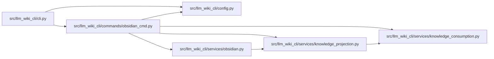

# obsidian_cmd Module

**Path:** `src/llm_wiki_cli/commands/obsidian_cmd.py`

## Description

Dispatches `obsidian export`, `check`, and `install-plugin`. Export validates
the live source-selection boundary and optionally builds a redacted knowledge
projection before writing the mirror; check compares a vault with the
canonical wiki and exits nonzero on mismatches; installation copies the
packaged plugin through the service's guarded filesystem operations.

## Imports

| Source | Symbols |
|--------|---------|
| `..config` | `DEFAULT_WIKI_DIR`, `validate_path`, `validate_source_root` |
| `..services.knowledge_consumption` | `load_knowledge_read_view` |
| `..services.knowledge_projection` | `KnowledgeProjection`, `KnowledgeProjectionError`, `project_knowledge` |
| `..services.obsidian` | `DEFAULT_NOTES_DIR`, `DEFAULT_PLUGIN_SOURCE`, `ObsidianError`, `check_obsidian_vault`, `export_obsidian_vault`, `install_obsidian_plugin`, `render_report_json`, `render_report_text`, `validate_obsidian_export_source_selection` |
| `__future__` | `annotations` |
| `sys` | `sys` |

## Local dependency map

<!-- Auto-generated local dependency summary. Do not edit by hand. -->

### Internal neighbors

| Direction | Module |
|---|---|
| Inbound | [cli](../modules/cli.md) |
| Outbound | [config](../modules/config.md) |
| Outbound | [knowledge_consumption](../modules/knowledge_consumption.md) |
| Outbound | [knowledge_projection](../modules/knowledge_projection.md) |
| Outbound | [obsidian](../modules/obsidian.md) |

## Functions

| Function | Signature | Decorators | Description |
|----------|-----------|------------|-------------|
| `_knowledge_projection` | `(args, wiki_dir: str) -> KnowledgeProjection \| None` | — | — |
| `_print_report` | `(report, output_format: str, *, action: str) -> None` | — | — |
| `run` | `(args) -> None` | — | — |