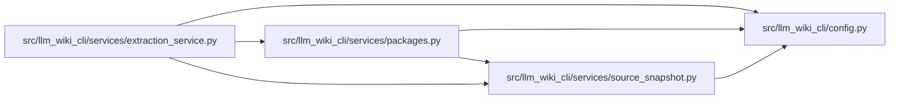

# packages Module

**Path:** `src/llm_wiki_cli/services/packages.py`

## Description

Discover Python packages within a source tree.

Walks the directory tree under *src_dir* looking for ``pyproject.toml``
and ``setup.py`` markers, then extracts package metadata (name, version,
source root).  Each discovered package is represented as a
:class:`PackageInfo` dataclass.

## Imports

| Source | Symbols |
|--------|---------|
| `..config` | `EXCLUDED_DIRS` |
| `.source_snapshot` | `SourceSnapshot` |
| `__future__` | `annotations` |
| `ast` | `ast` |
| `dataclasses` | `dataclass` |
| `pathlib` | `Path` |
| `tomli` | `tomllib` |
| `tomllib` | `tomllib` |
| `typing` | `TYPE_CHECKING`, `Sequence` |

## Local dependency map

<!-- Auto-generated local dependency summary. Do not edit by hand. -->

### Internal neighbors

| Direction | Module |
|---|---|
| Inbound | [extraction_service](../modules/extraction_service.md) |
| Outbound | [config](../modules/config.md) |
| Outbound | [source_snapshot](../modules/source_snapshot.md) |

### External packages

| Language | Used packages | Undeclared packages |
|---|---:|---:|
| python | 1 | 0 |

## Classes

| Class | Line | Bases | Description |
|-------|------|-------|-------------|
| [PackageInfo](../entities/PackageInfo.md) | 31 | — | Metadata for a single Python package discovered on disk. |

## Functions

| Function | Signature | Decorators | Description |
|----------|-----------|------------|-------------|
| `_parse_pyproject_toml` | `(text: str) -> dict[str, str]` | — | Parse project metadata from PEP 621 first, then Poetry metadata. |
| `_parse_setup_py` | `(text: str) -> dict[str, str]` | — | Extract *name* and *version* from a ``setup.py`` via AST inspection. |
| `_package_marker_paths` | `(src_path: Path, source_snapshot: SourceSnapshot \| None) -> tuple[list[Path], list[Path]]` | — | — |
| `discover_packages` | `(src_dir: str, *, source_snapshot: SourceSnapshot \| None = None) -> list[PackageInfo]` | — | Return all Python packages found under *src_dir*. |
| `stamp_inventory_packages` | `(inventory: dict, packages: Sequence[PackageInfo]) -> None` | — | Add a ``"package"`` key to each inventory entry in-place. |
