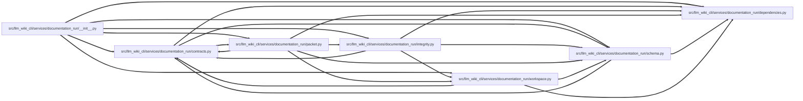

# packet Module

**Path:** `src/llm_wiki_cli/services/documentation_run/packet.py`

## Description

Documentation-run packet services.

## Imports

| Source | Symbols |
|--------|---------|
| `.contracts` | `*` |
| `.dependencies` | `*` |
| `.integrity` | `*` |
| `.schema` | `*` |
| `.workspace` | `*` |
| `__future__` | `annotations` |

## Local dependency map

<!-- Auto-generated local dependency summary. Do not edit by hand. -->
<!-- Thick arrows (==>) mark edges inside an import cycle. -->

### Internal neighbors

| Direction | Module |
|---|---|
| Inbound | [documentation_run___init__](../modules/documentation_run___init__.md) |
| Inbound | [documentation_run_contracts](../modules/documentation_run_contracts.md) |
| Outbound | [documentation_run_contracts](../modules/documentation_run_contracts.md) |
| Outbound | [documentation_run_dependencies](../modules/documentation_run_dependencies.md) |
| Outbound | [integrity](../modules/integrity.md) |
| Outbound | [documentation_run_schema](../modules/documentation_run_schema.md) |
| Outbound | [workspace](../modules/workspace.md) |

## Functions

| Function | Signature | Decorators | Description |
|----------|-----------|------------|-------------|
| `_render_packet_markdown` | `(payload: Mapping[str, Any]) -> str` | — | — |
| `build_documentation_agent_packet` | `(workspace: str \| Path, *, stage: str) -> DocumentationAgentPacket` | — | Build and persist a provider-neutral packet for one agent stage. |
