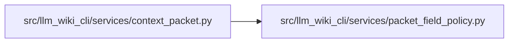

# packet_field_policy Module

**Path:** `src/llm_wiki_cli/services/packet_field_policy.py`

## Description

Explicit field/key spaces for the frozen qualified-packet path policy.

This describes classification coverage, not a new wire schema or a sharing
admission policy. Semantic validation remains in context_packet. Open inventory
and legacy enrichment JSON are deliberate delegation boundaries; they retain
the existing structural-path/URI rules for their nested string fields.

## Imports

| Source | Symbols |
|--------|---------|
| `collections.abc` | `Mapping` |
| `dataclasses` | `dataclass`, `field` |
| `types` | `MappingProxyType` |
| `typing` | `Any` |

## Local dependency map

<!-- Auto-generated local dependency summary. Do not edit by hand. -->

### Internal neighbors

| Direction | Module |
|---|---|
| Inbound | [context_packet](../modules/context_packet.md) |

## Classes

| Class | Line | Bases | Description |
|-------|------|-------|-------------|
| [FieldPolicy](../entities/FieldPolicy.md) | 16 | — | — |
| [UnclassifiedPacketField](../entities/UnclassifiedPacketField.md) | 24 | `ValueError` | — |

## Functions

| Function | Signature | Decorators | Description |
|----------|-----------|------------|-------------|
| `classify_string` | `(pointer: tuple[str, ...]) -> str` | — | Classify a string after its fixed/delegated field space was admitted. |
| `_record` | `(names: str = '', **children: FieldPolicy) -> FieldPolicy` | — | — |
| `_list` | `(item: FieldPolicy = SCALAR) -> FieldPolicy` | — | — |
| `_mapping` | `(item: FieldPolicy, *, keys: str) -> FieldPolicy` | — | — |
| `_json` | `(reason: str) -> FieldPolicy` | — | — |
| `packet_policy` | `(version: int) -> FieldPolicy` | — | — |
| `validate_field_coverage` | `(value: Mapping[str, Any]) -> None` | — | — |
| `field_policy_manifest` | `() -> dict[str, Any]` | — | Enumerate every fixed field and deliberately open key space for review. |
