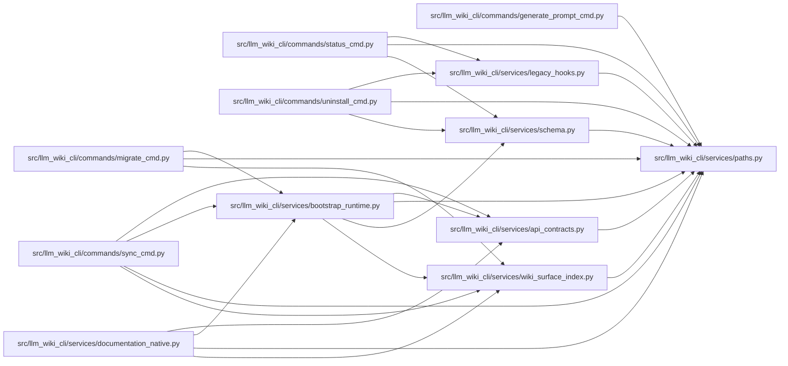

# paths Module

**Path:** `src/llm_wiki_cli/services/paths.py`

## Description

Shared path normalization helpers.

## Imports

| Source | Symbols |
|--------|---------|
| `__future__` | `annotations` |
| `pathlib` | `Path`, `PurePosixPath`, `PureWindowsPath` |
| `shlex` | `shlex` |

## Local dependency map

<!-- Auto-generated local dependency summary. Do not edit by hand. -->

### Internal neighbors

| Direction | Module |
|---|---|
| Inbound | [generate_prompt_cmd](../modules/generate_prompt_cmd.md) |
| Inbound | [migrate_cmd](../modules/migrate_cmd.md) |
| Inbound | [status_cmd](../modules/status_cmd.md) |
| Inbound | [sync_cmd](../modules/sync_cmd.md) |
| Inbound | [uninstall_cmd](../modules/uninstall_cmd.md) |
| Inbound | [api_contracts](../modules/api_contracts.md) |
| Inbound | [bootstrap_runtime](../modules/bootstrap_runtime.md) |
| Inbound | [documentation_native](../modules/documentation_native.md) |
| Inbound | [legacy_hooks](../modules/legacy_hooks.md) |
| Inbound | [services_schema](../modules/services_schema.md) |
| Inbound | [wiki_surface_index](../modules/wiki_surface_index.md) |

## Functions

| Function | Signature | Decorators | Description |
|----------|-----------|------------|-------------|
| `normalize_source_path` | `(value: str \| None, src_dir: str \| None = None) -> str \| None` | — | Normalize a source path from generated markdown or Docker instructions. |
| `is_test_source_path` | `(value: str \| Path \| None) -> bool` | — | Return whether *value* follows a common cross-language test path pattern. |
| `shell_quote` | `(value: str \| Path) -> str` | — | Quote a value for POSIX shell snippets, including Git Bash on Windows. |
| `display_project_path` | `(path: Path) -> str` | — | Render a checkout-local path with stable POSIX separators. |
| `portable_source_root_label` | `(value: str \| Path, *, base: str \| Path \| None = None) -> str` | — | Return a host-independent source-root label for generated artifacts. |
