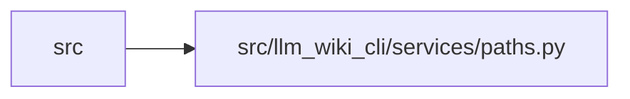

# paths Module

**Path:** `src/llm_wiki_cli/services/paths.py`

## Description

Shared path normalization helpers.

## Imports

| Source | Symbols |
|--------|---------|
| `__future__` | `annotations` |
| `pathlib` | `Path`, `PurePosixPath`, `PureWindowsPath` |
| `shlex` | `shlex` |

## Local dependency map

<!-- Auto-generated local dependency summary. Do not edit by hand. -->

```mermaid
flowchart LR
    n0["src"]
    n1["src/llm_wiki_cli/services/paths.py"]
    n0 --> n1
    click n1 "../modules/paths.md"
```

> Module-level dependencies exceed the generated-diagram limits, so the diagram and table below group them by top-level package. Counts report the number of module neighbors in each package.

### Internal neighbors

| Direction | Module |
|---|---|
| Inbound | `src` (13) |

> All 13 module neighbor(s) are summarized by package because the module-level view exceeds the 12-node limit.

## Functions

| Function | Signature | Decorators | Description |
|----------|-----------|------------|-------------|
| `normalize_source_path` | `(value: str \| None, src_dir: str \| None = None) -> str \| None` | — | Normalize a source path from generated markdown or Docker instructions. |
| `is_test_source_path` | `(value: str \| Path \| None) -> bool` | — | Return whether *value* follows a common cross-language test path pattern. |
| `shell_quote` | `(value: str \| Path) -> str` | — | Quote a value for POSIX shell snippets, including Git Bash on Windows. |
| `render_shell_command` | `(argv: list[str], *, windows: bool = False) -> str` | — | Render literal arguments for POSIX shells or Windows PowerShell. |
| `display_project_path` | `(path: Path) -> str` | — | Render a checkout-local path with stable POSIX separators. |
| `portable_source_root_label` | `(value: str \| Path, *, base: str \| Path \| None = None) -> str` | — | Return a host-independent source-root label for generated artifacts. |
