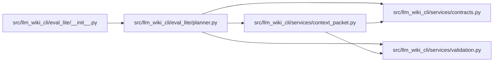

# planner Module

**Path:** `src/llm_wiki_cli/eval_lite/planner.py`

## Description

Deterministic, inspection-only planning for qualified-context packets.

This module treats oracle commands as inert manifest data.  It validates and
compares already materialized packets, or asks the read-only packet builder to
materialize them, but it does not execute tasks, contact providers, mutate
repositories, or probe capabilities.

## Imports

| Source | Symbols |
|--------|---------|
| `__future__` | `annotations` |
| `collections.abc` | `Iterable`, `Mapping`, `Sequence` |
| `dataclasses` | `dataclass` |
| `hashlib` | `hashlib` |
| `json` | `json` |
| `llm_wiki_cli.services` | `context_packet` |
| `llm_wiki_cli.services.context_packet` | `build_qualified_context`, `reconcile_context_packet`, `ContextPacketError`, `QualifiedContextPacket`, `validate_context_packet` |
| `llm_wiki_cli.services.contracts` | `EVAL_LITE_PLAN_SCHEMA_VERSION`, `EVAL_LITE_TASK_SCHEMA_VERSION` |
| `llm_wiki_cli.services.validation` | `portable_path_key`, `require_portable_relative_path` |
| `math` | `math` |
| `re` | `re` |
| `types` | `MappingProxyType` |
| `typing` | `Any` |

## Local dependency map

<!-- Auto-generated local dependency summary. Do not edit by hand. -->

### Internal neighbors

| Direction | Module |
|---|---|
| Inbound | [eval_lite___init__](../modules/eval_lite___init__.md) |
| Outbound | [context_packet](../modules/context_packet.md) |
| Outbound | [services_contracts](../modules/services_contracts.md) |
| Outbound | [validation](../modules/validation.md) |

## Classes

| Class | Line | Bases | Description |
|-------|------|-------|-------------|
| [EvaluationPlanError](../entities/EvaluationPlanError.md) | 63 | `ValueError` | A task manifest, packet input, or capability declaration is invalid. |
| [EvaluationPlan](../entities/EvaluationPlan.md) | 73 | — | An immutable canonical inspection plan. |

## Functions

| Function | Signature | Decorators | Description |
|----------|-----------|------------|-------------|
| `normalize_task_manifest` | `(manifest: Mapping[str, Any]) -> dict[str, Any]` | — | Validate and canonicalize the explicit task-first manifest. |
| `build_evaluation_plan` | `(manifest: Mapping[str, Any], baseline_packet: bytes \| bytearray \| memoryview \| Any, treatment_packet: bytes \| bytearray \| memoryview \| Any, *, available_capabilities: Iterable[str] = (), baseline_reconciliation: Any \| None = None, treatment_reconciliation: Any \| None = None) -> EvaluationPlan` | — | Build a deterministic exploratory plan without executing either arm. |
| `materialize_evaluation_plan` | `(manifest: Mapping[str, Any], *, src_dir: str, wiki_dir: str, baseline_request: Mapping[str, Any], treatment_request: Mapping[str, Any], available_capabilities: Iterable[str] = ()) -> EvaluationPlan` | — | Materialize both packets through the read-only QCP builder, then plan. |
| `_normalize_oracle` | `(value: Any) -> dict[str, Any]` | — | — |
| `_normalize_environment` | `(value: Any) -> dict[str, Any]` | — | — |
| `_validated_packet` | `(value: Any, field: str) -> dict[str, Any]` | — | — |
| `_source_binding_report` | `(expected: str, baseline: Mapping[str, Any], treatment: Mapping[str, Any]) -> dict[str, Any]` | — | — |
| `_evidence_report` | `(baseline: Mapping[str, Any], treatment: Mapping[str, Any], baseline_reconciliation: Any \| None, treatment_reconciliation: Any \| None) -> dict[str, Any]` | — | — |
| `_reconciliation_receipt` | `(value: Any \| None, packet_id: str, field: str) -> dict[str, Any]` | — | — |
| `_arm_receipt` | `(packet: Mapping[str, Any]) -> dict[str, Any]` | — | — |
| `_packet_differences` | `(baseline: Mapping[str, Any], treatment: Mapping[str, Any]) -> list[dict[str, Any]]` | — | — |
| `_walk_differences` | `(left: Any, right: Any, path: tuple[str, ...], output: list[tuple[tuple[str, ...], Any, Any]]) -> None` | — | — |
| `_classify_difference` | `(path: tuple[str, ...]) -> tuple[str, str]` | — | — |
| `_confound_categories` | `(differences: Sequence[Mapping[str, Any]], manifest: Mapping[str, Any], source_binding: Mapping[str, Any], evidence: Mapping[str, Any], capabilities: Mapping[str, Any]) -> list[dict[str, Any]]` | — | — |
| `_value_receipt` | `(value: Any) -> dict[str, Any]` | — | — |
| `_normalize_capabilities` | `(values: Iterable[str], *, field: str = 'available_capabilities') -> list[str]` | — | — |
| `_require_exact_fields` | `(value: Mapping[str, Any], expected: frozenset[str], field: str) -> None` | — | — |
| `_require_text` | `(value: Any, field: str) -> str` | — | — |
| `_require_sequence` | `(value: Any, field: str, *, allow_empty: bool) -> list[Any]` | — | — |
| `_validate_json_tree` | `(value: Any, field: str, *, depth: int = 0) -> None` | — | — |
| `_canonical_json_bytes` | `(value: Any) -> bytes` | — | — |
| `_domain_digest` | `(domain: bytes, value: bytes) -> str` | — | — |
| `_json_copy` | `(value: Any) -> Any` | — | — |
| `_json_type` | `(value: Any) -> str` | — | — |
| `_json_pointer` | `(path: Sequence[str]) -> str` | — | — |
| `_freeze_json` | `(value: Any) -> Any` | — | — |
| `_thaw_json` | `(value: Any) -> Any` | — | — |
