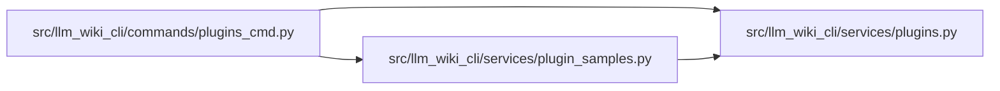

# plugin_samples Module

**Path:** `src/llm_wiki_cli/services/plugin_samples.py`

## Description

Bundled sample plugin export helpers.

## Imports

| Source | Symbols |
|--------|---------|
| `.plugins` | `MANIFEST_FILENAME`, `PluginError` |
| `__future__` | `annotations` |
| `importlib` | `resources` |
| `pathlib` | `Path` |
| `shutil` | `shutil` |
| `typing` | `Any` |
| `warnings` | `warnings` |

## Local dependency map

<!-- Auto-generated local dependency summary. Do not edit by hand. -->

### Internal neighbors

| Direction | Module |
|---|---|
| Inbound | [plugins_cmd](../modules/plugins_cmd.md) |
| Outbound | [plugins](../modules/plugins.md) |

## Functions

| Function | Signature | Decorators | Description |
|----------|-----------|------------|-------------|
| `list_samples` | `() -> list[dict[str, str]]` | — | Return bundled sample plugins in deterministic order. |
| `export_sample` | `(sample_id: str, dest: str \| Path, *, force: bool = False, root: str \| Path = '.') -> dict[str, Any]` | — | Copy a bundled plugin sample to ``dest``. |
| `_resolve_sample_id` | `(sample_id: str) -> str` | — | — |
| `_sample_resource` | `(sample_id: str)` | — | — |
| `_resolve_destination` | `(dest: str \| Path, *, root: str \| Path) -> Path` | — | — |
| `_prepare_destination` | `(path: Path, *, force: bool) -> None` | — | — |
| `_copy_resource_tree` | `(source, target: Path) -> None` | — | — |
