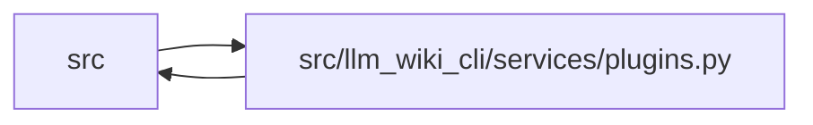

# plugins Module

**Path:** `src/llm_wiki_cli/services/plugins.py`

## Description

Local plugin marketplace support for llm-wiki.

Plugins are installed from local directories only.  Each plugin must provide a
``llm-wiki-plugin.json`` manifest and is copied into ``.llm-wiki/plugins`` so
runtime behavior is reproducible from project-local state.

## Imports

| Source | Symbols |
|--------|---------|
| `..` | `__version__` |
| `..config` | `EXTRACTOR_REGISTRY` |
| `.validation` | `path_is_within`, `require_existing_file`, `resolve_portable_workspace_path` |
| `__future__` | `annotations` |
| `datetime` | `datetime`, `timezone` |
| `hashlib` | `hashlib` |
| `importlib` | `importlib` |
| `importlib.util` | `importlib.util` |
| `json` | `json` |
| `pathlib` | `Path` |
| `re` | `re` |
| `shutil` | `shutil` |
| `sys` | `sys` |
| `threading` | `threading` |
| `typing` | `Any` |

## Local dependency map

<!-- Auto-generated local dependency summary. Do not edit by hand. -->

> Module-level dependencies exceed the generated-diagram limits, so the diagram and table below group them by top-level package. Counts report the number of module neighbors in each package.

### Internal neighbors

| Direction | Module |
|---|---|
| Inbound | `src` (16) |
| Outbound | `src` (2) |

> All 18 module neighbor(s) are summarized by package because the module-level view exceeds the 12-node limit.

## Classes

| Class | Line | Bases | Description |
|-------|------|-------|-------------|
| [PluginError](../entities/PluginError.md) | 56 | `ValueError` | Raised when a plugin manifest, install, or lookup is invalid. |
| [_SafeFormat](../entities/SafeFormat.md) | 741 | `dict` | — |

## Functions

| Function | Signature | Decorators | Description |
|----------|-----------|------------|-------------|
| `plugin_home` | `(root: str \| Path = '.') -> Path` | — | — |
| `plugin_store` | `(root: str \| Path = '.') -> Path` | — | — |
| `lock_path` | `(root: str \| Path = '.') -> Path` | — | — |
| `_default_lock` | `() -> dict[str, Any]` | — | — |
| `read_lock` | `(root: str \| Path = '.') -> dict[str, Any]` | — | — |
| `write_lock` | `(data: dict[str, Any], root: str \| Path = '.') -> None` | — | — |
| `_load_catalog` | `(path: Path) -> dict[str, str]` | — | — |
| `resolve_plugin_ref` | `(ref: str, root: str \| Path = '.') -> Path` | — | Resolve a direct local path or a project/user catalog name. |
| `_manifest_root` | `(ref: str \| Path) -> tuple[Path, Path]` | — | — |
| `_ensure_id` | `(value: Any, field: str) -> str` | — | — |
| `_parse_version` | `(value: str) -> tuple[int, int, int]` | — | — |
| `_current_llm_wiki_version` | `() -> str` | — | — |
| `_version_satisfies` | `(current: str, requirement: str) -> bool` | — | — |
| `_is_relative_to` | `(path: Path, root: Path) -> bool` | — | — |
| `_entry_point_module_source` | `(plugin_dir: Path, module: str) -> Path \| None` | — | — |
| `_ensure_entry_point` | `(value: Any, field: str, *, plugin_dir: Path \| None = None) -> str` | — | — |
| `_ensure_no_reserved_plugin_sources` | `(plugin_dir: Path) -> None` | — | Reject authored Python hidden inside interpreter cache directories. |
| `_safe_component_path` | `(plugin_dir: Path, value: Any, field: str) -> str` | — | — |
| `_normalize_component` | `(plugin_dir: Path, raw: Any) -> dict[str, Any]` | — | — |
| `validate_plugin` | `(ref: str \| Path) -> dict[str, Any]` | — | Validate and normalize a plugin manifest without installing it. |
| `_installed_extractor_languages` | `(lock: dict[str, Any]) -> set[str]` | — | — |
| `_check_install_collisions` | `(manifest: dict[str, Any], lock: dict[str, Any]) -> None` | — | — |
| `_copy_ignore` | `(_dir: str, names: list[str]) -> set[str]` | — | — |
| `install_plugin` | `(ref: str, *, root: str \| Path = '.', dry_run: bool = False, yes: bool = False) -> dict[str, Any]` | — | — |
| `remove_plugin` | `(plugin_id: str, *, root: str \| Path = '.') -> dict[str, Any]` | — | — |
| `list_plugins` | `(root: str \| Path = '.') -> list[dict[str, Any]]` | — | — |
| `iter_components` | `(component_type: str \| None = None, *, root: str \| Path = '.') -> list[dict[str, Any]]` | — | — |
| `_activate_plugin_path` | `(path: Path) -> None` | — | — |
| `activate_plugin_paths` | `(root: str \| Path = '.') -> None` | — | — |
| `runtime_plugin_fallback_root` | `(source_root: str \| Path, *, source_selection_configured: bool, source_plugins_only: bool = False) -> Path \| None` | — | Return the ambient plugin fallback only for legacy compatible reads. |
| `runtime_project_plugins_enabled` | `(source_root: str \| Path, *, source_selection_configured: bool, source_plugins_only: bool = False, include_plugins: bool = True) -> bool` | — | Return whether project plugin code is authorized for this source read. |
| `_entry_point_components` | `(entry_point: str, *, root: str \| Path = '.') -> list[dict[str, Any]]` | — | — |
| `_installed_entry_point_plugin_dir` | `(entry_point: str, *, root: str \| Path = '.') -> Path` | — | — |
| `_module_loaded_from_plugin` | `(module: Any, plugin_dir: Path) -> bool` | — | — |
| `_ensure_loaded_module_not_shadowed` | `(module_name: str, plugin_dir: Path) -> None` | — | — |
| `_plugin_code_fingerprint` | `(plugin_dir: Path) -> str` | — | — |
| `_purge_changed_plugin_modules` | `(plugin_dir: Path) -> None` | — | — |
| `load_entry_point` | `(entry_point: str, *, root: str \| Path = '.') -> Any` | — | — |
| `get_extractor_registry` | `(root: str \| Path = '.') -> dict[str, str]` | — | — |
| `parallel_safe_extractor_entry_points` | `(root: str \| Path = '.') -> set[str]` | — | — |
| `entrypoint_detector_components` | `(root: str \| Path = '.') -> list[dict[str, Any]]` | — | — |
| `diagram_style_components` | `(root: str \| Path = '.') -> list[dict[str, Any]]` | — | — |
| `read_component_text` | `(component: dict[str, Any]) -> str` | — | — |
| `find_prompt_template` | `(template_id: str, *, root: str \| Path = '.') -> dict[str, Any]` | — | — |
| `_validate_prompt_template_vcs_boundary` | `(template: str) -> None` | — | — |
| `render_prompt_template` | `(template_id: str, values: dict[str, Any], *, root: str \| Path = '.') -> str` | — | — |
