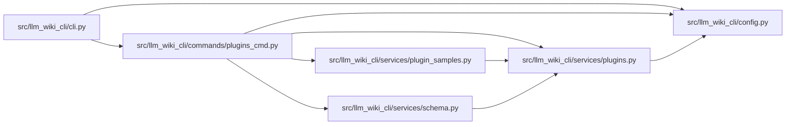

# plugins_cmd Module

**Path:** `src/llm_wiki_cli/commands/plugins_cmd.py`

## Description

_Auto-generated from `src/llm_wiki_cli/commands/plugins_cmd.py`._

## Imports

| Source | Symbols |
|--------|---------|
| `..config` | `DEFAULT_WIKI_DIR`, `validate_path` |
| `..services.plugin_samples` | `export_sample`, `list_samples` |
| `..services.plugins` | `PluginError`, `list_plugins`, `remove_plugin`, `validate_plugin` |
| `..services.schema` | `strip_plugin_skill_blocks` |
| `__future__` | `annotations` |
| `sys` | `sys` |

## Local dependency map

<!-- Auto-generated local dependency summary. Do not edit by hand. -->

### Internal neighbors

| Direction | Module |
|---|---|
| Inbound | [cli](../modules/cli.md) |
| Outbound | [config](../modules/config.md) |
| Outbound | [plugin_samples](../modules/plugin_samples.md) |
| Outbound | [plugins](../modules/plugins.md) |
| Outbound | [services_schema](../modules/services_schema.md) |

## Functions

| Function | Signature | Decorators | Description |
|----------|-----------|------------|-------------|
| `_render_components` | `(plugin: dict) -> str` | — | — |
| `run` | `(args) -> None` | — | — |
