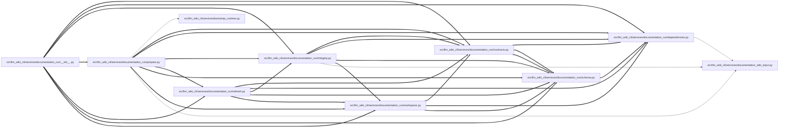

# prepare Module

**Path:** `src/llm_wiki_cli/services/documentation_run/prepare.py`

## Description

Documentation-run prepare services.

## Imports

| Source | Symbols |
|--------|---------|
| `..bootstrap_runtime` | `execute_bootstrap`, `_execute_documentation_workspace_refresh` |
| `..documentation_wiki_input` | `_adopt_documentation_wiki_snapshot_with_runtime` |
| `.contracts` | `*` |
| `.dependencies` | `*` |
| `.integrity` | `*` |
| `.refresh` | `*` |
| `.schema` | `*` |
| `.workspace` | `*` |
| `__future__` | `annotations` |

## Local dependency map

<!-- Auto-generated local dependency summary. Do not edit by hand. -->
<!-- Thick arrows (==>) mark edges inside an import cycle. -->

### Internal neighbors

| Direction | Module |
|---|---|
| Inbound | [documentation_run___init__](../modules/documentation_run___init__.md) |
| Outbound | [bootstrap_runtime](../modules/bootstrap_runtime.md) |
| Outbound | [documentation_run_contracts](../modules/documentation_run_contracts.md) |
| Outbound | [documentation_run_dependencies](../modules/documentation_run_dependencies.md) |
| Outbound | [integrity](../modules/integrity.md) |
| Outbound | [refresh](../modules/refresh.md) |
| Outbound | [documentation_run_schema](../modules/documentation_run_schema.md) |
| Outbound | [workspace](../modules/workspace.md) |
| Outbound | [documentation_wiki_input](../modules/documentation_wiki_input.md) |

## Functions

| Function | Signature | Decorators | Description |
|----------|-----------|------------|-------------|
| `prepare_documentation_run` | `(workspace: str \| Path, *, baseline_strategy: str = 'bootstrap_source', source_root: str \| Path \| None = None, source_selection: str \| Path \| None = None, input_wiki_root: str \| Path \| None = None, freshness_policy: str = 'require-current', site_name: str, audiences: Iterable[str] \| None = None, project_purpose: str \| None = None, audience_intent: Mapping[str, str] \| None = None, live_service_url: str \| None = None, live_service_access_mode: str = 'unspecified', live_service_observation_allowed: bool = False, helper_cache_root: str \| Path \| None = None, capture_root: str \| Path \| None = None, trust_source_plugins: bool = False, semantic_budget: int = 30, adjustment_loop_limit: int = 3, distribution_format: str = 'mkdocs', link_mode: str = 'http', knowledge_mode: str = 'off', knowledge_public_repository_identity: str \| None = None, refresh: bool = False) -> DocumentationRun` | — | Prepare a run with transactional rollback for initial creation and refresh. |
| `_prepare_documentation_run_impl` | `(workspace: str \| Path, *, baseline_strategy: str = 'bootstrap_source', source_root: str \| Path \| None = None, source_selection: str \| Path \| None = None, input_wiki_root: str \| Path \| None = None, freshness_policy: str = 'require-current', site_name: str, audiences: Iterable[str] \| None = None, project_purpose: str \| None = None, audience_intent: Mapping[str, str] \| None = None, live_service_url: str \| None = None, live_service_access_mode: str = 'unspecified', live_service_observation_allowed: bool = False, helper_cache_root: str \| Path \| None = None, capture_root: str \| Path \| None = None, trust_source_plugins: bool = False, semantic_budget: int = 30, adjustment_loop_limit: int = 3, distribution_format: str = 'mkdocs', link_mode: str = 'http', knowledge_mode: str = 'off', knowledge_public_repository_identity: str \| None = None, refresh: bool = False, refresh_transaction: _RefreshArchiveTransaction, initial_prepare_transaction: _InitialPrepareTransaction) -> DocumentationRun` | — | Prepare or idempotently resume an external documentation workspace. |
