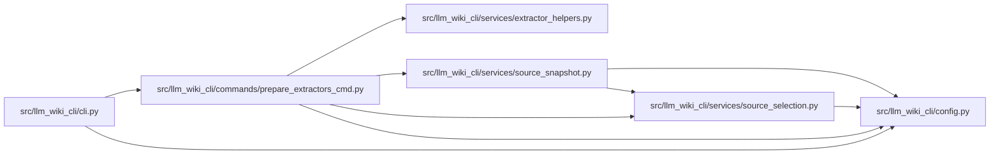

# prepare_extractors_cmd Module

**Path:** `src/llm_wiki_cli/commands/prepare_extractors_cmd.py`

## Description

Prepares optional TypeScript/JavaScript dependencies and Go, Rust, or Haskell
helper binaries outside normal source-reading commands. It either honors an
explicit language list or discovers required helpers from the selected source
snapshot, resolves a dedicated helper cache, reports each result, and fails if
any requested preparation fails.

## Imports

| Source | Symbols |
|--------|---------|
| `..config` | `validate_source_root` |
| `..services.extractor_helpers` | `SUPPORTED_HELPERS`, `HelperPrepareResult`, `prepare_helper`, `resolve_helper_cache_root` |
| `..services.source_selection` | `resolve_source_selection` |
| `..services.source_snapshot` | `build_source_snapshot` |
| `__future__` | `annotations` |
| `pathlib` | `Path` |
| `sys` | `sys` |

## Local dependency map

<!-- Auto-generated local dependency summary. Do not edit by hand. -->

### Internal neighbors

| Direction | Module |
|---|---|
| Inbound | [cli](../modules/cli.md) |
| Outbound | [config](../modules/config.md) |
| Outbound | [extractor_helpers](../modules/extractor_helpers.md) |
| Outbound | [source_selection](../modules/source_selection.md) |
| Outbound | [source_snapshot](../modules/source_snapshot.md) |

## Functions

| Function | Signature | Decorators | Description |
|----------|-----------|------------|-------------|
| `_dedupe_languages` | `(values: list[str] \| None) -> list[str]` | — | — |
| `_languages_from_snapshot` | `(src_dir: str, *, source_selection: str \| Path \| None = None) -> list[str]` | — | — |
| `_format_result` | `(result: HelperPrepareResult) -> str` | — | — |
| `run` | `(args) -> None` | — | — |
