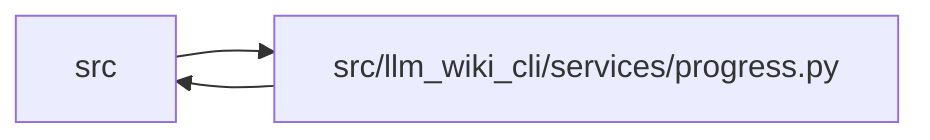

# progress Module

**Path:** `src/llm_wiki_cli/services/progress.py`

## Description

Bounded command-local phase events; services are silent without a caller sink.

## Imports

| Source | Symbols |
|--------|---------|
| `.contracts` | `PROGRESS_SCHEMA_VERSION` |
| `__future__` | `annotations` |
| `collections.abc` | `Callable`, `Iterator` |
| `contextlib` | `contextmanager` |
| `contextvars` | `contextvars` |
| `dataclasses` | `dataclass`, `field` |
| `functools` | `wraps` |
| `json` | `json` |
| `re` | `re` |
| `sys` | `sys` |
| `threading` | `threading` |
| `time` | `time` |
| `typing` | `Any`, `TextIO`, `TypeVar`, `cast` |
| `uuid` | `uuid` |

## Local dependency map

<!-- Auto-generated local dependency summary. Do not edit by hand. -->

> Module-level dependencies exceed the generated-diagram limits, so the diagram and table below group them by top-level package. Counts report the number of module neighbors in each package.

### Internal neighbors

| Direction | Module |
|---|---|
| Inbound | `src` (14) |
| Outbound | `src` (1) |

> All 15 module neighbor(s) are summarized by package because the module-level view exceeds the 12-node limit.

## Classes

| Class | Line | Bases | Description |
|-------|------|-------|-------------|
| [Phase](../entities/Phase.md) | 40 | — | — |
| [Progress](../entities/Progress.md) | 48 | — | One lightweight heartbeat worker and one bounded stream per command. |

## Functions

| Function | Signature | Decorators | Description |
|----------|-----------|------------|-------------|
| `phase` | `(name: str) -> Iterator[Phase]` | `@contextmanager` | — |
| `observed_phase` | `(name: str) -> Callable[[_F], _F]` | — | — |
| `current_progress` | `() -> Progress \| None` | — | — |
| `record_counts` | `(**counts: int) -> None` | — | — |
| `with_progress` | `(reporter: Progress \| None, function: Callable[..., Any], *args, **kwargs)` | — | Propagate only the caller's progress sink to extraction worker threads. |
