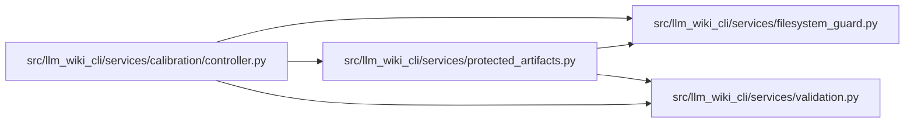

# protected_artifacts Module

**Path:** `src/llm_wiki_cli/services/protected_artifacts.py`

## Description

Protected, bounded artifact storage for controller-owned lifecycle state.

The store deliberately has no calibration-specific schema knowledge.  It owns
these filesystem mechanisms: a new/empty root, portable relative names, regular
files and directories, descriptor-relative POSIX operations, guarded Windows
pathname operations, atomic replacement, application-level write-once
artifacts, and a dedicated non-blocking root lock.

These are same-user, application-level guarantees within one trust domain.
Here ``immutable`` means that cooperating code creates a path once and accepts
only a byte-identical replay.  The mechanisms do not resist the filesystem
owner, root, or offline modification; they provide content-integrity checks,
not authenticity.

## Imports

| Source | Symbols |
|--------|---------|
| `.filesystem_guard` | `WindowsDirectoryGuardError`, `WindowsDurabilityError`, `WindowsFileGuardError`, `WindowsSecurityGuardError`, `create_private_windows_directory`, `fresh_no_follow_stat`, `guard_windows_directory_chain`, `move_windows_path_write_through`, `open_windows_guarded_lock_file`, `open_windows_private_write_file`, `open_windows_readonly_file`, `replace_windows_file_write_through`, `verify_windows_restrictive_dacl`, `windows_current_user_sid` |
| `.validation` | `portable_path_key`, `require_portable_path_component`, `require_portable_relative_path` |
| `__future__` | `annotations` |
| `contextlib` | `contextmanager` |
| `ctypes` | `ctypes` |
| `errno` | `errno` |
| `json` | `json` |
| `os` | `os` |
| `pathlib` | `Path`, `PurePosixPath` |
| `stat` | `stat` |
| `sys` | `sys` |
| `threading` | `threading` |
| `typing` | `Any`, `Callable`, `Iterator`, `Mapping`, `Sequence`, `cast` |
| `uuid` | `uuid` |

## Local dependency map

<!-- Auto-generated local dependency summary. Do not edit by hand. -->

### Internal neighbors

| Direction | Module |
|---|---|
| Inbound | [controller](../modules/controller.md) |
| Outbound | [filesystem_guard](../modules/filesystem_guard.md) |
| Outbound | [validation](../modules/validation.md) |

## Classes

| Class | Line | Bases | Description |
|-------|------|-------|-------------|
| [ProtectedArtifactError](../entities/ProtectedArtifactError.md) | 75 | `RuntimeError` | Base error for protected artifact storage. |
| [ProtectedArtifactIntegrityError](../entities/ProtectedArtifactIntegrityError.md) | 79 | `ProtectedArtifactError` | Raised when artifact filesystem or canonical-byte invariants fail. |
| [ProtectedArtifactLimitError](../entities/ProtectedArtifactLimitError.md) | 83 | `ProtectedArtifactError` | Raised when an artifact or protected root exceeds its byte limit. |
| [ProtectedArtifactLockError](../entities/ProtectedArtifactLockError.md) | 87 | `ProtectedArtifactError` | Raised when the controller root lock cannot be acquired. |
| [ProtectedArtifactDurabilityError](../entities/ProtectedArtifactDurabilityError.md) | 91 | `ProtectedArtifactError` | Raised when committed filesystem metadata cannot be made durable. |
| [ProtectedArtifactStore](../entities/ProtectedArtifactStore.md) | 149 | — | A reusable same-user application-level artifact store rooted at one directory. |

## Functions

| Function | Signature | Decorators | Description |
|----------|-----------|------------|-------------|
| `validate_portable_relative_path` | `(relative: str \| Path, *, normalize_backslashes: bool = True) -> str` | — | Return one normalized portable path or reject it. |
| `canonical_json_bytes` | `(payload: Mapping[str, Any]) -> bytes` | — | Serialize a JSON object to deterministic UTF-8 bytes. |
| `_create_or_require_empty_root` | `(root: Path) -> None` | — | — |
| `_supports_descriptor_relative_io` | `() -> bool` | — | — |
| `_uses_windows_guarded_io` | `() -> bool` | — | — |
| `_assert_tree_safe` | `(root: Path, *, target_parts: tuple[str, ...] \| None = None) -> tuple[int, int]` | — | — |
| `_assert_regular_directory` | `(path: Path, *, context: str, require_owner_only: bool = True) -> None` | — | — |
| `_assert_regular_directory_stat` | `(payload: os.stat_result, *, context: str, require_owner_only: bool = True) -> None` | — | — |
| `_assert_regular_file_stat` | `(payload: os.stat_result, *, context: str) -> None` | — | — |
| `_assert_regular_file_kind_stat` | `(payload: os.stat_result, *, context: str) -> None` | — | — |
| `_assert_posix_owner_only` | `(payload: os.stat_result, *, expected_mode: int, context: str) -> None` | — | — |
| `_current_posix_uid` | `() -> int` | — | — |
| `_assert_darwin_no_extended_acl_path` | `(path: Path, *, context: str, directory: bool = False, expected: os.stat_result \| None = None) -> None` | — | Reject a macOS filesystem object with any extended ACL entries. |
| `_assert_darwin_no_extended_acl_fd` | `(descriptor: int, *, context: str) -> None` | — | Reject an open macOS filesystem object with any extended ACL entries. |
| `_darwin_extended_acl_entry_count` | `(descriptor: int) -> int` | — | Return zero only when a descriptor has no macOS extended ACL object. |
| `_is_reparse_point` | `(payload: os.stat_result) -> bool` | — | — |
| `_directory_identity` | `(path: Path) -> tuple[int, int]` | — | — |
| `_directory_stat_identity` | `(payload: os.stat_result) -> tuple[int, int]` | — | — |
| `_file_identity` | `(payload: os.stat_result) -> tuple[int, int, int, int]` | — | — |
| `_validate_portable_component` | `(component: str, *, context: str) -> None` | — | — |
| `_portable_name_key` | `(name: str) -> str` | — | — |
| `_assert_portable_entry_names` | `(names: Iterator[str] \| Sequence[str]) -> None` | — | — |
| `_assert_directory_fd_entries_portable` | `(directory_fd: int) -> None` | — | — |
| `_assert_directory_entries_portable` | `(directory: Path) -> None` | — | — |
| `_assert_no_portable_collision_fd` | `(directory_fd: int, name: str) -> None` | — | — |
| `_assert_path_entry_portable` | `(parent: Path, name: str) -> None` | — | — |
| `_assert_relative_target_regular` | `(parent_fd: int, name: str) -> None` | — | — |
| `_assert_path_target_regular` | `(target: Path) -> None` | — | — |
| `_read_existing_from_fd` | `(parent_fd: int, name: str, expected_size: int) -> bytes \| None` | — | — |
| `_read_existing_windows` | `(target: Path, expected_size: int) -> bytes \| None` | — | — |
| `_read_bounded_fd` | `(descriptor: int, *, maximum_bytes: int, label: str) -> bytes` | — | — |
| `_write_all` | `(descriptor: int, data: bytes) -> None` | — | — |
| `_unlink_owned_temp` | `(parent_fd: int, name: str, expected_identity: tuple[int, int, int, int]) -> None` | — | — |
| `_unlink_owned_temp_path` | `(target: Path, expected_identity: tuple[int, int, int, int]) -> None` | — | — |
| `_fsync_directory` | `(directory_fd: int) -> None` | — | — |
| `_validate_maximum_bytes` | `(value: int) -> int` | — | — |
| `_validate_optional_root_bytes` | `(value: int \| None) -> int \| None` | — | — |
| `_assert_within_limit` | `(label: str, data: bytes, maximum_bytes: int) -> None` | — | — |
| `_unique_json_object` | `(pairs: list[tuple[str, Any]]) -> dict[str, Any]` | — | — |
| `_reject_json_constant` | `(value: str) -> Any` | — | — |
